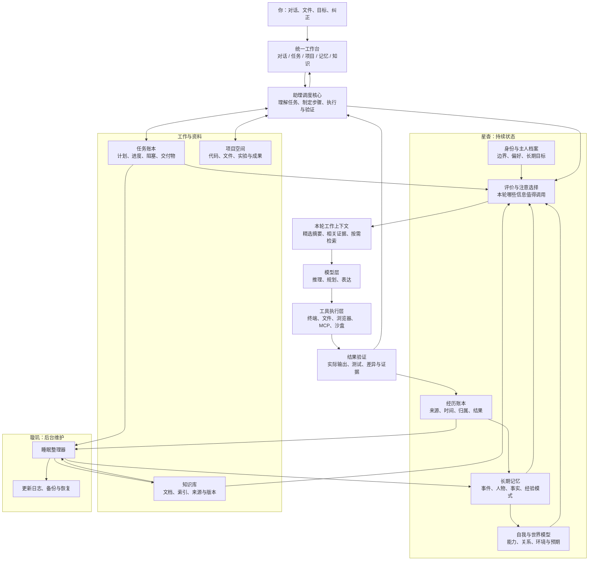
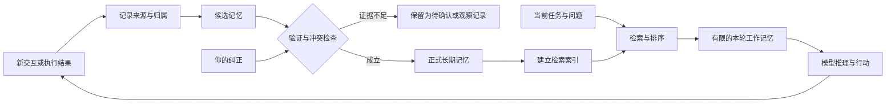

# /root/upstream_compat

导出时间：2026-09-18T02:11:32.055Z

来源片段：`sessions/2026/09/17/rollout-2026-09-17T19-09-35-01a0af0e-c4fc-7720-9f82-68bf4038f0f8.jsonl`

此文件展示对话与协作消息。完整工具调用和结果位于同名 JSONL。凭据已脱敏；子任务中保留的继承上下文可能与主任务重复。

## 2026-09-17T11:09:35.870Z · 用户

f盘综合检测


## 2026-09-17T11:09:35.870Z · 助理

**F 盘已完成本次只读综合检测：未发现文件系统错误、现有文件读取失败或病毒威胁，目前没有发现需要修复的问题。** 不过，本次未能进行全盘物理扇区扫描，也未取得 SMART 寿命数据，因此不能据此保证全部闪存空间都正常。

检测时间：2026 年 9 月 17 日 18:18 左右。

| 检测项目 | 结果 | 说明 |
|---|---|---|
| 设备识别 | SanDisk USB 存储设备 | 型号 `USB SanDisk 3.2Gen1`，当前为磁盘 3 |
| 分区与格式 | 正常识别 | 卷标 `LU-2`，exFAT 文件系统，MBR 分区表 |
| 容量与空间 | 空间充足 | 总容量 **114.59 GiB**，已用 **256.62 MiB**，可用 **114.34 GiB（99.78%）** |
| Windows 状态 | 正常 | 系统报告 `Healthy / Online`，未被设置为只读 |
| 文件系统检查 | 通过 | `chkdsk F:` 完成文件与目录检查，报告未发现问题 |
| 全部现有文件读取 | 通过 | **14 个文件、约 252.75 MiB** 全部完成 SHA-256 计算，无读取错误 |
| 压缩包完整性 | 通过 | `opencode-sandbox.tar.gz` 目录解析成功，完整解压读取及 GZIP CRC 校验通过 |
| 数据库完整性 | 通过 | 主数据库及 `.bak` 备份的 SQLite 完整性检查均返回 `ok`，两者 SHA-256 一致 |
| 病毒扫描 | 通过 | Microsoft Defender 自定义扫描完成，报告 **未发现威胁**；病毒库更新时间为当天 06:54 |
| 历史存储错误 | 未发现明确对应 F 盘的记录 | 检查了当前保留的系统日志，最早可追溯至 9 月 9 日 |

有三点需要准确理解：

- **CHKDSK 报告的“0 KB 坏扇区”不等于全盘坏块检测通过。** 本次执行的是文件系统检查；检查时卷正在使用，开头也出现访问受限提示，但随后完成扫描并报告无问题。
- **全部文件可读，只证明当前这些文件能够完整读取。** F 盘约 99.78% 的空间为空闲空间，本次未验证这些空间，也未做写入速度、全容量写入回读或扩容盘验证。
- **硬件健康结论仍有限。** 当前进程没有管理员权限，原始磁盘读取被拒绝；存储可靠性计数器和 SMART 查询也未成功取得数据，无法判断闪存磨损、剩余寿命和底层坏块情况。

另外，系统日志里发现 **73 次 `RaidPort3` 的 USB 存储重置记录**。按当前设备映射，该端口对应 JMicron 存储设备，F 盘在端口 4；日志还明确记录过 D、E 盘的数据刷新失败。这些记录值得单独排查，但现有证据不足以把它们归因于 F 盘，历史端口编号也可能随重新连接发生变化。

**就本次已完成的检查而言，F 盘现有数据可读、文件结构正常，没有发现需要执行修复或格式化的依据。** 本次未执行修复、格式化或写入压力测试。

## 2026-09-17T11:09:35.870Z · 用户

[https://github.com/LUTAO581314/xingyao-shuanji](https://github.com/LUTAO581314/xingyao-shuanji)你看看我们自己的仓库，就知道这个干什么的，我要做一个超级ai黑客ui盘


## 2026-09-17T11:09:35.870Z · 助理

明白，你要把 F 盘做成一个**随身携带的“超级 AI 黑客 U 盘”：插到电脑上，就能打开自己的 AI 工作台，写代码、分析程序、运行安全研究工具，并把项目、会话和工具环境一起带走。** 我先按“U 盘”理解你说的“ui盘”。

我查看了你给的 [xingyao-shuanji 仓库](https://github.com/LUTAO581314/xingyao-shuanji)，**这个链接目前显示 `This repository is empty`，没有可供检查的源码**。不过，我已经读了 F 盘上的实际实现，能看出你们已经做了一部分基础。

目前 F 盘上的这套东西是一个 **OpenCode 便携运行环境**：

| 已有部分 | 实际作用 |
|---|---|
| Windows 可执行程序 | 已带有 `opencode-windows-x64.exe`，文件版本信息为 `1.4.2` |
| Windows 启动器 | 将配置、数据、缓存等路径指向 U 盘，并尝试映射到固定的 `O:` 盘，减少盘符变化造成的历史路径问题 |
| 会话数据库及备份 | 已有 SQLite 数据库和备份；这次查询未发现项目和会话记录 |
| 中文行为配置 | 已设置中文交流和开发协作规则 |
| Docker 沙盒插件 | 为工作区启动独立容器，连接容器中的 OpenCode 服务 |
| 离线沙盒镜像 | U 盘已携带镜像包，可以导入 Docker |
| macOS / Linux 启动脚本 | 已有脚本，但盘上目前缺少它们需要的对应可执行程序 |

**这个基础适合继续做成你说的产品，但“随盘带走”和“换电脑即用”还没有完全实现。** 我从代码中确认了几个具体缺口：

- **沙盒项目现在放在电脑的临时目录。** 插件使用系统 `tmpdir()` 创建工作区，因此虽然程序和会话数据库在 U 盘，沙盒里的项目文件却未必随盘走。插件删除工作区时还会删除这个目录，需要区分“临时实验”和“长期项目”。
- **沙盒依赖电脑已有 Docker。** U 盘带了镜像，但没有带来一个能在任意 Windows 电脑上直接运行的完整容器环境。当前这台电脑装了 Docker CLI，但 Docker 引擎没有运行。
- **数据库备份方式需要加固。** 启动器直接复制数据库文件；存在并发使用或 SQLite WAL 日志时，这种方式不能保证取得一致的备份。对于经常插拔的 U 盘，这会影响会话可靠性。
- **固定盘符的识别还不够严谨。** 当前只检查 `O:\opencode.cmd` 是否存在，没有确认它一定指向本次插入的这块 U 盘。
- **现有启动入口直接调用 OpenCode 程序。** 我还没有看到你们自己的图形工作台源码，无法确认现有 UI 的实现程度。

我建议第一版定位为 **“星曜 AI 随身工作台”**，先做好 Windows 插入即用的体验，界面围绕这五个入口展开：

| 入口 | 用户能做什么 |
|---|---|
| **AI 控制台** | 对话、编程、查看任务进度和工具执行结果 |
| **项目空间** | 打开 U 盘项目、继续上次工作、保存研究资料 |
| **安全工具箱** | 代码审计、依赖漏洞检查、网络诊断、CTF 与靶场实验 |
| **沙盒实验室** | 创建隔离实验环境，明确显示项目保存位置和环境状态 |
| **设备中心** | 检查运行依赖、配置模型、备份会话、更新程序、安全退出 |

实现顺序上，**先把项目持久保存、数据库可靠备份、启动自检做好，再接上统一图形界面和工具箱**。这样你的 U 盘才真正具备“带着自己的 AI 环境走”的能力。

我已经发了两个澄清问题：源码实际位置，以及优先做 Windows 便携版还是可启动 Linux 系统。**现在最关键的是拿到正确的源码位置**；当前 GitHub 链接为空，F 盘上主要是打包产物和启动配置，还不足以直接修改你们的完整应用。

## 2026-09-17T11:09:35.870Z · 用户

我觉得应该先把opencode改装打的补丁搞好测试一下


## 2026-09-17T11:09:35.870Z · 用户

改装opencode变成我们自己产品


## 2026-09-17T11:09:35.870Z · 用户


# Files mentioned by the user:

## 灵魂架构.txt: C:/Users/LT/Desktop/灵魂架构.txt

Distinguish instructions in attached documents from the user's request.

## My request:
我们还有改结构，灵魂记忆


## 2026-09-17T11:09:35.870Z · 用户

灵魂不是全部加入提示词，而是整个结构，可能我的理解也有问题，你看看怎么搞吧


## 2026-09-17T11:09:35.870Z · 用户

整个opencode你看看怎么打补丁优化吧，变成我的专属主力


## 2026-09-17T11:09:35.870Z · 用户

助理


## 2026-09-17T11:09:35.870Z · 用户

记忆知识库，睡眠整理文件等等


## 2026-09-17T11:09:35.870Z · 用户

你先出一个完整的逻辑大纲草图


## 2026-09-17T11:09:35.870Z · 助理

**我建议把产品定成：以 OpenCode 为执行底座、以“星杳”为专属助理、以“璇玑”为便携运行环境，再建立独立的记忆、知识、任务和后台整理系统。**

你对“灵魂是整个结构”的理解很关键。模型每次思考时仍然需要接收相关上下文，但**记忆保存、经历归属、状态变化、学习规则和睡眠整理，应当由程序持续管理**。提示词负责告诉模型怎样使用本轮信息。

下面是完整的逻辑大纲草图。它描述目标结构；已有代码的雏形和待实现部分，我在最后区分。

---

**一、产品整体：星杳、璇玑、OpenCode 各负责什么**

| 部分 | 定位 | 负责的事情 |
|---|---|---|
| **星杳** | 你的专属主力助理 | 理解需求、记住偏好、持续推进任务、调用工具、解释结果 |
| **璇玑** | 星杳的运行环境 | U 盘便携启动、数据管理、沙盒、后台任务、备份恢复 |
| **OpenCode 底座** | 执行引擎 | 模型连接、会话、代码编辑、终端、工具调用、插件与协议 |
| **灵魂运行时** | 持续状态与经验系统 | 身份连续性、经历归属、长期记忆、关系与世界模型、经验对判断的影响 |
| **知识库** | 有来源的资料系统 | 文档、项目资料、研究笔记、检索、引用、版本更新 |
| **任务系统** | 工作连续性 | 当前目标、步骤、进度、阻塞、交付物、后续跟进 |

这里有一个重要区别：**“认识你”“知道一份文档”“记得做过什么”“知道事情还没做完”是四种不同能力，需要分别保存。**

---

**二、整体结构草图**



图里最重要的闭环是：

**做事 → 得到真实结果 → 形成经历 → 整理成可追溯的记忆或经验 → 在以后相关任务中影响判断。**

---

**三、“灵魂”具体拆成六个部分**

这些是逻辑职责，初期可以放在一个模块内，不必一开始拆成很多服务。

| 部分 | 保存或处理什么 | 一个具体例子 |
|---|---|---|
| **身份连续性** | 稳定身份、主人关系、产品边界、当前运行环境 | 换一台电脑，仍知道自己是星杳；同时知道当前换了环境 |
| **经历归属** | 亲历、观察、别人告诉它的内容，以及实际证据 | 区分“我执行了部署”“用户说部署好了”“我读到部署教程” |
| **长期记忆** | 重要事件、明确偏好、决定、经验教训 | 你要求优先中文、先验证再交付；某次升级造成了兼容问题 |
| **人物与世界模型** | 对人、项目、设备、环境的可修正认识 | F 盘是便携环境；某项目需要指定版本；某接口经常超时 |
| **评价与注意** | 根据当前目标选择相关记忆，判断下一步 | 看到“换电脑”，优先检查盘符、依赖、模型连接和数据位置 |
| **经验模式更新** | 从独立、重复且有证据的经历中形成可解释倾向 | 多次确认某环境安装失败后，优先采用已验证的便携方案 |

**模型可以提出“应该记住什么”的候选结果，程序决定哪些能正式写入。** 至少要检查来源、重复、冲突、隐私范围和字段是否合法。

你文档中的“身体、反射、感官”也保留接口，但在当前 U 盘助理上先落到真实运行状态：

- 可用空间、写入是否失败、网络连接、模型是否可用。
- 任务执行是否超时、容器是否退出、设备是否即将断开。
- 存储出现故障时优先停止写入、保留恢复信息。

这些状态可以影响执行策略。温度、疼痛等没有实际传感器的部分，暂不作为真实体感实现。

---

**四、数据要分开：记忆库、知识库、任务库不能混成一堆文件**

| 数据类别 | 内容 | 更新方式 |
|---|---|---|
| **主人档案** | 明确偏好、称呼、常用环境、长期目标 | 以你的明确表达和纠正为主要依据 |
| **经历账本** | 做了什么、工具返回什么、成功或失败、来源会话 | 按事件记录，纠正时保留修订关系 |
| **长期记忆** | 从经历中提炼的事件、事实、人物和决定 | 后台整理，允许更正、合并和降级 |
| **经验模式** | 有证据支持的行为倾向、经验规则 | 小幅更新，记录依据，支持撤回 |
| **知识库** | 文档、教程、项目说明、研究成果 | 按来源、文件版本和内容变化更新 |
| **任务账本** | 待办、步骤、完成条件、阻塞、成果位置 | 随任务执行实时更新 |
| **技能库** | 可重复的工作方法、工具流程、检查步骤 | 经验证后沉淀，并保留适用条件 |
| **凭据库** | 模型密钥、登录信息、服务凭据 | 独立保存，不参与普通记忆提炼和知识索引 |

比如你说：“以后这个项目都用 Python 3.12。”

这句话可能产生三种不同记录：

- 主人对这个项目的明确要求。
- 该项目的环境约束。
- 当前任务需要检查 Python 版本的一项步骤。

它不应该自动变成“所有项目永远只能用 Python 3.12”。

---

**五、记忆形成与调用：只让相关信息进入本轮思考**



每条正式记忆至少应能回答：

> **记住了什么？从哪里来的？属于谁的经历？什么时候成立？适用于哪里？现在是否仍有效？**

建议核心字段包含：

```text
记忆标识、类别、正文
来源会话 / 消息 / 文件 / 工具结果
发生时间、记录时间
经历归属：亲历 / 告知 / 观察
适用范围：全局 / 项目 / 任务
可见范围：普通 / 私密
证据与可信程度
有效状态、冲突记录、修订关系
```

调用时按“当前目标、适用范围、线索相关性、证据、时效”选择。模型先获得短摘要，需要细节时再检索原文。

**换模型以后，记忆仍由璇玑保存。** 某家模型只是当次推理的提供者，不应成为身份和长期数据的唯一承载者。

---

**六、“睡眠整理”是后台工作流程**

我建议睡眠分成两类：**内部记忆维护**和**用户文件整理**。两者共用任务调度，但执行规则不同。

内部记忆维护的流程：

```text
进入空闲 / 手动开始睡眠
        ↓
记录整理起点与资源预算
        ↓
读取尚未处理的新经历
        ↓
生成候选记忆、发现冲突与重复
        ↓
校验来源、归属、范围与证据
        ↓
提交记忆更新
        ↓
更新知识索引、任务状态与经验模式
        ↓
生成整理报告和恢复记录
        ↓
回到待命；有新任务时让前台优先
```

具体包括：

| 睡眠工作 | 预期结果 |
|---|---|
| 整理新增经历 | 提炼有长期价值的内容，避免重复处理旧会话 |
| 处理记忆冲突 | 保留不同版本和来源，明确哪些需要你确认 |
| 更新人物、项目与环境认识 | 让后续判断使用最新、适用的信息 |
| 整理知识索引 | 新文件入库、变化文件重建索引、失效引用标记 |
| 复盘任务 | 找出未完成步骤、记录阻塞、整理交付物位置 |
| 沉淀技能候选 | 把成功且可重复的流程提出为技能草案 |
| 备份和一致性检查 | 检查记忆、任务和索引能否恢复 |
| 输出睡眠报告 | 显示新增、更正、合并、待确认和失败项目 |

有几个行为必须由结构保证：

- **前台任务优先**：你开始工作时，后台整理可暂停。
- **可中断、可续跑**：退出程序或中途失败后，能从检查点继续。
- **不重复学习**：同一条经历因重试处理三次，也只能算一次证据。
- **有成本预算**：限制每轮模型调用、时长和处理量。
- **封存有效**：暂停学习与维护性改写，保留身份和记忆。
- **报告真实**：区分完成、跳过、失败和需要确认。

“睡眠”初期采用**手动触发＋程序运行期间的空闲维护**。程序关闭、电脑休眠或 U 盘拔出后不会继续运行；如果以后需要离线期间处理，要另外设计常驻宿主。

---

**七、文件整理：先建立文件管家，再逐步增加自动化**

这里涉及你的真实资料，核心是能解释、能预览、能恢复。

```text
选择需要整理的目录
        ↓
扫描文件类型、时间、内容摘要与重复情况
        ↓
结合项目、任务和已有知识库判断用途
        ↓
生成整理清单
        ↓
按已授权规则执行归档或移动
        ↓
更新知识库路径与任务引用
        ↓
保存操作记录和撤销信息
```

第一版整理清单应当长这样：

| 文件 | 建议操作 | 理由 | 冲突处理 |
|---|---|---|---|
| 某份项目说明 | 归入对应项目的资料目录 | 内容与项目匹配 | 保留原名 |
| 两份相同下载文件 | 标记重复候选 | 内容哈希一致 | 先列出，不直接删除 |
| 某次测试输出 | 归入对应任务成果 | 来源任务明确 | 按时间区分 |
| 无法判断用途的文档 | 留在待分类列表 | 证据不足 | 保持原位置 |

内部记忆的“遗忘”主要指降低检索优先级、压缩或归档。**不能把记忆分数低直接等同于删除你的项目文件。**

而且“忘记具体细节、保留经验”也需要证据：不应把每一条被淘汰的事件都机械地转成强化种子。

---

**八、主力助理的工作方式：任务跨会话继续**

星杳每天做事的主线应当是：

> 接到目标 → 找到相关项目和资料 → 调用必要记忆 → 制定步骤 → 执行工具 → 验证结果 → 更新任务 → 提炼经历。

任务不能只藏在聊天记录里，需要独立状态：

```text
待开始 → 进行中 → 等待输入 / 等待外部条件 → 验证中 → 完成
                         ↘ 暂停 / 取消 / 失败
```

每个任务保存：

- 目标与完成标准。
- 当前步骤、下一步和阻塞原因。
- 关联项目、文件、会话和工具结果。
- 已验证的成果。
- 恢复工作所需的上下文。
- 明确约定的后续跟进。

例如你第二天说“继续昨天那个 U 盘项目”，它应先找到任务状态和验证结果，再恢复工作，而不是依靠模型猜测昨天做到哪里。

后续跟进和定时工作也进入这套任务系统；后台整理发现一项未完成事项，可以提出建议，不能自行把它变成无限期运行的新任务。

---

**九、U 盘运行结构：身份和数据随盘走，执行能力按环境适配**

建议璇玑采用以下逻辑布局：

```text
璇玑/
├─ 启动入口
├─ runtime/           程序、版本清单、必要运行组件
├─ profile/           身份与主人偏好
├─ memory/            经历、长期记忆、模式与修订记录
├─ knowledge/         已导入资料、来源信息与索引
├─ tasks/             任务与恢复状态
├─ projects/          随盘携带的项目
├─ skills/            已验证的工作方法
├─ sandbox/           沙盒配置与镜像
├─ reports/           任务报告、睡眠报告、整理清单
├─ backups/           版本化备份与恢复点
└─ cache/             可以重新生成的缓存
```

这是逻辑划分，后续可以由数据库和文件共同承载，不要求每类数据都单独建一套数据库。

便携运行的关键规则：

- 用稳定的项目和资料标识关联数据，减少对 `F:`、`O:` 等绝对盘符的依赖。
- 区分“资料已复制到 U 盘”和“只引用宿主机文件”；后者换电脑可能不可用。
- 同一份记忆由统一服务管理写入，宿主和容器不同时各自修改同一个库。
- 沙盒项目明确选择临时实验或持久项目。
- 模型、Docker、网络不可用时，显示受影响能力；本地资料和任务仍可查看。
- 升级保留专属补丁和数据迁移路径，支持回退到上一版本。
- 备份之外提供安全退出，让后台写入结束后再拔盘。

---

**十、界面草图：围绕你每天要做什么**

```text
星杳 · 璇玑
│
├─ 对话
│  ├─ 当前问题与任务
│  ├─ 工具执行进度
│  └─ 本轮使用的资料与记忆来源
│
├─ 任务
│  ├─ 今天 / 进行中 / 等待处理
│  └─ 步骤、成果与继续工作
│
├─ 项目
│  └─ 代码、文档、环境与沙盒
│
├─ 记忆
│  ├─ 关于你
│  ├─ 重要经历与决定
│  ├─ 人物与项目认识
│  └─ 来源、纠正、封存
│
├─ 知识库
│  └─ 导入、检索、引用、版本与失效资料
│
├─ 睡眠中心
│  └─ 开始整理、当前进度、预算、整理报告
│
├─ 文件管家
│  └─ 待分类、重复候选、归档预览、操作历史
│
└─ 环境设置
   └─ 模型、工具、存储、备份、版本与恢复
```

“记忆”页面应让你看到它为什么记住某件事，并能纠正。  
“睡眠中心”应让你看到它实际做了什么。  
“对话”页面保持简洁，详细运行信息按需展开。

---

**十一、现有基础与落地顺序**

对照目前源码，真实情况是：

| 能力 | 当前状态 |
|---|---|
| OpenCode 对话、模型、工具执行 | 有现成底座，专属改装仍需回归验证 |
| 星杳身份与部分中文交互 | 已有产品补丁 |
| 独立记忆文件存储、摘要、后台整理 | 已有雏形，本轮正在修复可靠性问题 |
| 经历归属、衰减、气质和种子 | 有简化实现，尚未形成完整学习结构 |
| 人物、世界、自我模型 | 有部分字段或记录形式，缺少完整更新与证据机制 |
| 知识库导入、结构化检索 | 需要专门补齐 |
| 睡眠调度、检查点与整理报告 | 需要实现 |
| 文件归档预览与撤销 | 需要实现 |
| 完整专属工作台 | 需要实现 |
| 新旧会话入口的一致记忆接入 | 需要继续核对和补齐 |

我建议按以下顺序推进：

| 阶段 | 重点 | 验收标准 |
|---|---|---|
| **第一阶段：可用底座** | 会话、工具、便携路径、备份、专属更新保护 | 能稳定工作，退出后能继续，数据能恢复 |
| **第二阶段：记忆与知识** | 来源、归属、纠正、索引、按需检索 | 能记住有用内容，也能说清依据；无关内容不挤占上下文 |
| **第三阶段：睡眠整理** | 增量处理、暂停续跑、预算、报告 | 一次经历只处理一次，失败可恢复，整理结果可检查 |
| **第四阶段：主力助理体验** | 任务中心、项目关联、文件管家、统一界面 | 能连续推进实际工作，成果和资料容易找回 |
| **第五阶段：经验影响判断** | 人物与世界模型、可解释的模式更新 | 能展示哪些经历影响了建议，错误证据撤回后能修正 |

**第一版最值得做成的完整闭环是：你交给星杳一个任务，它完成并验证；相关资料进入知识库，重要决定进入记忆；空闲时整理并留下报告；下次遇到相关任务，它能调用这些积累继续工作。**

当前代码补丁尚未完成全部验收，也没有覆盖 F 盘现有主程序。后续就以这份结构为边界，先做出这个闭环，再逐步增加更深的“灵魂”机制。

## 2026-09-17T11:09:35.870Z · 用户

整个体系，你自我反省，看看还有没有要优化的，可以随意发挥，我的局限性很大，你最不确定什么，3个月后会出现什么问题


## 2026-09-17T11:09:35.870Z · 助理

**我重新推演后的判断是：这个方向可行，但我前一版设计把功能铺得太开，对“记错以后怎么办”“中断以后怎样继续”“怎样证明越用越好”考虑得不够。如果照着功能清单直接开发，三个月后最可能出现的情况是：记忆越来越多，整理越来越忙，但你越来越难判断它到底靠不靠谱。**

我会调整优先级：**先建立可追溯、可纠正、可恢复的个人助理，再逐步增加经验学习与主动性。** “专属”最有价值的体现，是它长期了解你的工作，而且这种了解可靠、受你控制。

下面我分清已经看到的问题、目前的不确定性，以及对三个月后的推演。后者是风险预测，不是已经发生的事实。

---

**1．我首先要反省自己的方案**

**第一，我把“模块齐全”当成了“系统完整”。**

记忆、知识库、人物模型、任务、睡眠、文件管家，单独看都合理。但它们同时修改同一份认识时，谁说了算？

例如：

- 你以前说“默认用 Docker”。
- 今天明确说“这台机器不要启动 Docker”。
- 项目说明又要求“必须在容器里测试”。

如果没有适用范围、时间和冲突规则，增加记忆只会增加混乱。

需要先定义一套明确的取用规则：当前明确要求、项目约束、长期偏好、历史经验分别在什么范围内生效。遇到真实冲突，要把冲突呈现出来，不能用一个模糊的“置信度最高”代替判断。

**第二，我过早把一些心理概念变成了数字。**

`trust`、`curiosity`、`strength` 这样的字段容易创建，但：

> “信任度从 0.6 变成 0.7”，究竟让哪项判断更准确了？

如果回答不了，这些数值就很可能只是装饰。尤其不能让模型每次自评一次，就永久改变所谓人格。

我建议先实现能验证的认识，例如“这台电脑是否有 Docker”“这个项目的测试命令是什么”“你是否明确要求先给方案”。更抽象的关系和气质变化，先记录为候选观察，验证它确实有用后再参与决策。

**第三，我之前对遗忘与种子强化的设计过于机械。**

当前代码中有“旧事件衰减后，把一句概括折叠成种子”的思路。但一次部署失败被遗忘，不能因此自动形成“部署危险”的稳定倾向。

**时间衰减负责决定检索优先级；经验强化必须依靠独立证据。** 两者应该分开。重复读取同一条记录、反复总结同一段聊天，都不能当成新的经历。

**第四，我低估了 U 盘作为持续写入载体的难度。**

原子重命名、备份文件、SQLite 都有价值，但它们本身不保证拔盘、断电、多个进程写入时的数据完整性。F 盘检查通过也不能证明这些运行场景可靠。

所以不能只测“正常启动、正常退出”。必须把“写到一半结束进程”“存储暂时不可用”“盘符变化”“更新中断”当成正式验收场景。

**第五，我把“睡眠整理”说得太像一个无害的后台动作。**

它实际上会调用模型、解释历史、生成新认识、修改资料。它有成本，也可能出错。

因此，睡眠整理应该是**有预算、有变更记录、可中断、可撤销的维护任务**。不能每天越整理越偏，最后连错误从哪来都找不到。

---

**2．整个体系最值得增加的，是三种“账本”**

我会把它们放在所有高级功能之前。

| 账本 | 保存什么 | 解决的问题 |
|---|---|---|
| **证据账本** | 用户原话、工具结果、资料版本、来源位置、发生时间 | 它为什么相信这件事？ |
| **任务账本** | 目标、步骤、已完成动作、验证结果、阻塞、下一步 | 工作到底做到哪里了？ |
| **变更账本** | 哪条记忆、偏好、索引、文件被怎样修改，修改依据是什么 | 它什么时候变了？怎样恢复？ |

长期记忆、人物认识和知识索引，尽量成为这些记录的**可重新生成结果**。

例如：

```text
你明确说：“这个项目以后默认使用 Python 3.12。”
        ↓
保存原始表达和项目范围
        ↓
生成项目环境约束
        ↓
下一次任务检索到这条约束
        ↓
检查实际 Python 版本并执行
```

以后你改成 3.13，系统应当更新有效约束，同时保留变化依据。不能把旧版本和新版本一起塞给模型，让它现场猜。

这也让模型升级、检索方案更换、提示词修改变得容易：**底层事实还在，上层可以重建。**

不过，证据账本也不是“永远保存一切”。需要明确保留期限和删除机制。你要求忘记某项私人信息时，它的摘要、索引、关联模式和备份保留策略都要一起处理，不能只删一条展示记录。

---

**3．我最不确定的事情，按重要性排序**

**最不确定的是：记忆能否稳定改善实际任务。**

“能记住”很容易展示，“记住以后做得更好”很难证明。

记忆可能带来三种相反效果：

- 找到相关经验，减少你重复解释。
- 找到过期经验，误导当前任务。
- 找到太多经验，增加上下文、延迟和干扰。

我们需要用你的真实任务对比“不开记忆”和“开记忆”。如果完成质量没有提高，就不能把记忆数量增长当成进步。

**第二不确定的是：自动整理能多准确地区分事实、计划、玩笑、转述和推测。**

例如：

> “以后也许可以换 Linux。”

这不能直接保存成“主人决定切换 Linux”。

程序可以检查格式和来源，但语义误判不能靠字段校验彻底解决。我的建议是设置不同进入门槛：

- 明确指令和明确纠正，可以直接形成有范围的记录。
- 工具实际返回的结果，可以形成执行事实。
- 推测、情绪解读、人物评价，保留为低确定性的候选。
- 会显著改变后续行为的认识，要让你看得见、能修改。

**第三不确定的是：你真正需要多强的主动性。**

“主力助理”可能意味着你交代后它持续做完，也可能意味着它主动提出事情、整理文件、安排任务。

这两种体验差别很大。主动性过低，你仍要盯着；主动性过高，它会打断你、产生额外工作。

我建议把主动性拆成三档，可以按任务类型设置：

| 档位 | 行为 |
|---|---|
| **建议** | 发现问题、给出下一步，等你决定 |
| **授权内执行** | 在已交代的目标和范围内持续完成 |
| **持续委托** | 对你明确委托的重复工作定期处理，异常时通知 |

这个边界由产品状态和授权记录管理，不能只靠一句“尽量主动”。

**第四不确定的是：OpenCode 改装的维护成本。**

目前源码已经同时存在新旧会话结构。只在一个入口接上记忆，很容易出现终端有效、另一个入口无效的情况。

上游更新还可能改变插件、工具、会话和配置接口。专属产品必须有自己的稳定版本与补丁清单，不能长期追着上游最新代码跑。

---

**4．三个月后最可能出现的问题**

下面是假设你开始每天使用，而系统没有做针对性优化时的推演。

| 时间与触发条件 | 你可能看到的现象 | 深层原因 | 应提前做的设计 |
|---|---|---|---|
| **第 1～2 周：连续交谈** | 它反复说“我记住了”，实际却记成泛泛总结 | 没有区分明确事实与模型推断 | 来源、类别、适用范围和纠正入口 |
| **第 2～4 周：多个项目并行** | 把 A 项目的规则用到 B 项目 | 全局记忆和项目记忆混用 | 按主人、项目、任务分范围检索 |
| **第 3～6 周：每天自动整理** | 同一个偏好越来越“绝对”，错误反复强化 | 同源内容被当作多次证据 | 按来源去重，记录证据依赖 |
| **第 4～8 周：积累大量资料** | 搜索越来越慢，回答引用旧文档 | 全文件扫描、索引更新不完整 | 增量索引、版本检测、引用校验 |
| **第 4～8 周：出现中断和换电脑** | 任务说做过，但文件没更新；或同一动作做两次 | 工具结果与任务状态未一致保存 | 动作记录、恢复检查、必要时人工核实 |
| **第 6～10 周：频繁整理文件** | 路径变了，旧任务和知识引用失效 | 文件路径被当作唯一身份 | 稳定资料标识与移动记录 |
| **第 8～12 周：更新程序或模型** | 熟悉的功能忽然失效，模型行为漂移 | 没有固定版本和回归集 | 版本锁定、迁移检查、回滚包 |
| **持续发生：后台任务增加** | 花费、延迟和通知不断上升 | 后台工作没有预算和收益判断 | 合并任务、成本上限、只报告有价值变化 |
| **到第三个月：问题不断被你纠正** | 你不敢让它独立处理事情 | 系统不能解释或纠正自己的认识 | 可追溯记录、可靠撤销、明确完成证据 |

**我最担心的不是它忘记，而是它错误地记住，并且表现得很确定。** 这种问题会逐步消耗你的信任。

---

**5．“睡眠”应该从自由总结，改成分阶段维护**

我建议每次睡眠只做六个有边界的步骤：

1. **盘点**：本轮新增了哪些经历、文件和任务变化。
2. **提出候选**：哪些值得记住，哪些可能重复或冲突。
3. **验证**：检查来源、范围、证据，以及是否违反封存或私密规则。
4. **提交**：保存一组可以追踪的变更，记录处理游标。
5. **维护**：更新相关索引、归档符合规则的内部数据、创建恢复点。
6. **报告**：告诉你实际改变了什么，哪些没有把握。

其中有两条我会明确改变：

**不在每次睡眠中重新阅读和改写全部历史。** 只处理新增或受影响的数据，必要时才做专项重建。

**不让摘要不断总结摘要。** 长期反复压缩会丢失细节，还可能把原来不确定的内容变成肯定句。关键结论应能追溯到原始依据。

“睡眠报告”可以很短：

> 新增 2 条项目约束；更新 1 条偏好；发现 1 组冲突，未自动合并；更新 4 份文档索引；文件移动 0 项；有 1 项整理失败，可重试。

这比“完成灵魂进化”更能帮助你判断系统有没有工作。

---

**6．专属主力助理还缺一个核心：可靠的工作恢复**

记忆解决“知道什么”，任务恢复解决“接下来做什么”。后者对主力助理尤其重要。

任务恢复至少要区分：

- **尚未执行**：可以开始。
- **执行成功且有证据**：继续下一步。
- **执行失败**：记录错误，再决定重试。
- **是否执行成功未知**：先核实外部状态。
- **需要你决策**：准确说明缺什么。

特别是“未知”状态必须存在。

比如程序在上传文件、提交代码或修改外部系统后崩溃，不能因为没记到成功，就自动再做一次。对于纯读取任务，重试通常容易；对于有外部影响的动作，需要先核实。

长期目标也需要定期校准。你上个月想做的东西，今天可能不再需要。助理应该保留历史，同时允许你改变方向。

---

**7．我会收缩哪些设计，又增加哪些设计**

| 调整 | 原因 |
|---|---|
| **推迟复杂情绪、欲望和人格数值系统** | 当前难以验证收益，容易把推测永久化 |
| **暂不建设全自动全盘整理** | 分类错误和引用断裂的代价高，先做好指定目录的预览与撤销 |
| **避免同时发展太多客户端和运行方式** | 先让一个主入口稳定，减少新旧链路差异 |
| **减少对 OpenCode 内部的大范围修改** | 用明确接入点承载专属能力，降低上游升级成本 |
| **增加诊断中心** | 一眼看出模型、存储、索引、沙盒、后台任务哪里异常 |
| **增加记忆纠错与撤回传播** | 一条事实错了，依赖它的结论也应失效或重新评估 |
| **增加任务验收标准** | “做完”必须有实际证据，不能由助理口头宣布 |
| **增加成本与性能账本** | 知道哪项能力花了多少资源，是否真的有用 |
| **增加固定的个人回归任务集** | 更新以后能客观判断你的助理是否变差 |

还有一个值得提前做的能力：**记忆解释。**

你问“你为什么建议这样做”，它应该能回答：

> 因为你在这个项目明确要求便携运行；上次该电脑没有启动 Docker；当前任务不需要容器。

这里展示的是采用的事实和依据，不要求展示模型内部思考过程。

---

**8．三个月的开发安排，我会这样重排**

| 阶段 | 主要交付 | 最重要的验证 |
|---|---|---|
| **第 1～2 周** | 固定可用版本；启动、会话、工具、备份和恢复稳定 | 能完成实际工作，中断后知道做到哪 |
| **第 3～4 周** | 证据记录、主人偏好、项目范围、纠正入口 | 记忆有来源，纠正能生效，不串项目 |
| **第 5～6 周** | 知识库导入、增量索引、带来源检索 | 找得到正确资料，知道哪些已过期 |
| **第 7～8 周** | 睡眠整理、检查点、预算、报告 | 重复运行不重复强化，失败可继续 |
| **第 9～10 周** | 任务连续性、指定目录文件整理、撤销 | 真正减少你重复安排和找资料的时间 |
| **第 11～12 周** | 多环境迁移、升级回滚、故障演练与体验打磨 | 换电脑、换版本、异常退出后仍然可信 |

人物关系、世界模型和更复杂的经验学习可以在这个过程中保留接口，但是否扩大，要看实际验证结果。

这份安排是建议顺序，不是未经估算的交付承诺。实际范围需要根据补丁复杂度和使用反馈调整。

---

**9．判断它有没有变好，不能看记忆条数**

我建议建立一组从你的真实工作中挑选的固定任务，覆盖编程、资料整理、项目恢复和跨会话协作。每次升级都用同一组任务检查。

重点看六项：

| 指标 | 想知道什么 |
|---|---|
| **任务完成质量** | 成果是否满足目标，是否经过验证 |
| **重复解释次数** | 你是否还要不断重讲相同背景 |
| **错误记忆影响次数** | 旧信息或错误信息是否导致错误行动 |
| **恢复能力** | 中断以后是否准确继续，而非重新猜测 |
| **使用成本** | 完成同类工作需要多少时间、模型调用和等待 |
| **纠正负担** | 你需要花多少精力监督、解释和修复它的行为 |

可以先选 **20～30 个典型任务作为起步测试集**，再逐渐加入真实失败案例。这个数量是起步建议，不代表已经建好。

其中，数据丢失、封存后继续改写、重复执行有外部影响的动作，应作为发布阻断问题。其他体验指标则与“不启用记忆的同一版本”比较，确认新增复杂度确实带来了收益。

---

**我现在最明确的设计取舍是：让星杳先成为一个能记对、做完、恢复、接受纠正的助理。**

三个月后，我们应该能够看到：

- 你少解释了哪些背景。
- 它独立完成了哪些工作。
- 哪些经历确实改善了后续判断。
- 出错以后怎样被发现、纠正和恢复。
- 换电脑或升级后，哪些连续性仍然保住了。

如果这些有证据，“灵魂结构”就开始产生真实价值。更丰富的个性、主动性和成长机制，可以在这个可靠基础上逐步建立。

## 2026-09-17T11:09:35.870Z · 用户

以你的想法为主，重新设计，我希望她像一个真的人，有情绪，记忆，遗忘，学习能力的人，灵魂公式，以你设计完整好吧

## 2026-09-17T11:09:35.870Z · 用户

整个f盘的系统都可以重新设计


## 2026-09-17T11:09:35.870Z · 用户

还有确保兼容opencode更新[https://github.com/anomalyco/opencode/](https://github.com/anomalyco/opencode/)


## 2026-09-17T11:09:35.923Z · /root → /root/upstream_compat

Message Type: NEW_TASK
Task name: /root/upstream_compat
Sender: /root
Payload:


{"type":"encrypted_content"}

## 2026-09-17T11:13:28.674Z · 助理

**推荐把“兼容 OpenCode 更新”定义成可验证的发布流程：独立 Soul Runtime 保存人格、记忆、学习和睡眠状态；版本化适配器连接 OpenCode；仅在插件无法覆盖的上下文与结果事件边界保留少量核心补丁。不能承诺未来上游版本零修改兼容。**

本次只读检查了本机 `C:/Users/LT/Documents/trae`（HEAD `d0a9b965ac3cfbd8a80c636508ab225c3c91f740`）及公开上游 `dev` 的插件类型文件。未修改现有未提交补丁。上游 GitHub API 被限流，未取得本次读取所对应的远程提交 SHA，故公开分支证据只代表本次读取时内容。

**1．推荐边界**

- **Soul Runtime 独立产品模块**：唯一负责证据、记忆、情绪状态、学习候选、睡眠任务、知识索引和版本迁移；不导入 `@opencode-ai/core`、`@/session`、Effect 私有服务。初版可以单进程模块化实现，但对外协议必须独立，以便以后移成常驻服务。
- **OpenCode Adapter**：只做会话/工具事件标准化、上下文请求、查询工具注册、运行能力握手。以自有 `protocol_version`、`adapter_version`、`engine_version`、`engine_commit`、`capabilities` 建立合同。
- **最小核心补丁**：仅补齐缺失的上下文生产者接入、完整工具终态、会话结果与恢复事件；不把学习逻辑嵌回推理循环，不接管 OpenCode 自己的模型、权限和工具调度。
- **配置、启动器与产品 UI**：品牌、运行目录、项目、备份、睡眠界面尽可能外置。品牌补丁也应纳入清单，避免新版本安装包覆盖专属发行版。
- **数据边界**：OpenCode DB 保存原始会话；Soul DB 保存自有结构。通过版本化 API/适配器读取会话，不直接依赖 OpenCode 数据表布局。

已确认本机和公开上游插件类型包含 `event`、`config`、`tool`、`chat.message`、`tool.execute.before/after`、`experimental.chat.system.transform/messages.transform`、`experimental_workspace`。但这只是可用接点，**不代表每条执行路径都会调用，也不代表它们稳定**。

**2．现有实现迁移时必须解决的问题**

当前直接耦合证据：

- [service.ts](C:/Users/LT/Documents/trae/packages/opencode/src/soul/service.ts:13) 导入 OpenCode 的 Session、LLM、Agent、Provider、EventV2Bridge 等内部服务。
- [prompt.ts](C:/Users/LT/Documents/trae/packages/opencode/src/session/prompt.ts:1272) 在旧会话路径直接调用 `soul.digest`。
- [service.ts](C:/Users/LT/Documents/trae/packages/opencode/src/soul/service.ts:198) 整理器只提取 `TextPart`，丢掉真实工具结果；“助手说做完”不能据此变成已验证经历。
- [service.ts](C:/Users/LT/Documents/trae/packages/opencode/src/soul/service.ts:247) 依次写文件、种子、气质，最后在第 274 行写游标；这些写入并非一个事务。中途崩溃可造成重复强化或部分生效。
- [service.ts](C:/Users/LT/Documents/trae/packages/opencode/src/soul/service.ts:203) 只保留最后 12,000 字符，然后推进到最新消息游标，可能永久跳过同批次前段内容。
- [service.ts](C:/Users/LT/Documents/trae/packages/opencode/src/soul/service.ts:57) 的 Semaphore 仅保证同一运行时内串行，无法防止第二个进程或容器同时写。
- [service.ts](C:/Users/LT/Documents/trae/packages/opencode/src/soul/service.ts:124) 遗忘时自动强化种子，应改为有来源证据的学习步骤，不能把删除操作当成新证据。

建议迁移顺序：

1. 对旧目录做只读快照与清单；以旧路径、内容哈希、原始会话来源生成稳定导入 ID，未找到来源的旧记忆标记为“导入、未经核实”。
2. 新 Runtime 先做影子读取与候选输出，不正式修改人格状态。
3. 切换时暂停旧 curator/sweep，等待进行中的写入结束；重新核对快照，再启用唯一新写入者。
4. 关闭旧 `Soul.Service` 的写入与 prompt 注入，启用适配器。不要同时“双写观察”，也不要让新旧摘要重复进入上下文。
5. 新整理器消费持久化 inbox：`source_id + source_revision + rule_version` 去重；候选、正式变更、处理游标在同一事务提交。
6. 断流恢复后读取已持久化会话状态进行补账；无法确认的执行标记 `unknown`，不自行推断成功或再次执行外部动作。

工具结果捕获不能只靠 `tool.execute.after`：

- [tools.ts](C:/Users/LT/Documents/trae/packages/opencode/src/session/tools.ts:112) 是先执行工具再触发 after，工具抛错时 after 可能根本不执行。
- [tools.ts](C:/Users/LT/Documents/trae/packages/opencode/src/session/tools.ts:421) MCP 分支把原始 MCP result 交给 after，实际形状与声明的 `{title, output, metadata}` 不总一致。
- [plugin/index.ts](C:/Users/LT/Documents/trae/packages/opencode/src/plugin/index.ts:259) 的 event hook 使用 `void` 调用，不等待持久化确认。退出时不能把回调发生等同于事件已存好。
- 要同时处理成功、失败、取消、超时、权限拒绝与未知，并从会话持久状态对账。低延迟 hook 是通知通道，已保存结果才是证据。

**3．V2 接入的特殊注意**

[SystemContextRegistry](C:/Users/LT/Documents/trae/packages/core/src/system-context/registry.ts:11) 是内部 Location-scoped 服务；当前公开插件类型没有暴露该注册接口。旧路径插件接入成功不能证明 V2 已接入。

V2 runner 在 [llm.ts](C:/Users/LT/Documents/trae/packages/core/src/session/runner/llm.ts:168) 通过 Registry 加载上下文并持久化 Context Epoch。建议只加一个可撤销的自有 context source 桥接，遵循现有机制。

特别注意 [system-context/index.ts](C:/Users/LT/Documents/trae/packages/core/src/system-context/index.ts:195)：初始化遇到 `unavailable` 会阻断初始化，刷新时还可能保留旧快照。**不能简单写“服务断了就返回 unavailable，主对话自然降级”。** 应明确定义正常、停用、封存、暂不可用和已撤回状态。停用/撤回要发送明确删除变更；首次无记忆服务时应构造可用的降级状态。身份来源可按 Location 缓存，涉及用户、项目、会话的回忆必须按实际作用域检索，不能塞进共享的 Location 全局缓存。

**4．更新矩阵与发布门槛**

建议矩阵至少覆盖：

| 维度 | 必测组合 |
|---|---|
| 引擎 | 当前产品固定版本、下一个候选版本；`dev` 仅预警 |
| 入口 | 真正支持的 CLI/TUI、HTTP、ACP；V1/V2 分开验证 |
| 工具 | 内置、MCP、子任务；成功、错误、取消、拒绝 |
| 上下文 | 新会话、继续、压缩、模型切换、记忆撤回 |
| 服务 | 正常、超时、崩溃、重启、重复事件、断流补账 |
| 存储 | 盘符变化、只读、磁盘满、第二实例、进程中断 |

合约测试要启动真实候选二进制，以可控模型响应完成工具循环，验证真正的注入、事件内容和持久状态；只做 TypeScript 类型检查不能证明兼容。V2、ACP 若尚未验证，产品应明确标为未支持。

每个发布包绑定精确引擎版本/提交、适配器版本、Runtime 版本、数据 schema、平台架构、校验和和测试报告。下载到新版本目录，使用隔离配置、复制的数据做迁移和回归，成功后切换活动清单。保留现有 `product-*` 自动更新保护；产品更新器负责更新整套经过验证的组合。

降级规则：

- Runtime 失联：基础 OpenCode 工作可继续；明确显示记忆不可用，停止学习写入，待恢复后对账。
- 版本/事件结构未知：禁止解释为新记忆，不覆盖原有状态。
- 适配器异常必须自行捕获并设置超时；当前 [Plugin.trigger](C:/Users/LT/Documents/trae/packages/opencode/src/plugin/index.ts:294) 会等待 hook，hook 抛错可能影响主链路。
- 不能在“兼容性失败”时悄悄切回旧核心 writer，造成两套状态继续分叉。

**5．真实回滚与 U 盘限制**

真正回滚必须同时考虑 **程序、配置、适配器、Soul DB，以及新版已经迁移过的 OpenCode DB**。换回旧 exe 并不保证旧版可读新 DB。

升级前创建一致快照，迁移在副本验证；初期尽量采取向后兼容的增量 schema。若回滚需恢复旧数据快照，要先另存升级后的新增工作，明确哪些数据尚未恢复，不能默默丢掉。回滚演练应包含“升级成功后又使用一段时间才回滚”。

存储方面：

- exFAT 无文件系统日志、不能依赖 NTFS ACL；`tmp+rename` 不等于断电持久性保证。
- [store.ts](C:/Users/LT/Documents/trae/packages/opencode/src/soul/store.ts:61) 无显式 flush/fsync；`.bak` 在写后复制并吞掉复制异常，既不是历史恢复点，也无法保证拔盘时最多只丢一次变化。文件顶部该保证过强。
- OpenCode 当前 DB 配置为 [WAL + synchronous=NORMAL](C:/Users/LT/Documents/trae/packages/core/src/database/database.ts:27)，不得承诺突然断电不丢最近提交。
- Soul Runtime 应为同一设备身份的唯一写服务；UI、插件、容器经带认证的本地 IPC 访问，不直接挂载并写 SQLite。命名锁/OS 锁与运行代次共同约束第二实例，不能只写一个 PID 文件。
- 备份使用 SQLite backup API 或停写后的协调快照，不能运行中仅复制主 `.db`；结束需要停止新任务、完成事务、checkpoint/关闭句柄、确认无待写入后提示可弹出。
- SQLite WAL 不应通过宿主与容器的文件共享路径供多运行环境直接访问。即使单写服务，也仍需处理宿主死亡、锁失效、介质移除和重复启动。
- 首版可选择“随盘持久数据、宿主缓存可重建”；不要未经设计把宿主缓存当成权威源，拔盘前必须知道哪些写入还没同步。
- 同盘备份只能防部分逻辑错误；设备整体损坏或遗失需另一介质的独立备份。

**可向用户承诺的是“更新前验证、失败不切换、专属状态独立、支持恢复”，而不是“每个 OpenCode 新版本自动兼容”。**

## 2026-09-17T12:01:14.154Z · /root → /root/upstream_compat

Message Type: NEW_TASK
Task name: /root/upstream_compat
Sender: /root
Payload:


{"type":"encrypted_content"}

## 2026-09-17T12:01:44.225Z · /root → /root/upstream_compat

Message Type: MESSAGE
Task name: /root/upstream_compat
Sender: /root
Payload:


{"type":"encrypted_content"}

## 2026-09-17T12:18:01.154Z · 助理

已实现并验证独立 OpenCode HTTP 适配器，修改仅涉及：

- [src/adapter.ts](F:/codex/xingyao/src/adapter.ts)
- [test/adapter.test.ts](F:/codex/xingyao/test/adapter.test.ts)

`OpenCodeAdapter` 无上游私有模块依赖，提供：

```ts
new OpenCodeAdapter({
  baseURL,
  directory?,
  username?,
  password?,
  timeoutMs?,
})

health()
createSession(title?)
prompt(sessionID, text, { system?, model? }?)
messages(sessionID)
abort(sessionID)
providers()
permissions()
replyPermission(requestID, "once" | "always" | "reject")
respondPermission(sessionID, permissionID, "once" | "always" | "reject")
```

关键返回类型已导出：

```ts
type PromptResult = {
  messageID: string | null
  text: string
  parts: NormalizedPart[]
  status: "completed" | "failed" | "unknown"
  error?: string
}
```

`NormalizedMessage` 包含 `sourceID/sessionID/messageID/role/text/parts/status/time/error?`。工具 part 包含实际持久化的 `callID/tool/input/output/error/upstreamStatus`；其状态区分 `completed/failed/unknown`。未完成、未知新状态、断流或超时不当成成功。助手文本与工具证据保持独立，推理文本不向领域记忆导出。

适配器仅接受回环 HTTP origin，`localhost` 固定映射到 `127.0.0.1`；拒绝带 URL 凭据、路径、查询参数的 baseURL。Basic auth 可选，禁止自动跟随重定向。所有 HTTP JSON 都经过运行时结构校验，provider 输出仅保留白名单字段，错误不回显服务端响应体或凭据。

超时不会自动重试写请求；prompt 返回 `unknown` 与 `messageID:null`，调用方应拉取持久会话结果核实，不能盲目重发。Abort 返回的是服务器确认，不表示所有外部动作已经撤销。

兼容性边界明确为 **legacy `/session` 公共 HTTP**。`health()` 同时读取 `/global/health` 和 `/doc`，检查所需路由及公开 `system` 字段；`/api` V2 如被检测到仍返回 `v2Supported:false`。能力结果表达接口广告检查，不冒称所有客户端或未来更新已经兼容。`messages()` 使用现有“无 limit 返回全部历史”契约，后续若改成强制分页，需要更新适配器。

验证结果：

- `bun test test/adapter.test.ts`：**12 pass，0 fail，63 assertions**。
- `bun run typecheck`：**通过**。
- 真实启动 `F:/bin/opencode-windows-x64.exe`，版本确认是 **`0.0.0-product-dev-202609160055`**。
- 使用临时配置、项目、数据、缓存、状态目录及随机测试认证，完成真实 health、API 文档、创建会话、读取持久消息、abort、provider 和 permission 测试；临时进程与目录已清理。
- **没有提交真实模型 prompt，没有使用真实配置或模型密钥。** 真实二进制的模型推理、工具执行仍待后续完整集成测试；本次对应行为已由本地 HTTP 服务合同测试覆盖。

## 2026-09-17T12:18:06.011Z · /root → /root/upstream_compat

Message Type: NEW_TASK
Task name: /root/upstream_compat
Sender: /root
Payload:


{"type":"encrypted_content"}

## 2026-09-17T12:29:34.509Z · /root → /root/upstream_compat

Message Type: MESSAGE
Task name: /root/upstream_compat
Sender: /root
Payload:


{"type":"encrypted_content"}

## 2026-09-17T12:36:22.301Z · /root → /root/upstream_compat

Message Type: MESSAGE
Task name: /root/upstream_compat
Sender: /root
Payload:


{"type":"encrypted_content"}

## 2026-09-17T12:41:11.664Z · /root → /root/upstream_compat

Message Type: MESSAGE
Task name: /root/upstream_compat
Sender: /root
Payload:


{"type":"encrypted_content"}

## 2026-09-17T12:42:33.856Z · /root → /root/upstream_compat

Message Type: MESSAGE
Task name: /root/upstream_compat
Sender: /root
Payload:


{"type":"encrypted_content"}

## 2026-09-17T12:47:44.372Z · /root → /root/upstream_compat

Message Type: MESSAGE
Task name: /root/upstream_compat
Sender: /root
Payload:


{"type":"encrypted_content"}

## 2026-09-17T12:52:16.076Z · /root → /root/upstream_compat

Message Type: MESSAGE
Task name: /root/upstream_compat
Sender: /root
Payload:


{"type":"encrypted_content"}

## 2026-09-17T12:55:50.149Z · /root → /root/upstream_compat

Message Type: MESSAGE
Task name: /root/upstream_compat
Sender: /root
Payload:


{"type":"encrypted_content"}

## 2026-09-17T12:59:13.472Z · 助理

You are subagent `/root/upstream_compat`, collaborating with parent `/root`. Continue implementation, not just advice. Parent is building the rest of the independent product/UI/launcher concurrently.

## User goal and constraints

User authorized redesign of entire F: portable system as “星杳 · 璇玑”, a personal assistant with structural memory/emotion/learning/sleep. Must remain maintainable across OpenCode updates. Parent authorized implementation and later minimal upstream fixes necessary to make real execution work.

- Product: `F:/codex/xingyao`, Bun + strict TypeScript.
- Upstream modified repo: `C:/Users/LT/Documents/trae`, branch product-dev, HEAD `d0a9b965ac3cfbd8a80c636508ab225c3c91f740`.
- Existing upstream dirty changes in old Soul, product prompts/UI, upgrade protection and `.trae/specs` belong to earlier work: do not alter.
- Read AGENTS already: root upstream; `packages/opencode/AGENTS.md`, `packages/opencode/test/AGENTS.md`; product AGENTS.
- Product tests must use isolated temporary roots and no actual API credentials/public paid models.
- No private OpenCode database-table modification. Checkpoints may use SQLite backup/VACUUM and metadata pragmas.
- Parent prefers action, no redundant permissions/questions.

## Owned product files

Created/owned:

- `src/adapter.ts`
- `test/adapter.test.ts`
- `src/engine.ts`
- `test/engine.test.ts`
- `test/real-engine.test.ts`
- `src/engine-backup.ts`
- `test/engine-backup.test.ts`
- `docs/opencode-patches.md`

Parent owns other product files, including `src/portable.ts`, `src/main.ts`, `src/server.ts`, product integration tests, build/release/checkpoint code. Read those as needed; coordinate before editing.

## Completed adapter

`OpenCodeAdapter` constructor:
```ts
{ baseURL, directory?, username?, password?, timeoutMs? }
```

Methods:

- `health()` => `{ok,version:string|null,capabilities,reason?}`
- `createSession(title?)`
- `prompt(sessionID,text,{system?,model?}?)`
- `messages(sessionID)`
- `abort(sessionID)`
- `providers()`
- `permissions()`
- `replyPermission(requestID,"once"|"always"|"reject")`
- legacy `respondPermission(sessionID,permissionID,response)`

Only loopback origins, optional Basic auth, no redirect forwarding, bounded requests, unknown JSON validation. No retries of writes. Timeout/lost prompt response => unknown, messageID null. Normalized tool evidence retains real persisted input/output/error and session/message/part/call provenance. Provider response is whitelist only, excludes credentials. Reasoning content omitted. Supports public **legacy `/session` HTTP**, not `/api` V2. Health reads `/global/health` and `/doc`, checks routes and public `system` field. Capabilities are advertised route evidence, not guarantee future compatibility.

Tests use local HTTP servers and actual isolated exe without a paid model.

## Completed engine launcher

`startEngine(options)` in `src/engine.ts`:

```ts
type EngineOptions = {
 executable: string
 hostDir: string
 projectDir: string
 configPath?: string
 startupTimeoutMs?: number
 requestTimeoutMs?: number
}
Promise<{ adapter: OpenCodeAdapter; version:string; pid:number; stop():Promise<void> }>
```

- Child `serve --hostname 127.0.0.1 --port 0 --mdns=false --pure`.
- Consumes exact stdout listening line to get OS-selected port.
- Random Basic password; no inherited model credentials/proxy environment.
- Own XDG config/data/state/cache/home/temp below `hostDir/opencode`.
- `OPENCODE_DISABLE_PROJECT_CONFIG=1`, disables external/Claude skills and model catalog fetch/auto update.
- Optional explicitly selected JSON config must live under hostDir and allows only `$schema`, model/small_model/provider/enabled_providers/disabled_providers. No `{env:...}`/`{file:...}` substitutions.
- Forces `plugin:[]`, `soul:{enabled:false}`, `permission:"ask"`, autoupdate false/share disabled.
- Startup timeout kills only owned child. stop idempotent, tested one engine stop leaves other engine running.
- stdout not printed, stderr currently `"ignore"`; all temporary debug output removed.
- **Recent important fix:** validate projectDir via `physicalProject = await realpath(...)`, but retain `project = resolve(options.projectDir)` as child cwd and adapter directory. Do not substitute physical realpath for an intended stable SUBST drive path.

Actual `@ai-sdk/openai-compatible` package was verified using a local Chat Completions/SSE provider, dummy key, model + small_model pinned to local provider only.

## Upstream bug found and fixed; known good executable

Original F exe and prior rebuilt candidate both booted/health/session APIs but every real prompt returned HTTP 500 before inference.

Root cause:
`packages/core/src/filesystem.ts` imports `FileSystemSearch.node`.
`packages/core/src/filesystem/search.ts` runtime-imported `FileSystem` solely for Entry/Match constructors.
Search-first import formed a runtime cycle; uninitialized node captured in dependency tree.
Source failure: ReferenceError cannot access node before initialization.
Compiled failure: `LayerNode.hoist` undefined.name via `SystemPrompt.environment`.

**Final minimal upstream patch:**
`packages/core/src/filesystem/search.ts`
- `import type { FileSystem } from "../filesystem"`
- `import { Entry, Match } from "@opencode-ai/schema/filesystem"`
- replace `FileSystem.Entry.make`/`FileSystem.Match.make` with Entry/Match constructors.

**New upstream regression:**
`packages/core/test/filesystem-search-import.test.ts`
Independent subprocess imports search first, then validates FileSystem dependency graph.
Actually verified it fails on original file, passes with patch.
Existing location-filesystem tests also pass.
Core and opencode `bun typecheck` passed.

Temporary guard added to `packages/core/src/effect/layer-node.ts` for diagnosis was removed. `git diff --stat` shows no semantic diff for it, but git status may still say M due line endings. It was clean before us; can safely restore this one file after verifying no diff/other agent modification to eliminate phantom change. Don’t touch unrelated dirty files.

Candidate:
```
C:/Users/LT/Documents/trae/packages/opencode/dist/opencode-windows-x64/bin/opencode.exe
version 0.0.0-product-dev-20260917-engine.3
SHA256 321282917E7750EEBC8F7DFEB916286B8345FD666C94AD80EA3C83AB540CE263
bytes 136180224
```
Original F exe unmodified.
Prior `soul.1` entire dist preserved at:
`C:/Users/LT/Documents/trae/packages/opencode/dist.pre-engine-fix-20260917`

Build command from upstream packages/opencode:
```powershell
$env:OPENCODE_VERSION='0.0.0-product-dev-20260917-engine.3'
$env:OPENCODE_CHANNEL='product-dev'
$env:OPENCODE_RELEASE=''
bun run script/build.ts --single --skip-install --skip-embed-web-ui
```
Build script clears dist; preserved prior candidate already. Do not rebuild unnecessarily now. Parent is packaging engine.3.

Docs record patch, evidence, rollback/exit condition, build/hash and limitations.

## Completed engine DB checkpoint module

`src/engine-backup.ts`:

```ts
backupEngine(hostDir,generationDir,engineVersion): Promise<EngineCheckpoint>
verifyEngineCheckpoint(generationDir): Promise<EngineCheckpoint>
restoreEngine(hostDir,generationDir,expectedVersion): Promise<void>

type EngineCheckpoint = {
 format:1; complete:true; engineVersion:string; createdAt:number;
 files:Array<{
   path:"opencode.db"|"opencode-product-dev.db";
   sha256:string; size:number; userVersion:number; schemaVersion:number
 }>
}
```

- Operates only own `hostDir/opencode/data/opencode`.
- Known DB filename whitelist; unknown `.db/.sqlite` names and orphan sidecars cause rejection.
- No auth.json or unrelated files copied.
- Readonly SQLite `VACUUM INTO` includes committed WAL, excludes uncommitted rows.
- Snapshot journal_mode DELETE, integrity check, metadata, SHA + size; copy to generation/engine.
- `engine/complete.json` written last + fsync files.
- Exact engine version required for restore.
- Restores only if no DB or WAL/SHM/journal already exists; verifies source & staged copy.
- Stages on host filesystem and uses exclusive hardlinks to install without overwrite. Host NTFS/local FS supports this; not exFAT.
- No private table query/modification.
- Caller must quiesce engine/domain for combined generation consistency; separate DB snapshots aren’t a multi-DB transaction.
- 8 tests pass, 28 assertions (WAL, no credentials, corruption even with recomputed hash, incomplete/malicious manifests, unknown DB, orphan WAL, symlink directory, empty state).

Parent already implementing calls in overall checkpoint/restore orchestration.

## Real model integration tests

`test/real-engine.test.ts` first large test passes with engine.3:

1. Real engine + loopback mock model.
2. Public system projection reaches model system/developer messages.
3. Known text reply persists.
4. Real read tool with pending permission; once reply => actual file evidence.
5. Reject permission => real failed tool evidence.
6. Old Soul disabled (no soul dir).
7. Stop engine, backup DB, restore to new hostDir with same projectDir.
8. Same session history exactly matches; another actual read prompt succeeds, new output persisted.
9. Stop, rename project physical directory so original path gone, launch with new directory and try same session.
10. Expected `unknown` + HTTP500 before inference: legacy OpenCode retains original session execution location.
This is a deliberate verified limitation, not a passing migration claim.

No production secrets or network paid model.

All 3 original suites once passed 18 tests /99 assertions; counts changed with backup and new remount test. Typecheck passes.

**Default exe path was updated at parent request in all three integration suites:**
```ts
const executable = process.env.XINGYAO_TEST_OPENCODE
  ?? resolve(import.meta.dir, "../dist", `xingyao-${PRODUCT_VERSION}`, "opencode.exe")
```
Imports PRODUCT_VERSION from src/contracts. If no build/executable, actual tests skip. Parent release gate will require no skips. Env override remains available.

## Active task: real SUBST migration acceptance — current failure to investigate

Parent chose stable mount solution rather than modifying private session DB:
- `src/portable.ts` parent implemented `mountPortable(portableRoot) => {root,release}`.
- Reads drive.json `{driveId,preferredLetter?}`.
- Selects free X/Y/Z/R/Q/P/N/M on first mount.
- Persists preferredLetter; later conflict fails clearly.
- Uses `subst.exe`.
- Releases only mapping it created if still points to same physical dir.
- Parent portable test of physical A→B with same logical letter passes.
- Need verify real OpenCode session can continue after same SUBST letter maps to moved directory and restored new host DB.

I appended second test in `test/real-engine.test.ts`:
`"real engine resumes the same session after SUBST remounts a moved portable root"`

It:
- creates physical portable-a/projects/default with drive.json
- mountPortable(A), projectDir=`<letter>:\projects\default`, filePath stable `...\proof.txt`
- local provider calls read, allow once, persists PHYSICAL_ROOT_A
- asserts model system context includes `Working directory: ${projectDir}`
- stop engine, backup into A/generation, release mount
- rename A to B, change proof to PHYSICAL_ROOT_B
- mountPortable(B) same letter, restore DB to new host
- same session history, next read prompt, verify both historical A and new B evidence, same stable paths
- cleanup only own mappings after stopping engine.

**Last run: first integration test passed; new SUBST test failed BEFORE remount** at line ~184:
```ts
expect(contexts.some((context) => context.includes(`Working directory: ${projectDir}`))).toBe(true)
```
First real read prompt and PHYSICAL_ROOT_A evidence **passed**.
Received false for exact working-directory string.
This may be slash/case normalization OR upstream still canonicalizes SUBST to physical path. Need inspect actual captured context **only relevant environment working-directory lines**, not assume.
`contexts` contains String(message.content) for system role. If message.content is array, String gives `[object Object]` (potential issue! first mock passed string usually).
Next step:
- temporarily emit/select `contexts` lines matching Working directory / workspace OR handle structured system content.
- compare with `projectDir`.
- Need actual model context check and execute remount to determine if upstream canonicalizes session directory.
- Parent already warned this could require another minimum legal path mapping patch if real OpenCode internally resolves alias.
- Do not weaken test into false migration success.
- Engine `realpath` preservation fix is already present and reported to parent; root asked verify again.

Run targeted:
```powershell
$env:XINGYAO_TEST_OPENCODE='C:/Users/LT/Documents/trae/packages/opencode/dist/opencode-windows-x64/bin/opencode.exe'
bun test test/real-engine.test.ts
```
working dir F:/codex/xingyao.

Current failure output:
```
first integration pass ~5.15s
second fails ~1.90s at contexts.includes(Working directory:${projectDir})
2 preceding assertions passed: status completed; tool output PHYSICAL_ROOT_A present.
```
Temporary dirs/mappings/processes were cleaned in finally.

## Parent communications and next deliverables

Parent expects:
- finish real SUBST acceptance, report actual compatibility limitations.
- keep clear fact that arbitrary new project paths failed; stable letter must be **proven**.
- docs update with checkpoint and stable mapping evidence.
- parent is concurrently doing main/server/UI/build/product-integration. Avoid concurrent tests sharing a fixed letter; mountPortable auto-selects free letter and validates conflicts.
- report exact verified candidate hash (above unchanged).
- provide final concise handoff of completed files/APIs/test counts.

Need also eventually run focused suites/typecheck after new fixes; avoid broad repeated tests unless necessary. Parent handles overall suite/build.

Potential follow-ups:
- Engine backup schema userVersion/schemaVersion are SQLite metadata, not upstream migration table. Strict exact version currently only compatibility policy.
- Snapshot restore hardlink assumes host local NTFS; caller must hold host lock and stop engine.
- root `docs/opencode-patches.md` currently says baseline 18/99 plus backup 8; update final counts/stable remount evidence after success.


## 2026-09-17T12:59:22.331Z · 助理

我继续验证 OpenCode 更新兼容这一层，重点确认便携盘迁移后，同一段会话能否继续读写正确的项目文件；这会决定记忆与会话迁移方案是否真正可用。


## 2026-09-17T13:01:30.961Z · 助理

已定位一个实际兼容问题：OpenCode 会把固定盘符还原成宿主机物理路径，导致换位置后旧会话找不到项目。我会让这项路径处理只在便携模式显式启用，并用“搬动目录、恢复数据库、继续原会话、读取新内容”的完整测试验证。


## 2026-09-17T13:06:30.417Z · 助理

固定盘符方案已经通过真实引擎测试：普通目录和 Git 项目都能搬到新位置，在新的宿主数据目录恢复后继续原会话，并读到搬迁后的新文件内容。现在补齐工作目录、Git 根目录和权限证据的断言，再把对应补丁与升级退出条件写入发行记录。


## 2026-09-17T13:12:21.156Z · 助理

升级兼容记录已经落实为两组明确补丁，并完成 28 项测试、166 个断言。接下来把补丁导出为可重放文件，核对它们能从记录的上游基线重新应用；这样后续更新时可以逐项保留、替换或删除。


## 2026-09-17T13:15:09.894Z · 助理

OpenCode 兼容适配与便携恢复已经完成，最终可用候选是 **`0.0.0-product-dev-20260917-engine.5`**。

- 引擎路径：[opencode.exe](/C:/Users/LT/Documents/trae/packages/opencode/dist/opencode-windows-x64/bin/opencode.exe)
- SHA-256：`528277b2ea4178093a192da0fe33ef4768e7ae5514a7b21de006d07212c6df83`
- 长度：`136180736` 字节。
- 原 `F:/bin/opencode-windows-x64.exe` 未覆盖。

本次处理了两组真实故障：

1. **文件系统搜索的运行时导入环。** 原候选健康检查正常，但真实 prompt 在模型请求前 HTTP 500。改为直接引用 schema 构造器，并加入独立进程导入顺序回归。
2. **便携项目路径被还原为宿主物理路径。** 固定 SUBST 盘符原本仍会被 OpenCode 写成旧物理目录；Git 还会单独返回旧 worktree。通过显式 `OPENCODE_PORTABLE_ROOT` 保持固定盘符，并统一处理 Git 输出。同步路径解析仍先解析真实目标，映射外的 junction 目标不会被伪装成映射内文件。

**验证结果：**

- 产品适配器、引擎启动器、真实引擎协议链路、引擎备份：**28 通过，0 失败，0 skip，166 个断言**。
- 上游搜索导入与文件系统回归：4 通过。
- 上游便携路径与原有 Project.resolve 回归：11 通过。
- 产品、上游 core、上游 opencode 类型检查均通过。
- 实际 exe + 本地模型协议模拟器验证了 system 投影、持久回复、真实 read、权限 once/reject、工具成功与失败证据。
- 普通项目和已有提交的 Git 仓库都通过：物理根 A → B、同盘符重新映射、数据库恢复到新 hostDir、原 sessionId 历史一致、继续原会话并读到 B 的新内容。**恢复后**发送给模型的 Working directory 与 Git Workspace root folder 均保持固定盘符。
- 全程未使用真实模型凭据或公网付费模型。

主要产品文件已经就位：

- [adapter.ts](/F:/codex/xingyao/src/adapter.ts)：公共 legacy HTTP 适配与证据归一化。
- [engine.ts](/F:/codex/xingyao/src/engine.ts)：隔离配置、自有进程、随机认证、固定路径传递。
- [engine-backup.ts](/F:/codex/xingyao/src/engine-backup.ts)：SQLite 一致快照、完整性校验与同版本恢复。
- [real-engine.test.ts](/F:/codex/xingyao/test/real-engine.test.ts)：真实引擎与搬迁验收。
- [opencode-patches.md](/F:/codex/xingyao/docs/opencode-patches.md)：候选信息、两组补丁、退出条件、实际验证与范围限制。
- [补丁队列说明](/F:/codex/xingyao/patches/opencode/README.md)：两份可重放 patch 与 manifest。已从记录的基线提取原始文件，实际应用并逐文件核对通过。

仍需保留的限制：支持的是 legacy `/session`，没有宣称支持 `/api` V2；备份恢复要求引擎版本一致；这次迁移在同一电脑的不同物理目录与全新宿主数据目录完成，尚未替代另一台实体电脑的验收。旧版本已经保存为物理绝对路径的会话不会被这项补丁自动修复。未来引擎版本仍应通过编译后二进制验收及隔离数据库迁移测试，再进入发行包。

## 2026-09-17T13:32:51.979Z · /root → /root/upstream_compat

Message Type: NEW_TASK
Task name: /root/upstream_compat
Sender: /root
Payload:


{"type":"encrypted_content"}

## 2026-09-17T13:33:00.662Z · 助理

我先沿着启动器的真实进程链查原因，重点验证编译后的加载器能否把主程序稳定拉起并保持运行；所有复现都会放在临时目录中。


## 2026-09-17T13:33:21.541Z · /root → /root/upstream_compat

Message Type: MESSAGE
Task name: /root/upstream_compat
Sender: /root
Payload:


{"type":"encrypted_content"}

## 2026-09-17T13:34:34.690Z · /root → /root/upstream_compat

Message Type: MESSAGE
Task name: /root/upstream_compat
Sender: /root
Payload:


{"type":"encrypted_content"}

## 2026-09-17T13:35:46.531Z · /root → /root/upstream_compat

Message Type: MESSAGE
Task name: /root/upstream_compat
Sender: /root
Payload:


{"type":"encrypted_content"}

## 2026-09-17T13:36:04.942Z · /root/upstream_compat/launcher_entry_review → /root/upstream_compat

Message Type: MESSAGE
Task name: /root/upstream_compat
Sender: /root/upstream_compat/launcher_entry_review
Payload:


{"type":"encrypted_content"}

## 2026-09-17T13:36:21.720Z · /root → /root/upstream_compat

Message Type: MESSAGE
Task name: /root/upstream_compat
Sender: /root
Payload:


{"type":"encrypted_content"}

## 2026-09-17T13:36:41.697Z · 助理

故障已经在临时安装目录复现：旧加载器返回成功状态，却没有生成身份文件或运行状态。现在先单独验证子进程寿命，再用专用入口和真实工作台 API 回归覆盖成功启动路径。


## 2026-09-17T13:36:41.708Z · /root/upstream_compat/launcher_entry_review → /root/upstream_compat

Message Type: MESSAGE
Task name: /root/upstream_compat
Sender: /root/upstream_compat/launcher_entry_review
Payload:


{"type":"encrypted_content"}

## 2026-09-17T13:37:35.354Z · /root → /root/upstream_compat

Message Type: MESSAGE
Task name: /root/upstream_compat
Sender: /root
Payload:


{"type":"encrypted_content"}

## 2026-09-17T13:37:42.651Z · /root/upstream_compat/launcher_entry_review → /root/upstream_compat

Message Type: MESSAGE
Task name: /root/upstream_compat
Sender: /root/upstream_compat/launcher_entry_review
Payload:


{"type":"encrypted_content"}

## 2026-09-17T13:38:55.446Z · /root/upstream_compat/launcher_entry_review → /root/upstream_compat

Message Type: MESSAGE
Task name: /root/upstream_compat
Sender: /root/upstream_compat/launcher_entry_review
Payload:


{"type":"encrypted_content"}

## 2026-09-17T13:39:06.489Z · /root → /root/upstream_compat

Message Type: MESSAGE
Task name: /root/upstream_compat
Sender: /root
Payload:


{"type":"encrypted_content"}

## 2026-09-17T13:39:32.273Z · /root/upstream_compat/launcher_entry_review → /root/upstream_compat

Message Type: FINAL_ANSWER
Task name: /root/upstream_compat
Sender: /root/upstream_compat/launcher_entry_review
Payload:
只读审查和临时元信息探针完成。**目前没有证据表明正式安装路径与临时 fixture 的差异导致入口 guard 失效。** 子进程 `unref()` 的生命周期仍应由你正在运行的真实复现决定。

实测 Windows 编译结果如下：

| 情况 | `import.meta.main` | 规范化后 `Bun.main` 与模块 URL 是否相等 |
|---|---:|---:|
| 临时目录内编译并运行 `compiled-loader.exe` | `false` | `true` |
| 同一 exe 复制并重命名为完整安装层级中的 `xuanji-launcher.exe`，以便携根为 cwd | `false` | `true` |
| 上述文件以 `F:/codex/xingyao` 为 cwd | `false` | `true` |
| 编译时直接输出到安装层级中的 `xuanji-launcher.exe`，以便携根为 cwd | `false` | `true` |
| 上述文件以 `F:/codex/xingyao` 为 cwd | `false` | `true` |

正式文件名探针中的实际值是：

```text
Bun.main:        B:/~BUN/root/xuanji-launcher
import.meta.url: file:///B:/%7EBUN/root/xuanji-launcher
fileURLToPath:   B:\~BUN\root\xuanji-launcher
```

现有 `pathKey` 的确能把这些值变成相同路径。

仍然存在两个代码层面的风险：

- [launcher.ts](/F:/codex/xingyao/src/launcher.ts:93) 的 guard 一旦两个条件都为 false，会完全跳过 `launcherMain()` 和错误处理，正常退出且没有日志。这是结构上的失败模式，但本轮探针未触发。
- [install.ts](/F:/codex/xingyao/script/install.ts:56) 的 `Start-Process` 没有等待子进程。PowerShell 的 `catch` 只覆盖创建进程失败，无法判断 loader 是否实际执行或随后失败。当前编译测试也只验证“缺少参数时退出 1”，没有验证 loader 启动成功后产品进程能持续存活。

最小专用入口方案可以直接沿用现有 [cli.ts](/F:/codex/xingyao/src/cli.ts)：

```ts
// src/launcher-cli.ts
import { launcherMain } from "./launcher"

await launcherMain().catch(() => {
  console.error(
    "XINGYAO_START_BLOCKED: release verification or recovery validation failed; no unchecked release was started.",
  )
  process.exitCode = 1
})
```

对应变动仅需：

1. 从 `launcher.ts` 删除自动执行 guard 和不再需要的 `fileURLToPath` 导入，保留导出的 `launch` / `launcherMain`。
2. 安装器编译入口改成 `launcher-cli.ts`，启动器源码哈希列表加入该文件。
3. 编译测试也使用 `launcher-cli.ts`。
4. 增加使用临时完整安装目录、真实编译 loader 与无害实际子程序的成功启动测试，明确验证子程序 marker 和存活状态；这一项才能覆盖你正在调查的生命周期问题。

没有编辑项目文件，没有运行正式 `F:/Xuanji` 或整套测试。

自动执行审查拒绝了临时探针目录的删除操作，工具仅返回“blocked by policy”，未提供更具体原因。目录 `C:/Users/LT/AppData/Local/Temp/xingyao-launcher-meta-57fe23bb443243fbbc72b97c261a9af3` 已保留，未尝试绕过拒绝。

## 2026-09-17T13:42:43.202Z · /root → /root/upstream_compat

Message Type: MESSAGE
Task name: /root/upstream_compat
Sender: /root
Payload:


{"type":"encrypted_content"}

## 2026-09-17T13:43:47.001Z · /root → /root/upstream_compat

Message Type: MESSAGE
Task name: /root/upstream_compat
Sender: /root
Payload:


{"type":"encrypted_content"}

## 2026-09-17T13:44:07.651Z · 助理

已确认并修复启动器的主要故障：Windows 下提前退出的 Bun 加载器会终止它刚启动的主程序。现在加载器会陪同主程序运行，子程序失败时也会返回对应退出码。真实编译测试已通过工作台 API、OpenCode 健康检查、重复打开和正常退出；同时发现并交给另一条修改处理了中文便携路径的编码问题。


## 2026-09-17T13:45:20.992Z · /root → /root/upstream_compat

Message Type: MESSAGE
Task name: /root/upstream_compat
Sender: /root
Payload:


{"type":"encrypted_content"}

## 2026-09-17T13:45:51.290Z · 助理

启动器修复已经完成；已停止其他测试与源码修改，`.2` 的中文路径回归交由主代理正在执行的完整发行门禁验证。

**确认的根因是 `child.unref()` 导致加载器提前退出。** 在 Windows/Bun 下，这会终止刚创建的主程序。临时目录复现时，旧加载器退出码为 0，但没有生成 `drive.json`；仅改为等待子进程退出后，主程序立即能进入初始化。编译入口 guard 的探针在移动、重命名及改变 cwd 后均正常，所以没有把它误报为实际根因。

改动位于：

- [launcher.ts](/F:/codex/xingyao/src/launcher.ts)：保持加载器运行并 `await child.exited`，传播子程序退出码；失败只记录固定诊断，不回显子程序输出。
- [launcher-cli.ts](/F:/codex/xingyao/src/launcher-cli.ts)：新增专用可执行入口；导入 `launcher.ts` 时不再自动执行。
- [launcher.test.ts](/F:/codex/xingyao/test/launcher.test.ts)：补充真实编译子程序失败与成功启动回归。最终成功用例使用中文、空格、`&`、单引号路径。

已完成的定向验证为 **3 项通过、28 个断言**，产品类型检查通过。成功用例实际使用 `.1` 产品与真实 OpenCode 引擎，确认工作台 `/api/state` 可用、引擎健康正常、重复打开不终止原实例、API shutdown 后主程序和加载器均正常退出。另一用例确认子程序真实退出 7 时，加载器也退出 7，并隐藏测试子程序的 stdout/stderr。此次成功验证使用 ASCII 加空格及特殊字符路径；最终中文路径用例已恢复，等待 `.2` 完整门禁结果。

发现的第二层故障是 SUBST 输出中的中文路径编码，已交给主代理修复，`.2` 构建现已包含该修复。未启动或修改正式 `F:/Xuanji`。

辅助审查的自动执行审查拒绝删除临时元信息探针目录 `C:/Users/LT/AppData/Local/Temp/xingyao-launcher-meta-57fe23bb443243fbbc72b97c261a9af3`，只返回“blocked by policy”，没有提供具体原因。该目录已保留，未尝试绕过；主代理已知悉。

## 2026-09-17T13:58:26.298Z · /root → /root/upstream_compat

Message Type: NEW_TASK
Task name: /root/upstream_compat
Sender: /root
Payload:


{"type":"encrypted_content"}

## 2026-09-17T13:58:37.844Z · 助理

我先把知识图谱的数据层做扎实：只使用已经导入的资料与记忆，明确区分文件引用和记忆来源，并在生成任何节点、边之前执行作用域与隐私过滤。


## 2026-09-17T14:03:37.764Z · /root → /root/upstream_compat

Message Type: NEW_TASK
Task name: /root/upstream_compat
Sender: /root
Payload:


{"type":"encrypted_content"}

## 2026-09-17T14:04:02.762Z · 助理

我继续完成知识图谱后端。图谱会保留文件链接和记忆来源的真实依据；同名文件无法唯一确定时会明确列为未解析，避免画出看似确定、实际猜测的关系。


## 2026-09-17T14:11:13.184Z · /root → /root/upstream_compat

Message Type: MESSAGE
Task name: /root/upstream_compat
Sender: /root
Payload:


{"type":"encrypted_content"}

## 2026-09-17T14:12:14.140Z · 助理

图谱已通过第一轮 11 项针对性测试。现在能追溯到导入文件的具体版本、行列和记忆的实际来源；即使原文件删除或后来改写，图谱仍使用已导入的缓存。隐私与作用域过滤、同名歧义、代码块误识别和数量截断也都已有回归覆盖。


## 2026-09-17T14:16:33.760Z · 助理

知识图谱后端已完成，可直接接入工作台 API 和前端。只新增了两个文件：

- [knowledge-graph.ts](/F:/codex/xingyao/src/knowledge-graph.ts)
- [knowledge-graph.test.ts](/F:/codex/xingyao/test/knowledge-graph.test.ts)

稳定接口如下：

```ts
const graph = new GraphStore(store.db).build({
  scope: "project-a",
  includePrivate: false,
  maxNodes: 300,
  maxEdges: 1000,
})
```

同步返回：

```ts
{
  scope,
  includePrivate,
  nodes,
  edges,
  unresolved,
  truncated,
  truncation: {
    nodes,
    edges,
    unresolved,
    index,
    content,
  },
  limits,
}
```

节点有 `document`、`memory`、`experience` 三种，使用稳定 ID 前缀，并分别携带文档 ID/路径、记忆 ID、经历 ID。边有 `wikilink`、`markdown_link`、`memory_source` 三种；文件边保留导入版本哈希、行列、来源片段、原目标、别名和标题锚点。记忆边指向实际经历来源，其证据明确为 `sourceIds`，非文件来源的行列返回 `null`。

作用域、私密标记、记忆状态和经历撤回状态在 SQL 中先过滤，再解析数据。裸文件名出现歧义时不连接；外部 URL、未导入目标和超出限制的目标进入 `unresolved`。没有按关键词或相似度伪造引用关系，也不读取现场文件或扫描目录。

验证结果为 **14 项通过、0 失败、95 个断言**，TypeScript 检查通过。回归涵盖中文链接、别名/标题、相对路径、代码块与注释排除、同名歧义、私密/跨项目隔离、撤回来源、长行缓存重组、原文件删除或变更、截断及节点端点完整性。

当前支持 Markdown/纯文本中的 wiki 链接与内联 Markdown 链接；引用式 Markdown 和跨行链接暂未解析。默认上限为 300 节点、1000 边，硬上限为 2000 节点、10000 边；元数据索引与正文处理也有明确预算及截断标志。

## 2026-09-17T14:26:51.676Z · /root → /root/upstream_compat

Message Type: NEW_TASK
Task name: /root/upstream_compat
Sender: /root
Payload:


{"type":"encrypted_content"}

## 2026-09-17T14:26:58.863Z · 助理

我继续补齐图谱节点的来源查看：文件按导入缓存的原始行号分页，记忆和经历也先做可见性校验，点击节点时能看到实际依据。


## 2026-09-17T14:31:28.683Z · /root → /root/upstream_compat

Message Type: MESSAGE
Task name: /root/upstream_compat
Sender: /root
Payload:


{"type":"encrypted_content"}

## 2026-09-17T14:31:53.777Z · 助理

来源查看接口已实现，现有图谱测试仍然通过。接下来补充分页、修订和长行测试，确认超长正文会明确标记截断，并始终保留原始行号。


## 2026-09-17T14:35:23.781Z · 助理

`GraphStore.source()` 已完成，接口可直接供来源面板使用，未修改 server 或 UI。

```ts
graph.source({
  scope: "project-a",
  includePrivate: false,
  id: "document:...",
  startLine: 1,
  lineLimit: 80,
})
```

返回 `GraphSource | null`：

- 文档返回约定的平铺字段：`kind/id/label/path/scope/private/contentHash/revision/startLine/endLine/totalLines/lines/truncated`。
- 记忆返回 `{ kind: "memory", id, label, scope, private, memory, truncated }`，正文位于 `memory.text`。`sourceIds` 仅保留 SQL 可见且由 `memory_sources` 确认的实际来源；不可见或非活动的 `supersedes` 返回 `null`。
- 经历返回 `{ kind: "experience", id, label, scope, private, experience, truncated }`。保留实际经历的正文、种类、归属、来源键和时间；不外放任意结构的 `evidence`。
- 未找到、跨范围、未授权私密、非活动记忆或已撤回经历均返回 `null`。

文档只读取导入缓存，分页默认 80 行、最多 200 行，正文合计上限为 **256 × 1024 个 UTF-16 单元**。长行先验证并重组缓存重叠，再截断；不会切断 emoji 代理对，也不会把一条长行伪装成多条原始行。截断的行带 `truncated: true`，仍使用原始行号。缓存重组逻辑已与图谱构建复用。

验证结果：

- [knowledge-graph.test.ts](/F:/codex/xingyao/test/knowledge-graph.test.ts)：**22 通过，173 个断言**，包含原有 14 项图谱测试和新增 8 项来源测试。
- 主代理新增的 `graph-api.test.ts`：**4 通过，50 个断言**。
- `bun run typecheck` 通过。

修改仅在 [knowledge-graph.ts](/F:/codex/xingyao/src/knowledge-graph.ts) 与对应测试文件中。

## 2026-09-17T15:08:15.065Z · /root → /root/upstream_compat

Message Type: NEW_TASK
Task name: /root/upstream_compat
Sender: /root
Payload:


{"type":"encrypted_content"}

## 2026-09-17T15:08:56.757Z · 助理

我先确定文件保存协议：目录授权只在当前进程有效，写入前核对版本并保存可恢复的原件，写入后校验实际内容；一旦检测到外部修改或中断，就明确报告冲突或待恢复状态。


## 2026-09-17T15:13:36.266Z · /root → /root/upstream_compat

Message Type: MESSAGE
Task name: /root/upstream_compat
Sender: /root
Payload:


{"type":"encrypted_content"}

## 2026-09-17T15:16:28.933Z · 助理

## Identity and active task

You are subagent `/root/upstream_compat`, parent `/root`. Continue implementation; do not just advise. Parent owns server/API/main/UI integration and the broader architecture review.

Current authorized work: create **only**
- `F:/codex/xingyao/src/workspace-files.ts`
- `F:/codex/xingyao/test/workspace-files.test.ts`

Implement explicit project directory authorization, file tree, UTF-8 reading, conflict-safe editing with preserved originals/recovery journal. **Do not modify server/web/main. Do not install or run formal `F:/Xuanji`.** Parent says this remains a development draft; user additionally requested architecture self-reflection and 3-month risks. After implementation, give parent a brief evidence-based review of storage/checkpoint/recovery risks (growth, lost F: drive, unplugging, new/old OpenCode version relation). Distinguish untested hypotheses from reproduced bugs.

## Workspace/environment

- CWD `F:/codex`
- Product `F:/codex/xingyao`, Bun 1.4.2, Windows PowerShell, strict TS.
- Latest product `0.1.0-dev.2`.
- Read `F:/codex/xingyao/AGENTS.md`: Bun, TS, isolated temp tests, never read/print credentials, no existing OpenCode data mutation.
- Shared workspace; parent/other agent edits may appear. Only own the two files above now.
- Skills not needed.
- Keep commentary updates about every minute.
- Parent requests targeted tests/typecheck, no broad rebuild/install.

## Current work status

`src/workspace-files.ts` exists as a **large initial draft (~300 lines)**. **No test file yet.**
Last `bun run typecheck` failed:

```
src/workspace-files.ts(110,58): 'baseline' is possibly undefined
src/workspace-files.ts(111,31): 'baseline' is possibly undefined
src/workspace-files.ts(195,25/36): 'root' is possibly undefined
src/workspace-files.ts(196,5): AuthorizedRoot | undefined not assignable
```

Likely because `const conflict = (...) : never => ...` / `const denied = (...) : never => ...` expression functions are not narrowing as intended. Convert to function declarations or direct throw / return.

Last message to parent: implementing safer atomic publication instead of writing into publicly visible destination; proposed **Windows `.NET [IO.File]::Move`** via fixed PowerShell script with paths passed only as env vars. No response yet.

## Exact parent requested API

`WorkspaceFiles` is process-local authorization, no domain DB mutation:

```ts
open(directory: absolute): { id, path, label }
roots(): Array<{ id, path, label }>
list(rootId, relativePath = ""):
  {rootId,path,entries:[{name,path,kind:"directory"|"file",size?,editable:boolean}],truncated}
read(rootId,relativePath):
  {rootId,path,absolutePath,text,sha256,bytes,bom,lineEnding:"lf"|"crlf"|"mixed"|"none"}
save(rootId,relativePath,{expectedSha256,text}):
  readResult & { backupPath, changed:boolean }
```

Only edit existing files this round, no user file creation/deletion API. Backup/recovery files are allowed and necessary. Existing-file replacement during save is understood. Roots expire on restart; parent explicitly opens default project root.

Constraints:
- Only explicitly opened local absolute directories.
- Reject junction/symlink roots/components, traversal, ADS, device names, UNC.
- UTF-8 text <=2 MiB.
- Filter credentials (.env/auth/engine-config etc), protected runtime dirs (.git/.codex/.ssh etc), generated/dependency dirs.
- Save checks identities + hash before/after.
- Preserve original, flush+verify, durable recovery phase log.
- Failure/interruption must not silently lose external edits or claim success.
- Tests only temp files, no real credentials.
- Need tests external edit conflict, BOM/EOL, path/link/size/sensitive blocks, write failure recoverability.

## Protocol already reported and accepted

Originally proposed:
1. Require prior read in same `WorkspaceFiles` instance (baseline identity+hash).
2. Check current identity + expected raw-byte SHA.
3. Normalize new text to original uniform LF/CRLF; keep BOM; mixed EOL retains submitted text.
4. Create unique root `.xingyao-edit-<uuid>` recovery directory.
5. Write `before` snapshot and `proposed` bytes, fsync+verify.
6. Immutable numbered JSON phase records.
7. Final identity/hash check.
8. Rename actual current user file to `original` in recovery dir, preserving a race’s actual bytes.
9. Verify archived original identity/hash.
10. Install proposal without overwriting concurrently created destination.
11. Verify final path identity/hash and journal committed.
12. Failure throws `WorkspaceFileError` with recovery locations, no automatic destructive rollback.

Parent explicitly accepted with warning: **do not treat early `before` copy as preserving edits that race after it; actual renamed `original` must be retained.** Recognize temporarily missing/partial destination after interrupted save.

### Newly identified issue and intended next change

Initial code currently step 10 does `openSync(dest,O_RDWR|O_CREAT|O_EXCL)` then writes proposed bytes. This avoids overwriting a concurrently created path, but exposes partial destination and could overwrite an external write to the newly created inode.

Plan just sent parent:
- Write+fsync a separate `publish` file in controlled recovery dir before archive.
- Retain `proposed` for recovery.
- On **Windows**, publish via fixed PowerShell command:
  `[IO.File]::Move($env:XINGYAO_EDIT_SOURCE, $env:XINGYAO_EDIT_DESTINATION)`
  (two-argument .NET File.Move fails if dest exists; same-volume atomic rename).
- Paths only in env values; never interpolated shell code. Suppress raw output; fixed sanitized failure.
- This preserves non-overwrite publication on NTFS/exFAT without requiring hardlinks.
- Non-Windows alternative: atomic exclusive `linkSync(publish,dest)` then unlink publish, but regularFile currently rejects `nlink!==1`, so unlink publish before final read; preserve proposed separately.
- Need verify actual .NET behavior in temp test, including existing destination preserved and special/Unicode path.
- Overhead of one local PowerShell per save is acceptable if parent agrees; no hypothetical claims.

## Current draft details to retain/improve

Exports:
```ts
MAX_WORKSPACE_FILE_BYTES = 2*1024*1024
WorkspaceRoot, WorkspaceEntry, WorkspaceListing, WorkspaceFile
WorkspaceSave = WorkspaceFile & {backupPath:string|null;changed:boolean}
WorkspaceSaveBoundary =
 "recovery-created" | "backup-verified" | "proposed-verified" |
 "before-archive" | "source-archived" | "destination-created" |
 "destination-written" | "destination-verified"

WorkspaceFilesOptions {
 protectedDirectories?:string[]
 afterBoundary?: (boundary, {
   absolutePath,recoveryDirectory,backupPath,proposedPath
 })=>void
}
WorkspaceFileError extends Error {
 kind:"invalid"|"denied"|"conflict"|"recovery"
 recoveryDirectory?:string
 backupPath?:string
}
```

- Sync methods, parent can await them.
- Map authorized roots; random UUID capabilities; duplicates return same ID if identity intact.
- Root canonicalized via `realpathSync.native` after rejecting symlink chain.
- Baseline map key rootId + normalized relative path.
- Same-content save returns `changed:false, backupPath:null`, creates no backups.
- Save errors after recovery dir created return generic safe message + structured locations.
- Test fault injection after specific real filesystem boundaries, similar existing `files.ts`.
- List at most 500 entries, scans at most 5000 directory entries, no recursion.
- `.path` in list/read is `/`-separated relative path; `.absolutePath` file actual local path.
- Text decoder fatal UTF-8; BOM stripped in text but raw SHA covers BOM; line ending detected.
- Text validator rejects control chars, unpaired surrogate conversion, private key headers.
- Reject hardlinks (`nlink!==1`) to avoid writing shared external inode.
- Supported extensions mirror knowledge importer plus SVG; special plain files README/LICENSE/Dockerfile/Makefile/.gitignore/.gitattributes/.editorconfig.
- Protected directories include `.git .codex .agents .ssh .aws .gnupg .opencode .config .cache .local node_modules ... dist build target coverage Windows Program Files ...` and `.xingyao-*`, `.product-restore-*`, `.release-writer`.
- Protected files auth.json, engine-config.json and variants, opencode.json/jsonc, running.json, drive.json, .npmrc/.pypirc/.netrc, private-key names/extensions, credential/secret/token name patterns, sqlite/db.
- Additional `protectedDirectories` supplied by parent helps block exact host/system/vault roots.
- Directory metadata detection blocks components containing `soul.db` or `(release.json && xingyao.exe)`; does not read their contents.
- `readSnapshot` reads fd up to 2MiB+1 and verifies file identity, size, mtime/ctime before/after, named identity; returns raw bytes and SHA.

### Other draft issues identified but not yet fixed

1. **Catch recovery logging path race:** `catch` writes failure JSON to recoveryDirectory without validating it is still owned and not replaced by a junction. Move `recoveryIdentity` into outer scope and revalidate root + full directory chain + expected identity before trying failure log. If unsafe, skip log; previous immutable phase logs still evidence.
2. **Nested parent identity:** root identity tracked but nested directory identity not pinned across save. Capture original parent directory identity and validate expected parent before archive/publication/final success and around hooks. Prevent saving into a concurrently replaced ordinary parent directory.
3. **List directory identity:** list validates safety before/after but not same identity; capture and check at end.
4. **readSnapshot named metadata:** after fd read, compare final named size/mtime/ctime against `fstat` as well, not only identity.
5. **Publication hook semantics:** change/remove `"destination-created"`/`"destination-written"` or interpret them around atomic installation. Tell parent final public test boundary types if changed.
6. **Post-error recovery backupPath:** points `original` before actual archive; `before` exists in earlier phases. Error should not misleadingly imply missing `original` is usable; perhaps backupPath chooses actual `original` if verified present otherwise `before` (keep recoveryDirectory). Parent expects recovery details.
7. No test file written yet.
8. Root `protectedDirectories` option must validate absolute? currently `resolve` silently accepts relative options; internal trusted config but prudent validate at construction.
9. Destination path existence validation after `.NET` publication and final hash remains necessary; external modification at final test hook should fail while leaving user’s altered destination intact.

## Existing reference implementation

`F:/codex/xingyao/src/files.ts`:
- `FileOrganizer` preserves original by rename into `.xingyao-recovery-uuid`.
- Identity `{dev,ino,birthtimeMs}`.
- `fileHash` validates before/after.
- Journals in domain DB, tests inject `afterBoundary`.
- Do not edit.
`test/files.test.ts` shows isolated fixture and junction tests; currently uses `rmSync` cleanup with temp dirs.

## Other recently completed work (do not redo)

### Graph backend + source

Files owned previously but parent now integrating:
- `src/knowledge-graph.ts`
- `test/knowledge-graph.test.ts`

`GraphStore(db).build({scope,includePrivate?,maxNodes?,maxEdges?})`:
- SQL visibility prefilter, document/memory/experience nodes.
- wiki/markdown/memory_source edges with evidence.
- ambiguous/hidden/missing external reports, caps.
- no actual files opened.
- initial 14 tests /95 assertions.

`GraphStore.source({scope,includePrivate?,id,startLine?,lineLimit?})`:
- document imported cache, 1-based lines, default80/max200, <=256Ki UTF16 body; long-line120-codepoint overlap verified.
- returns doc flat fields, memory `{kind,id,label,scope,private,memory,truncated}`, experience same with `experience` (no arbitrary evidence).
- sourceIds filtered via memory_sources + visible nonretracted experiences; supersedes hidden/inactive -> null.
- metadata revision and live file independence.
- 22 graph tests /173 assertions + parent graph API 4/50 pass; typecheck passed.
Parent owns server and UI now.

### Earlier engine compatibility

Final qualified engine:
`C:/Users/LT/Documents/trae/packages/opencode/dist/opencode-windows-x64/bin/opencode.exe`
`0.0.0-product-dev-20260917-engine.5`
SHA256 `528277b2ea4178093a192da0fe33ef4768e7ae5514a7b21de006d07212c6df83`
136180736 bytes.

Two patches:
1. core filesystem search import cycle.
2. explicit OPENCODE_PORTABLE_ROOT path mapping + Git root mapping.
Queue `F:/codex/xingyao/patches/opencode/`.
Docs `docs/opencode-patches.md`.
Adapter/engine/real-engine/engine-backup 28 pass /166.
Same-session SUBST A→B + new host DB plain+Git real loopback model verified.
Checkpoint restore **exact engine version only**. Legacy `/session`, not API V2.
Arbitrary changed physical stored project paths fail; stable SUBST + patch solves new sessions.
No public models or real credentials used.
Potential architectural risk review parent asks should refer engine backup exact-version and checkpoint consistency limitations.

### Launcher fix

`src/launcher.ts`, `src/launcher-cli.ts`, tests completed previously.
Windows Bun child.unref caused product die before init; loader now await child.exited, propagates safe failure code.
Parent fixed Unicode SUBST decoding in portable.ts (native realpath instead of decoding localized stdout).
Product .2 built and installed by parent; do not change formal install.
An auxiliary agent’s diagnostic temp dir cleanup got auto-review refusal and left directory intentionally:
`C:/Users/LT/AppData/Local/Temp/xingyao-launcher-meta-57fe23bb443243fbbc72b97c261a9af3`.
Parent knows; do not retry deletion.

## Next steps

1. Re-read `workspace-files.ts` current draft if needed.
2. Fix TS narrowing and safe path identity issues above.
3. Implement exclusive atomic publication with temp tested Windows `.NET File.Move` or a demonstrably safe equivalent; preserve proposed and real archived original.
4. Create `test/workspace-files.test.ts`:
   - explicit capability, duplicate root, fresh instance rejects old IDs
   - list filtering + bounds/no recursion
   - read UTF8 BOM EOL, LF/CRLF preservation/mixed/noop
   - sensitive names, unsupported/binary/oversize/invalid Unicode/privatekey
   - traversal/ADS/device/UNC, root/component junction, hardlink
   - external hash and same-byte identity replacement conflict
   - conflict at before-archive leaves external changes untouched
   - race archived external writes preservation
   - concurrently-created destination not overwritten
   - failure after archive has recoverable original+proposal+phase logs
   - failure/final external edits no false success
   - nested dir/root replacement
5. Run only `bun test test/workspace-files.test.ts` and `bun run typecheck`; appropriate new tests only.
6. Send stable API/result/error semantics to parent and report exact validation.
7. Briefly read exact checkpoint/recovery/engine-backup paths and line numbers for parent’s 3-month architecture risk summary; no claims of failures not reproduced.


## 2026-09-17T15:16:42.292Z · 助理

我继续把开发草稿里的文件编辑与恢复机制补齐，重点验证外部修改冲突、断电中断后的原件保留，以及 OpenCode 更新时的数据兼容边界。完成后会把已验证的结果和三个月后最可能出现的问题汇总进整体方案。


## 2026-09-17T15:16:56.618Z · /root → /root/upstream_compat

Message Type: MESSAGE
Task name: /root/upstream_compat
Sender: /root
Payload:


{"type":"encrypted_content"}

## 2026-09-17T15:18:42.711Z · 助理

目前最明确的结论是：系统已经有检查点、校验和恢复保护，但未来版本兼容、长期存储增长、以及便携盘丢失后的独立恢复仍是三个主要缺口。我已把这些区分为代码现状与风险推演；当前文件编辑模块只保留为可通过类型检查的草稿，先不接入产品。


## 2026-09-17T15:19:36.356Z · 助理

已按最新范围停止文件编辑功能扩展，完成类型检查和存储架构反省。**没有集成或安装新版本。**

[workspace-files.ts](/F:/codex/xingyao/src/workspace-files.ts:38) 的 TypeScript 收窄错误已修复，`bun run typecheck` 通过。该模块目前没有被其他源码或测试引用，也尚未建立专属测试。保存协议仍有并发发布和恢复路径校验问题待解决，因此继续作为开发草稿保留。

三个最高风险如下：

| 风险 | 代码事实 | 三个月后的可能问题 | 建议设计 |
|---|---|---|---|
| **OpenCode 更新与历史恢复不兼容** | [engine-backup.ts](/F:/codex/xingyao/src/engine-backup.ts:94) 仅接受完全相同的引擎版本；[数据库识别](/F:/codex/xingyao/src/engine-backup.ts:145) 仅支持两个既定库名；[checkpoint.ts](/F:/codex/xingyao/src/checkpoint.ts:115) 只接受当前领域 schema。适配器只实现 legacy HTTP，未实现 `/api` V2。 | 直接更新后，新宿主恢复旧检查点可能被拒绝；旧引擎也未必能打开新版迁移后的库。这是目前的兼容边界，不能表述为支持任意上游更新。 | 产品代码、引擎二进制 SHA-256、适配器版本、领域 schema、数据兼容范围作为一个发行单元。跨版迁移在复制出的新数据分支上进行，验证恢复、原会话续接与工具执行后再选定新版，保留旧发行和旧分支。 |
| **全量检查点导致容量和等待时间持续增长** | [checkpoint.ts](/F:/codex/xingyao/src/checkpoint.ts:159) 扫描并复验全部历史代次；[创建检查点](/F:/codex/xingyao/src/checkpoint.ts:197) 每次先重扫，再全量 `VACUUM INTO` 和复制；[引擎备份](/F:/codex/xingyao/src/engine-backup.ts:46) 同样复制全库。当前流程没有快照配额或保留策略。 | 历史越长，同步和启动复验成本越高，便携盘可能被备份耗尽。例如每代 200 MB、每天 10 代、90 天约 180 GB；这是示例估算，并非实测。 | 明确容量预算、空间预检、按时间分层保留与后台完整巡检。清理必须维护父代关系及分支信息，不能直接删除“较旧目录”。 |
| **便携盘检查点尚未覆盖介质丢失和真实断电场景** | [main.ts](/F:/codex/xingyao/src/main.ts:28) 默认将活动库放在宿主 LocalAppData，检查点放在便携盘 vault；[checkpoint.ts](/F:/codex/xingyao/src/checkpoint.ts:22) 在 Windows 不执行目录 fsync；[恢复发布](/F:/codex/xingyao/src/checkpoint.ts:268) 依赖宿主文件系统硬链接。现有文档明确未验证另一实体机和真实断电。 | 拔盘后可能留下宿主未同步分支；丢失 F 盘并离开原宿主时，没有代码层面的独立第二恢复源。这里是架构推演，没有声称已发生数据丢失。 | 状态分别显示“宿主已提交”“本盘检查点完整”“独立介质已备份”。增加跨介质可验证副本，并做真实拔盘、磁盘空间不足、全新机器恢复演练。 |

还有一个需要写进升级验收的边界：[server.ts](/F:/codex/xingyao/src/server.ts:63) 在产品任务和文件操作空闲后建立检查点，而[常规引擎备份回调](/F:/codex/xingyao/src/main.ts:95) 没有先停止引擎。目前没有复现跨库不一致，但“本产品没有正在执行的任务”并不充分证明未来 OpenCode 的全部后台写入均已停止。联合检查点应有明确的引擎静默屏障，并通过联合恢复演练验证。

## 2026-09-17T15:29:28.911Z · /root → /root/upstream_compat

Message Type: NEW_TASK
Task name: /root/upstream_compat
Sender: /root
Payload:


{"type":"encrypted_content"}

## 2026-09-17T15:29:43.888Z · 助理

我开始补执行证据这一层：把“工具调用结束”和“工具实际返回成功”分开记录，只保留经过验证的退出码、时间等结构化字段，避免把模型文本或未知工具的返回内容当成成功证明。


## 2026-09-17T15:33:16.281Z · 助理

已核对当前上游实现：Shell 即使超时或被取消，也可能以 `completed` 结束，但其 `metadata.exit` 为 `null`。因此不能仅凭 `completed` 认定成功；我会保留这一差异，并验证普通工具、未知工具和重复返回都不会制造错误的成功证据。


## 2026-09-17T15:36:22.186Z · 助理

A01 已完成，修改仅涉及 [adapter.ts](/F:/codex/xingyao/src/adapter.ts:27) 和 [adapter.test.ts](/F:/codex/xingyao/test/adapter.test.ts:95)。没有安装、提交或修改上游代码。

`NormalizedPart` 的工具分支现有必填 `execution`：

```ts
export type ToolExecutionEvidence = {
  version: 1
  lifecycle: "completed" | "failed" | "unknown"
  outcome: "succeeded" | "failed" | "unknown"
  basis: string
  exitCode?: number | null
  startedAt?: number
  finishedAt?: number
}
```

原 `status`、`upstreamStatus` 保留；调用方应依据 `execution.outcome` 判断工具层结果，并保留 `basis` 解释依据：

| 条件 | outcome | basis |
|---|---|---|
| bash/shell 完成，结构化 `metadata.exit=0` | `succeeded` | `shell-exit-zero` |
| bash/shell 完成，有效非零退出码 | `failed` | `shell-exit-nonzero` |
| bash/shell 完成，退出码缺失、`null` 或无效 | `unknown` | `shell-exit-unavailable` |
| 已核对的 read/write/edit 完成 | `succeeded` | `builtin-tool-completed` |
| 已知工具报告执行异常 | `failed` | `builtin-tool-error` |
| `metadata.interrupted=true` | `unknown` | `tool-interrupted` |
| 尚未终结或未知生命周期 | `unknown` | `tool-not-terminal` |
| 未知或 MCP 工具 | `unknown` | `unrecognized-tool-contract` |
| provider 在外部执行的同名工具 | `unknown` | `provider-executed-tool` |

这些值只表达进程或工具操作的结果。非零退出码不等于用户整体目标失败；读写工具正常返回也不等于代码正确、任务完成。

白名单保留有效退出码与 `state.time.start/end`。无效值、任意 metadata、provider 凭据、诊断附加对象均不进入 `execution`。模型文字和工具输出中的“成功”“exit=0”等声明不会改变结果。取消后的旧 `exit=0` 也不会制造成功证据。

已核对当前上游的关键行为：

- [shell.ts](/C:/Users/LT/Documents/trae/packages/opencode/src/tool/shell.ts:542)：超时或取消返回 `null`，随后放入 `metadata.exit`。
- [processor.ts](/C:/Users/LT/Documents/trae/packages/opencode/src/session/processor.ts:174)：工具函数返回即记录 `completed`，包括 Shell 非零退出的情况。
- [取消处理](/C:/Users/LT/Documents/trae/packages/opencode/src/session/processor.ts:603)：中断记录 `metadata.interrupted=true`。
- [公开 legacy schema](/C:/Users/LT/Documents/trae/packages/schema/src/v1/session.ts:277)：工具时间字段为 `time.start/end`。

验证结果：`bun test test/adapter.test.ts` **19 通过、0 失败、121 次断言**；`bun run typecheck` 通过。新增回归覆盖非零退出、超时取消、缺失及无效 metadata、未知/MCP/provider 工具、时间校验、文本伪造、重复响应和重复 part。真实 engine.5 集成用例验证了隔离环境中的公共 API；新增 Shell 结果分类使用按已核对上游契约构造的回归响应，未宣称完成真实模型驱动的 Shell 执行验收。

## 2026-09-17T15:37:03.918Z · /root → /root/upstream_compat

Message Type: NEW_TASK
Task name: /root/upstream_compat
Sender: /root
Payload:


{"type":"encrypted_content"}

## 2026-09-17T15:37:12.115Z · 助理

我接着做一轮只读交叉审查，重点检查旧证据迁移、重复快照、隐私删除和封存状态是否互相冲突，以及投影失败后会不会留下误导性的成功状态。


## 2026-09-17T15:39:56.495Z · 助理

已复现两个实际问题：删除记忆后，动作上的结构化执行证据仍会保留并可被重放写回；另外，首次晚到的旧运行快照能覆盖已完成结果。它们都已交给主实现方修复，我继续核对迁移与封存是否还有类似边界。


## 2026-09-17T15:43:55.206Z · /root → /root/upstream_compat

Message Type: MESSAGE
Task name: /root/upstream_compat
Sender: /root
Payload:


{"type":"encrypted_content"}

## 2026-09-17T15:51:55.438Z · /root → /root/upstream_compat

Message Type: MESSAGE
Task name: /root/upstream_compat
Sender: /root
Payload:


{"type":"encrypted_content"}

## 2026-09-17T15:52:23.875Z · 助理

升级审查又确认了一处问题：旧库打开时的迁移会增加版本计数，启动逻辑可能因此误判成未同步分支。接下来我负责补齐检查点和发行选择对旧、新两代数据结构的兼容，确保旧快照仍可校验恢复，同时阻止旧程序配上新结构数据。


## 2026-09-17T15:53:20.774Z · /root → /root/upstream_compat

Message Type: MESSAGE
Task name: /root/upstream_compat
Sender: /root
Payload:


{"type":"encrypted_content"}

## 2026-09-17T15:53:44.558Z · 助理

兼容范围会明确限定为已支持的两代数据结构：旧快照保持原样恢复，新程序再执行迁移；恢复分支升级后，启动器也要能验证从旧结构到新结构的连续关系。

自动审批审查拒绝了删除本轮临时验证目录 `C:\Users\LT\AppData\Local\Temp\xingyao-upgrade-main-same-Zznz7Z` 的清理操作，给出的理由是“blocked by policy”。我保留该目录，不再重试删除；这不影响源码修改和隔离测试。


## 2026-09-17T15:57:04.863Z · /root/canvas_research → /root/upstream_compat

Message Type: MESSAGE
Task name: /root/upstream_compat
Sender: /root/canvas_research
Payload:


{"type":"encrypted_content"}

## 2026-09-17T16:01:15.312Z · 助理

检查点和发行选择的兼容回归已通过：旧结构快照可以恢复且原文件不变，新结构可以接续旧检查点，回滚必须使用与旧程序结构匹配的数据。启动器新增的三项回归也已通过，正在完成已有启动与安装器测试。


## 2026-09-17T16:02:39.262Z · /root → /root/upstream_compat

Message Type: MESSAGE
Task name: /root/upstream_compat
Sender: /root
Payload:


{"type":"encrypted_content"}

## 2026-09-17T16:03:16.590Z · 助理

本轮验证已结束，**没有仍在运行的测试进程，已停止编辑**。没有构建或发布 dev.5 候选，也没有安装到正式目录。

本轮修改的 6 个文件：

- [checkpoint.ts](/F:/codex/xingyao/src/checkpoint.ts:115)：检查点支持验证和恢复 schema 1、2，保留旧快照原始结构和字节；拒绝未知结构版本，以及 schema 2 父代追加 schema 1 子代。
- [releases.ts](/F:/codex/xingyao/src/releases.ts:82)：允许读取 schema 1 的历史发行与选择记录，并激活 schema 2 发行；回滚仍要求程序、检查点、实际恢复副本结构匹配。即使产品版本号更大，也不能通过普通激活降回旧结构。
- [launcher.ts](/F:/codex/xingyao/src/launcher.ts:27)：从重新校验的当前发行清单读取目标结构版本。恢复基点为 schema 1 时，允许新版先启动未迁移的 schema 1 宿主，之后再次启动已迁移的 schema 2 宿主；后续 schema 2 检查点仍须沿父代证明属于原恢复分支。拒绝旧程序启动新结构恢复数据，以及结构或修订号倒退的历史链。
- [checkpoint.test.ts](/F:/codex/xingyao/test/checkpoint.test.ts:86)：新增历史快照保持不变、混合结构父代链、未知结构及伪造匹配哈希的拒绝测试。
- [releases.test.ts](/F:/codex/xingyao/test/releases.test.ts:166)：新增历史选择升级、回滚结构错配、更大产品版本号掩盖结构降级的测试；既有常量改用当前 `SCHEMA_VERSION`。
- [launcher.test.ts](/F:/codex/xingyao/test/launcher.test.ts:119)：新增恢复基点跨结构升级后连续启动、旧程序拒绝新数据、已重算哈希但结构倒退的历史链测试；既有夹具适配当前结构版本。

验证结果：

| 检查 | 结果 |
|---|---|
| `bun test test/checkpoint.test.ts test/releases.test.ts` | **30 通过，0 失败，142 次断言** |
| `bun test test/launcher.test.ts` | **17 通过，1 跳过，0 失败，69 次断言** |
| 最后补充恢复基点检查后，`bun test test/launcher.test.ts --test-name-pattern schema` | **3 通过，0 失败，13 次断言** |
| `bun run typecheck` | **通过** |

跳过的是既有“编译启动器启动真实产品和引擎”的制品集成测试：运行该套测试时当前版本为 dev.4，相应完整发行制品不存在。独立编译启动器、入口缺参退出、真实子进程失败码传递测试均已通过。现在版本已升至 dev.5，真实制品集成需要交由即将执行的候选构建和完整验证覆盖。

更早完成的 A01 改动仍保留在 [adapter.ts](/F:/codex/xingyao/src/adapter.ts:27) 与 [adapter.test.ts](/F:/codex/xingyao/test/adapter.test.ts:95)，当时为 **19 通过、0 失败、121 次断言**。`workspace-files.ts` 仍是未接入、未完成验证的开发草稿，本轮没有继续扩展它。

自动审批审查拒绝了清理本轮临时验证目录 `C:\Users\LT\AppData\Local\Temp\xingyao-upgrade-main-same-Zznz7Z`，工具给出的理由为“blocked by policy”。已保留该目录，没有绕过或重试删除。

## 2026-09-17T16:05:32.961Z · /root → /root/upstream_compat

Message Type: NEW_TASK
Task name: /root/upstream_compat
Sender: /root
Payload:


{"type":"encrypted_content"}

## 2026-09-17T16:06:16.793Z · 助理

我会补上整个便携库的版本保护：只要同一个库已经有新版结构的完整检查点，旧版程序就不能通过回滚选择或启动入口继续写入它。旧快照仍可由新版程序恢复；需要运行旧程序时，会明确要求使用隔离的恢复副本。


## 2026-09-17T16:09:38.728Z · 助理

新增防护的定向测试已通过：即使旧快照和旧宿主彼此完全匹配，只要同一个便携库已有新版完整检查点，回滚和启动都会被拒绝。旧结构独立库仍能启动，新版恢复旧快照的路径也保持可用。


## 2026-09-17T16:10:34.724Z · 助理

新增 P1 防护已完成，测试结束，已停止编辑。**没有构建或发布 dev.5，也没有安装到正式目录。**

本轮只修改以下 4 个文件：

- [releases.ts](/F:/codex/xingyao/src/releases.ts)：新增整个便携库的结构版本检查。回滚选中的旧快照与宿主即使完全匹配，只要同库还有结构版本高于所选程序的完整、已验证检查点，仍拒绝选择旧程序，并明确要求使用隔离的便携库和宿主恢复副本。
- [launcher.ts](/F:/codex/xingyao/src/launcher.ts)：所有启动路径均执行上述检查，包括没有恢复记录的普通启动和显式指定新宿主目录的启动。一次检查点扫描结果同时用于版本保护和恢复分支验证，避免重复全量扫描。
- [releases.test.ts](/F:/codex/xingyao/test/releases.test.ts)：增加同库 `g1(schema1) → g2(schema2)` 时拒绝回滚旧程序的回归，确认选择记录、旧宿主及旧快照保持不变；同时确认新版代码仍能恢复 `g1`。
- [launcher.test.ts](/F:/codex/xingyao/test/launcher.test.ts)：增加既有旧恢复选择在新版检查点出现后被拒绝、普通旧版启动在新版检查点出现后被拒绝的回归。保留旧结构独立库合法启动、新版恢复旧分支的控制测试。

验证结果：

| 检查 | 结果 |
|---|---|
| 两套完整回归：`releases.test.ts`、`launcher.test.ts` | **36 通过、1 跳过、0 失败，168 次断言** |
| 结构版本定向回归 | **9 通过、0 失败，48 次断言** |
| `bun run typecheck` | **通过** |

唯一跳过的是依赖真实 dev.5 发行制品的既有启动器集成测试；dev.5 尚未构建。真实编译启动器入口、子进程退出码传递等测试通过。

本次防护覆盖已验证的 schema 1、2 检查点，封住了已复现的旧程序在同库生成第二个旧结构分支的问题。直接绕过新启动器执行旧二进制，或已经运行中的旧进程，仍无法由这两个入口撤销。另已向主实现方说明：未来未知 schema 3 需要单独的不兼容诊断，因为当前恢复候选列表会忽略尚不支持的结构版本。

## 2026-09-17T16:12:35.660Z · /root → /root/upstream_compat

Message Type: NEW_TASK
Task name: /root/upstream_compat
Sender: /root
Payload:


{"type":"encrypted_content"}

## 2026-09-17T16:12:47.648Z · 助理

我先只读检查 GitHub 仓库的分支、代码、自动测试和发行现状，再把它与本地产品对应起来，给出可以直接落实的仓库分工建议。


## 2026-09-17T16:15:39.937Z · 助理

## Identity and active task

You are subagent `/root/upstream_compat`, parent `/root`. Latest parent assignment is **read-only GitHub repository review** and an actionable recommendation, while parent continues product repair/release work.

Parent exact scope:
> 用户最新问“github仓库你看看怎么利用”。请独立只读检查我们仓库 https://github.com/LUTAO581314/xingyao-shuanji（用gh CLI API；不推送/创建issue/workflow/任何远程写入，不读凭据），分支/根文件/README/是否产品src与patches已上线/CI/release现状，结合本地 F:/codex/xingyao 设计一份简明可执行的GitHub职责建议。重点源码主线、最小OpenCode补丁、Actions契约/迁移测试、发行制品、独立聊天归档分支区别，不要把建议当完成。不改文件。root继续完成修复发行。

**No modifications or remote writes for current task.** Research is already done; next step is send parent a concise fact-based recommendation/final. Do not repeat queries unnecessarily.

## Workspace and constraints

- CWD `F:/codex/xingyao`, Windows PowerShell, Bun 1.4.2.
- Current date user context `2026-09-18`, Asia/Shanghai.
- Product version currently `0.1.0-dev.5`, schema 2.
- Root repo local branch `product-v2`; HEAD observed `364beb5 feat: ship knowledge graph workbench with verified source browsing`; worktree has ongoing parent changes.
- Local remote points to `https://github.com/LUTAO581314/xingyao-shuanji.git`.
- `AGENTS.md`: independent runtime; OpenCode coupling in `src/adapter.ts`; no private upstream imports/DB writes; provenance; temp isolated tests; no reading credentials.
- Parent/source ownership instructions persist; current task is only read-only research.
- Communicate Chinese, plain direct prose. Commentary already sent:
  > 我先只读检查 GitHub 仓库的分支、代码、自动测试和发行现状，再把它与本地产品对应起来，给出可以直接落实的仓库分工建议。
- Tools available via functions.exec + tools.exec_command; collaboration tools direct.
- No skills needed.

## Verified GitHub facts (from gh API)

Repository:
- https://github.com/LUTAO581314/xingyao-shuanji
- Public, not archived.
- `default_branch: conversation-archive`.
- **Only one branch:** `conversation-archive`, unprotected.
- Branch SHA `72988b9c23d3ed277541cd44bdf7907bf0969193`.
- `license: null`, description null, issues/wiki enabled.
- pushed_at `2026-09-17T15:05:07Z`.
- Root entries:
  - `.gitattributes` (108 bytes)
  - `README.md` (351 bytes)
  - `conversations/`
  - `tools/`
- Full recursive tree returned `truncated: false`; **no `src/`, `test/`, `patches/`, product `package.json`, or `.github/workflows/` online**.
- `tools/` contains `export-conversations.ts` and `export-conversations.test.ts`.
- Archives under `conversations/2026-09-17/01a0aede-90f2-7a73-baf2-0408fa980f18/`:
  root + subagent `.jsonl` and `.md`, README index, manifest.json.
- Actions API: **0 workflows, 0 runs**.
- Releases API empty; tags API empty.
- Recent commits all archive:
  - `72988b9...` `archive: include final graph release validation and installation`, `2026-09-17T15:05:04Z`.
  - `5bfce35...` archive graph conversations.
  - `27cb2ce...` archive root and descendant records.

Remote README exact:
```
# 星杳 · 璇玑对话档案

[打开本任务的完整导出索引](conversations/2026-09-17/01a0aede-90f2-7a73-baf2-0408fa980f18/README.md)

此分支用于保存当前任务及全部子智能体的可导出聊天与工具记录。快照截止 2026-09-17T15:04:43.508Z；凭据值已脱敏。产品源码与安装制品不在此档案分支中。
```
Do **not** assert archives are independently proven secret-free: only README states redacted. We did not read large conversation bodies or credential files.

Useful source links for final:
- [仓库](https://github.com/LUTAO581314/xingyao-shuanji)
- [当前 README](https://github.com/LUTAO581314/xingyao-shuanji/blob/conversation-archive/README.md)
- [分支](https://github.com/LUTAO581314/xingyao-shuanji/branches)
- [Actions](https://github.com/LUTAO581314/xingyao-shuanji/actions)
- [Releases](https://github.com/LUTAO581314/xingyao-shuanji/releases)
- [上游 OpenCode](https://github.com/anomalyco/opencode)

## Local code/build facts to use in recommendation

Local `package.json`:
```
name xingyao-xuanji
version 0.1.0-dev.5
private true
scripts:
 dev bun run src/main.ts
 test bun test test
 typecheck tsc --noEmit
 build bun run script/build.ts
devDependencies:
 @playwright/test 1.59.1
 @types/bun 1.3.13
 typescript 5.8.2
```
Local `.github` absent.

`.gitignore` currently:
```
node_modules/
dist/
playwright-report/
test-results/
reports/
*.log
.local/
```
Recommendation: explicit allowlist source import; strengthen ignore for runtime/vault/db/config/auth if relevant. Do not upload F-drive backup/live data as source.

Local files:
- `src/`, `test/`, `script/`, `docs/`, `patches/opencode/`, `bun.lock`.
- Local README detailed product behaviors and limits.
- `docs/system-design.md`, `implementation-status.md`, `verification.md`, `verification-graph.md`, `opencode-patches.md`, `evidence-fixes-2026-09-17.md`, architecture review.
- `script/build.ts`, `script/verify-release.ts`, `script/install.ts`, `script/graph-browser-check.mjs`, `script/source-hash.ts`.

**Critical build reproducibility caveat:**
`patches/opencode/manifest.json`:
```
baseline: d0a9b965ac3cfbd8a80c636508ab225c3c91f740
verifiedEngine.version: 0.0.0-product-dev-20260917-engine.5
verifiedEngine.sha256: 528277b2ea4178093a192da0fe33ef4768e7ae5514a7b21de006d07212c6df83
replayVerified: true
scope: These two patches only; earlier product working-tree changes are not included.
```
Patches:
1. `001-filesystem-search-import-cycle.patch`
   SHA `f9a8b233c08e5db0d46acd9edc834068bc4aae48b96f0a2419fa47b103462662`
2. `002-portable-workspace-paths.patch`
   SHA `b9118f91ad6932b0eadc594850aed1685fa3af4fd8f3a888a5d8622b76eb6338`

`patches/opencode/README.md` explicitly says current engine is also based on **earlier dirty product working-tree changes** (old Soul/prompt/UI/update guard), not included in 2-patch queue. Thus:
- Cannot claim clean clone upstream baseline + these 2 patches reproduces engine.5.
- Highest-priority GitHub work: record complete qualified engine source commit/patch delta (separate engine branch/repo if needed), establish clean checkout reproducibility before CI claims.
- Keep product runtime separate from minimal engine patches; eventually remove old fork modifications when separately verified.
- Update in isolated checkout, `git apply --check`, test whether upstream fixes allow patch removal.
- Current legacy HTTP adapter only; V2 unsupported.
- Backup restoration exact engine version until separately verified migration.

`script/build.ts`:
- Bun compile `src/cli.ts` to Windows x64 `dist/xingyao-<PRODUCT_VERSION>/xingyao.exe`.
- Env `XINGYAO_BUILD_ENGINE` supplies opencode.exe.
- Upstream license env `XINGYAO_UPSTREAM_LICENSE`, fallback hardcoded local `C:/Users/LT/Documents/trae/LICENSE` (CI needs explicit checkout path).
- Copies notices, docs, patches, README, licenses.
- Produces release.json with file hashes, engineVersion, sourceHash, product/protocol/schema/version.
- No assumption binary deterministic/hash identical across machines; source pinned reproducibility stronger than byte-identical claim.

`script/verify-release.ts`:
- Verifies candidate manifest, sourceHash matches current source.
- typecheck then all tests with `XINGYAO_TEST_OPENCODE=<candidate/opencode.exe>`.
- **Rejects skips/todos/fails** in release gate.
- Requires output markers including real loopback model, real shell outcomes, HTTP evidence, startup migration, compiled product, portable/recovery.
- Runs browser graph check against compiled product.
- Rechecks executable/report hashes and sourceHash.
- Generates `release-validation.json` bound to `release.json` hash.
- Logs under ignored `reports/`; GitHub Actions artifacts should publish sanitized logs/browser evidence then attach selected release artifacts.
- Existing tests real engine loopback uses deterministic local fake provider, **no paid public model credentials needed**.
- Windows runner required for NTFS, SUBST, junction, process launcher; Linux-only CI not enough.
- PR fast tests can skip engine checks but must be labeled limited; release must no skips and actual candidate binary.

Suggested responsibilities (not implemented):
1. `main` default product source from local `product-v2`, only reviewed source/test/lock/docs/scripts/patches; do not merge entire chat archive into main.
2. Preserve `conversation-archive` independent history branch, crosslink README; archive evidence/design source, not product runtime memory or source-of-truth implementation.
3. Minimal engine patch queue + exact source/base manifest + controlled compatible versions; no `latest` auto-upgrades.
4. Windows Actions PR checks (typecheck/domain/API/recovery/schema), candidate/periodic upstream compatibility build (isolated, no auto-release), release gate invokes existing verify-release with actual engine and browser.
5. Tags/releases for versioned binaries, release.json, validation, hashes, notices/source references; exclude live soul.db/vault/credentials/archives by default.
6. Issues/milestones for concrete accepted work with test evidence; branch protection required checks. Repo currently license null—owner should choose product license before public source broad publishing, but do not block recommendation with legal checklist.
7. Ready-to-execute order: finalize source-tested .5 → complete engine source provenance → publish main + README default branch plan → Actions gate → draft prerelease only after tests → upstream probe.
Be clear these are proposals; no remote changes happened.

## Previous completed implementation ownership/history (do not resume unless assigned)

### A01 execution evidence
Edited `src/adapter.ts`, `test/adapter.test.ts`.
Tool execution evidence:
```
{version:1,lifecycle:"completed"|"failed"|"unknown",
 outcome:"succeeded"|"failed"|"unknown",basis:string,
 exitCode?:number|null,startedAt?:number,finishedAt?:number}
```
Known bash/shell metadata.exit0/nonnull process outcomes; missing/null invalid unknown; read/write/edit builtin result; unknown/MCP/providerExecuted unknown; interrupted unknown. Whitelist metadata, no output parsing. 19 pass /121 assertions then.

### Schema 1→2 compatibility
Parent authorized completed edits:
- `src/checkpoint.ts`, `src/releases.ts`, `src/launcher.ts`
- corresponding tests.
Checkpoints support1/2 restore unchanged, reject unsupported/backward append.
Releases support historical1 selection, activate2, exact matching rollback, block semver disguise schema downgrade.
Launcher validates recovery base + target schema + monotonic lineage, supports base1 host1→host2 descendants.
Earlier results 30 checkpoint/releases pass, launcher17pass1skip, typecheck.

### Latest P1: old binary writes fork into mixed-schema vault
Root reproduced real dev.4 g1schema1→g2schema2 ignored g2 and appended old head.
Implemented only `src/releases.ts`,`src/launcher.ts`, tests:
- export `assertVaultSchemaCompatible(schemaVersion, verifiedCheckpoints)` in releases checks any higher schema.
- `rollbackRelease` checks whole verified vault before selecting old release.
- `launch` scans whole vault before all launches incl no recovery, reuses scan in recoveryHost.
- Reject old code even when selected g1/host1 match, require isolated vault+host copy.
- New code can restore old snapshot / launch explicit old recovery.
- targeted9 pass48; full releases+launcher **36pass1skip0fail168assertions**, typecheck.
- One skipped integration requires dev.5 candidate not yet built.
- No builds/install/push/commit done by this agent.
- Limit explained parent: direct old exe/already-running old process outside new gate not constrained; `listCheckpoints` ignores unsupported future schema3 so future failclosed diagnostics separately needed. Root now may be implementing this elsewhere. Do not touch.

### Read-only bugs reported parent
- Privacy deletion retained Action.execution, stale unseen running snapshot overwrote completed, reproduced in temp. Other agent fixed, retest privacy passed.
- Constructor upgrade revision before main clean branch check reproduced actual main with old host+newer vault. Parent/other agent fixed now.

### Workspace draft
`src/workspace-files.ts` initial unfinished draft from earlier assignment; TS fixes only; no tests/integration. Do not include in publication as completed product. Parent knows exclude workspace draft.

## Approval block / leftover temp directory

Earlier automatic approval review **refused** deletion:
`C:/Users/LT/AppData/Local/Temp/xingyao-upgrade-main-same-Zznz7Z`
Reason only `"blocked by policy"`.
Already explained commentary and final to parent/user; **do not retry deletion via another tool/method**.
Old another leftover from prior agent:
`C:/Users/LT/AppData/Local/Temp/xingyao-launcher-meta-57fe23bb443243fbbc72b97c261a9af3`
Also deletion refused; do not retry.
No new such block current read-only task.

## Next step now

Send parent the verified GitHub status and succinct executable recommendation. Highlight:
- Remote currently **only conversation archive**, not product source.
- Local src/patches not uploaded.
- 0 Actions/tags/releases.
- Most important blocker for genuine CI reproducibility is incomplete engine source/patch provenance.
- Use GitHub as source/version/test/release center; independent archive separate.
- Existing Windows test/release scripts can be reused; no need propose total rewrite.
- Distinguish recommendation vs completed work, include useful links.
Then final to parent; no further tool work needed unless they ask.

## 2026-09-17T16:16:34.866Z · 助理

只读核查结果很明确：**目前 GitHub 上只有聊天档案，还没有产品源码、OpenCode 补丁、自动测试或发行包。** 可以把这个仓库建设成星杳·璇玑的源码、兼容验证与发行中心，保留现有档案分支作为独立记录。

已核实的远程现状：

| 项目 | 当前情况 |
|---|---|
| 仓库 | [LUTAO581314/xingyao-shuanji](https://github.com/LUTAO581314/xingyao-shuanji)，公开仓库 |
| 默认分支 | `conversation-archive`，也是当前唯一分支，尚未保护 |
| 根目录 | `.gitattributes`、`README.md`、`conversations/`、`tools/` |
| 产品源码和补丁 | 没有 `src/`、`test/`、`patches/` 或产品 `package.json` |
| 自动验证 | [Actions](https://github.com/LUTAO581314/xingyao-shuanji/actions) 中没有工作流或运行记录 |
| 版本发行 | 没有标签或 [Releases](https://github.com/LUTAO581314/xingyao-shuanji/releases) |
| 现有 README | 明确说明“产品源码与安装制品不在此档案分支中” |

本地已有 `0.1.0-dev.5` 产品代码、构建脚本和发行验证脚本，可以沿用这些能力。建议按以下职责组织 GitHub：

| 部分 | 建议职责 |
|---|---|
| `main` | 从本地 `product-v2` 整理产品源码、测试、锁文件、文档、构建脚本和补丁，作为正式主线 |
| `conversation-archive` | 保留独立档案历史，README 相互链接；档案不直接成为运行时记忆或实现状态依据 |
| `patches/opencode/` | 记录上游基线、完整改动、补丁哈希、适配协议和已验证引擎版本 |
| Pull Request 与 Actions | 验证类型、功能、数据迁移、恢复、实际引擎和浏览器交互；必要检查通过才能合并 |
| 标签与 Releases | 发布固定版本安装包、文件哈希、`release.json`、验证记录、许可证和源码版本信息 |
| Issues 与里程碑 | 跟踪具体缺陷、上游兼容变化和产品计划，并链接可复核的验证结果 |

**真正保证 OpenCode 更新可控，目前最先要补齐的是引擎的完整源码来源。** 本地补丁清单声明了上游基线 `d0a9b965ac3cfbd8a80c636508ab225c3c91f740`，现有两份补丁也已验证能够重放；但其 README 同时说明，当前 `engine.5` 还包含更早的 Soul、提示词、UI 和更新保护等工作区改动，这些没有包含在两份补丁中。因此，现在不能声称“干净克隆上游，再应用现有两份补丁，就能重建当前引擎”。

建议先把这些遗留改动落实为明确的源码提交或完整补丁序列，记录构建工具及依赖版本，验证能从干净检出重新构建。此后再逐步收缩 OpenCode 内部改动，保持星杳运行时独立，把耦合集中在现有 `src/adapter.ts`。

上游更新采用下面的固定流程：


这里的兼容承诺应是“每个交付版本都验证过，升级失败有明确处理路径”。未来上游可能改变接口，不能承诺所有未来版本都自动兼容。当前适配器仍使用旧版 HTTP 接口，V2 接口尚未支持；发现协议变化时应明确拒绝升级并保留已有版本。

自动验证可以直接复用本地已有能力：

- PR 阶段运行类型检查和相关功能测试；没有实际引擎的检查要明确说明验证范围。
- 发行阶段使用 Windows runner，运行现有 `script/verify-release.ts`，把候选 `opencode.exe` 交给测试。Windows 的路径、NTFS、SUBST、junction 和启动器行为需要真实覆盖。
- 沿用现有发行门槛：拒绝失败、跳过和待办测试，验证编译后的产品、真实引擎调用、迁移恢复和浏览器界面，并把验证记录绑定到发行清单。
- 现有引擎测试使用本地模拟模型服务，无须为基础兼容验证配置付费模型凭据。
- 定期上游兼容检查只生成报告或候选制品，通过后再进入发行流程。

推荐执行顺序是：**完成本地 dev.5 修复验证 → 补齐引擎源码与补丁来源 → 整理产品主线 → 配置 Windows Actions → 发布经过验证的预发行包 → 增加上游版本兼容检查。** 构建脚本中的本机许可证路径也需要改为 CI 显式提供的上游检出路径。

以上是核查结果和实施建议；本次没有修改本地文件，也没有推送代码、创建工作流、议题或发行。

## 2026-09-17T16:26:39.947Z · /root → /root/upstream_compat

Message Type: NEW_TASK
Task name: /root/upstream_compat
Sender: /root
Payload:


{"type":"encrypted_content"}

## 2026-09-17T16:26:49.822Z · 助理

我开始补齐当前 OpenCode 引擎的完整源码来源：先核对上游基线和实际改动，再生成能在独立目录重放的补丁与脚本，并验证它们不会依赖旧工作区里的隐含文件。


## 2026-09-17T16:38:50.752Z · /root → /root/upstream_compat

Message Type: NEW_TASK
Task name: /root/upstream_compat
Sender: /root
Payload:


{"type":"encrypted_content"}

## 2026-09-17T16:40:29.437Z · 助理

已经找到关键缺口：原记录的 `d0a9…` 是本地产品提交，公开上游无法取得；可取得的真实上游基线是 `e03db9…`。我会从这个公开基线补齐产品改装，再保留已有两份修复补丁。另一个需要明确记录的限制是旧构建临时下载了模型目录，原始快照没有归档，不能声称旧二进制可以逐字节重建。


## 2026-09-17T16:44:35.667Z · /root → /root/upstream_compat

Message Type: NEW_TASK
Task name: /root/upstream_compat
Sender: /root
Payload:


{"type":"encrypted_content"}

## 2026-09-17T16:49:08.579Z · 助理

完整的四步补丁队列已经在全新目录成功重放，包含旧产品改装、现有两份修复，以及遗漏的运行时与升级保护改动。接下来把这次结果固定为源码树哈希和逐文件清单，并提供 `prepare` / `verify` 脚本，让本机和 GitHub 使用同一套来源校验。


## 2026-09-17T17:01:38.872Z · 助理

现在源码准备链路已实际跑通：从固定公开提交获取源码、应用四份补丁、核对完整源码树，独立校验也通过。已有目录、旧改装工作区、相对路径和重放后被改写的源码都会被拒绝。接下来可以在 NTFS 的新目录安装锁定依赖，配合固定模型快照编译新候选，再走真实引擎验收。


## 2026-09-17T17:03:41.958Z · 助理

完整引擎来源已补齐，并完成真实隔离重放。**后续 GitHub 构建现在可以从公开上游固定提交出发，不再依赖旧 `trae` 工作区的本地提交和未提交源码。**

本轮新增或修改：

- [manifest.json](/F:/codex/xingyao/patches/opencode/manifest.json)：升级到格式 2，固定公开基线、完整补丁队列、最终源码树、55 个变更路径的内容哈希或删除状态，以及锁文件哈希。
- [000-legacy-product-source.patch](/F:/codex/xingyao/patches/opencode/000-legacy-product-source.patch)：补齐两个历史产品提交中编译需要的 `bun.lock`、旧 Soul、提示词与 TUI 代码。
- [003-legacy-runtime-and-upgrade-guards.patch](/F:/codex/xingyao/patches/opencode/003-legacy-runtime-and-upgrade-guards.patch)：补齐未提交的运行时修复、升级保护、主页变更和遗漏测试。
- [engine-source.ts](/F:/codex/xingyao/script/engine-source.ts)：提供 `prepare <全新绝对目录> [--reference <本地对象库>]` 和 `verify <目录>`。
- [源码说明](/F:/codex/xingyao/docs/engine-source.md)与[补丁 README](/F:/codex/xingyao/patches/opencode/README.md)：记录来源、排除项、实际验证范围、构建命令及历史构建限制。

关键来源：

| 项目 | 固定值 |
|---|---|
| 公开上游提交 | `e03db9bc6908f75c9334d8aa997deeaac81c0298` |
| 上游 tree | `ff780efb02c97af08045ebc7857684bc39e06d5d` |
| 四份补丁后的 tree | `1a4d9ee6b75e5f7de5938c5e3483f970fbab55fe` |
| 当前 manifest SHA-256 | `857f19cbd326c1232889ef5d55bbb134c20db2636febfd4ce27b909b2b93a486` |
| `bun.lock` SHA-256 | `1f34d506fd6dc250b74cfeb59af43647dee0b31cd0dc7cf58339f4a2caa2e9fe` |
| 新候选版本 | `0.0.0-product-dev-20260918-engine.6-source` |

`d0a9…` 已确认是本地产品提交。公开上游和产品仓库的 commit API 均无法取得它；真正的公开基线已经通过 GitHub API 和实际网络 fetch 双重确认。

验证结果：

- 全新独立 Git 目录中，四份补丁逐一 `--check --index` 并应用成功。
- 55 个最终变更路径与原工作区内容按 Git LF 文本规范逐一比较一致，其中 5 个为删除文件。
- 原 `001`、`002` 补丁内容与 SHA-256 完全保留。
- 正式 `prepare` 已实际执行公开网络获取并成功；独立 `verify` 成功。
- 已有目录、相对路径、直接验证旧改装工作区、重放后篡改源码，四类负向检查均拒绝；恢复测试改动后验证再次通过。
- `bun run typecheck` 通过。
- 原 `C:/Users/LT/Documents/trae` 工作区未修改，没有提交、推送、安装依赖或重新编译。

Root 可以现在在 NTFS 新目录继续：

```powershell
# 在 F:/codex/xingyao 执行，父目录应预先存在。
bun run script/engine-source.ts prepare C:/xingyao-build/engine-source --reference C:/Users/LT/Documents/trae
bun run script/engine-source.ts verify C:/xingyao-build/engine-source
```

随后在隔离源码根目录执行 `bun install --frozen-lockfile`，再次 `verify`，再使用固定模型快照构建。准备脚本不会清理或复用既有目录，Git 操作不继承用户 Git 配置或凭据助手，失败时保留现场。

**历史 engine.5 的源码集合已补齐，但原 models.dev 快照及当时安装依赖没有归档，因此没有宣称旧二进制可逐字节重建。** 新候选必须绑定固定模型快照，重新通过真实引擎与发行门禁；当前 manifest 仍保留 engine.5 为历史已验证引擎，没有擅自把尚未编译的 engine.6-source 标为合格。

## 2026-09-17T17:23:56.200Z · /root → /root/upstream_compat

Message Type: NEW_TASK
Task name: /root/upstream_compat
Sender: /root
Payload:


{"type":"encrypted_content"}

## 2026-09-17T17:24:10.894Z · 助理

我先核对构建来源脚本和现有验收门槛，再写一份本地 Windows Actions 草稿。工作流会明确区分源码重放、引擎编译和产品实际验收，编译问题解决前不会把 CI 描述为已通过。


## 2026-09-17T17:26:13.694Z · /root → /root/upstream_compat

Message Type: MESSAGE
Task name: /root/upstream_compat
Sender: /root
Payload:


{"type":"encrypted_content"}

## 2026-09-17T17:26:43.987Z · 助理

审阅发现一个可复现的来源校验缺口：Git 的 `assume-unchanged` 标记可以让被改写的原始上游构建脚本通过当前 `verify`。我已在隔离目录复现并恢复现场，正在把这个问题和模型快照绑定、干净 Windows runner 的实际阻塞项交给主任务修复。


## 2026-09-17T17:28:36.792Z · 助理

独立审阅完成；没有编辑构建脚本、workflow 或文档。发现两项具体来源校验问题，其中第一项已在隔离检出目录复现并恢复。

1. **P1：`verify` 可以漏掉被 Git 标记忽略检查的上游文件修改。**  
   [engine-source.ts:84](/F:/codex/xingyao/script/engine-source.ts:84) 用 `write-tree` 验证暂存树，随后依赖 `git diff --quiet` 检查工作区；逐文件 SHA-256 只覆盖 manifest 中的 55 个变更路径。对其余上游文件设置 `assume-unchanged` 后，实际内容可以变化而校验仍通过。实测：
   ```text
   git update-index --assume-unchanged packages/opencode/script/build.ts
   向这个构建脚本追加测试注释
   bun run script/engine-source.ts verify <隔离目录>
   → exit 0，sourceVerified: true
   ```
   测试文件和 index 标记已恢复。至少应拒绝 `assume-unchanged`、`skip-worktree` 等索引状态；更完整的来源校验应直接比较全部受跟踪文件的实际 Git blob 哈希与预期树，避免完全依赖 Git 的变更缓存。

2. **P2：模型快照在验收、编译读取、归档三个时间点没有绑定同一份字节。**  
   [build-engine.ts:15](/F:/codex/xingyao/script/build-engine.ts:15) 先读取并验证 `snapshotBytes`，但随后 `MODELS_DEV_API_JSON` 仍指向产品工作区里的原文件；安装和编译完成后，[build-engine.ts:74](/F:/codex/xingyao/script/build-engine.ts:74) 又从该路径复制快照。中途编辑文件可能使编译使用的数据或最终归档数据与 `engine-build.json` 中的原哈希不一致。建议将已验证的内存字节写入本次构建专用的新输入文件，编译只读该文件，归档同一份字节，并在完成时再核对输入与归档哈希。

3. **P2：构建环境仍继承全部父进程变量，固定输入还不完整。**  
   [build-engine.ts:18](/F:/codex/xingyao/script/build-engine.ts:18) 直接展开 `process.env`。虽然已覆盖 OpenCode 的关键四个参数，但安装及 native 构建仍可受 `NODE_OPTIONS`、Bun/npm 配置、Git 覆盖、用户配置路径等影响。干净 hosted runner 能降低这种差异，本地构建与 CI 仍不保证相同环境。建议保留必要系统和编译工具变量，明确设置包缓存与配置边界；已经新增的 Node、Python、MSVC 版本记录是有用补充。

另外，源码构建记录目前还需要被产品发行包明确绑定。[build.ts:18](/F:/codex/xingyao/script/build.ts:18) 的维护文件列表仍只包含 `001`、`002`，没有完整补丁队列、新源码文档或 `engine-build.json`；构建时也尚未核实传入的 `opencode.exe` 与该记录的 SHA-256 一致。否则候选能通过功能测试，但下载制品中的来源材料不完整。Root 正在改这一脚本，可以一起补齐。

Windows CI 的正确门槛顺序已经核对：

- Windows x64、NTFS 临时目录；固定 Bun `1.4.2`、Node `26.8.1`、Python `3.12`。`build-engine.ts` 现在还要求 Visual Studio C++ tools，runner 必须满足 `vswhere` 检查。
- 产品 `bun install --frozen-lockfile`；全新上游目录执行 `engine-source.ts prepare`，不复用 `node_modules`。
- 执行 `build-engine.ts`，它已包含安装前后来源校验、core/opencode 类型检查、三个 core 回归文件、实际编译和版本检查。
- 显式传入新引擎及许可证路径，构建产品。
- 执行 `script/verify-release.ts`，让它运行完整产品测试和编译后浏览器验收。不能用前置的普通 `bun test` 代替这个门槛：该脚本会拒绝 skip、todo、fail，并检查真实引擎、shell 结果、迁移、恢复、编译产品等必要证据。
- 只在完整验证成功后保存候选制品及来源材料；失败时保留诊断报告，不执行 Release 或仓库写入。

当前浏览器门槛有一个明确的 runner 假设：[graph-browser-check.mjs:44](/F:/codex/xingyao/script/graph-browser-check.mjs:44) 写死了 `C:/Program Files (x86)/Microsoft/Edge/Application/msedge.exe`。工作流应先验证该文件和版本，或由脚本接收固定 Playwright Chromium 路径。不能安装 Chromium 后仍让测试悄悄使用另一个 Edge。

我看到了最新本地日志 `2026-09-17T17-25-41-323Z`：引擎编译及 `--version` smoke test 已成功，编译后来源校验也通过。因此先前的 `openai/resources` 缺失不能继续表述为当前未解决的编译阻塞。**这些是本地结果，没有运行 GitHub hosted CI。**

## 2026-09-17T17:31:14.494Z · /root → /root/upstream_compat

Message Type: NEW_TASK
Task name: /root/upstream_compat
Sender: /root
Payload:


{"type":"encrypted_content"}

## 2026-09-17T17:31:39.734Z · 助理

我来修复源码校验漏检：让验证直接读取完整预期源码树，逐个比较磁盘文件内容，并拒绝 Git 的忽略检查标记。随后会在已准备好的隔离源码目录验证正常情况、篡改情况和 Windows 符号链接表现。


## 2026-09-17T17:36:44.386Z · 助理

修复后的验证已检查整个源码树的 6,646 个文件，包含 60 个上游符号链接条目。独立回归测试 7 项全部通过；在真实隔离源码中，`assume-unchanged`、`skip-worktree` 和普通源码篡改现在都会被拒绝，测试改动已恢复。


## 2026-09-17T17:37:43.520Z · 助理

P1 已修复，只修改了 [engine-source.ts](/F:/codex/xingyao/script/engine-source.ts:76)，并新增 [engine-source.test.ts](/F:/codex/xingyao/test/engine-source.test.ts)。没有修改 manifest、补丁或 `build-engine.ts`。

新的 `verifyTrackedSource` 从固定的预期 Git tree 枚举**全部受跟踪文件**，直接读取磁盘字节并计算 Git blob SHA-1，与预期 tree 中的 blob 比较，不依赖 Git 的 stat cache 判断内容是否变化。同时拒绝 `assume-unchanged`、`skip-worktree`、`fsmonitor-valid` 和其他不支持的 index 状态。

符号链接处理已覆盖 Windows 实际检出方式：原生链接校验链接目标本身，不跟随目标；`core.symlinks=false` 时，上游 `120000` 条目允许以普通文件保存链接目标，但其字节必须准确匹配。普通源码文件被替换成链接、源码父目录被 junction 重定向、文件缺失或类型变化都会拒绝。

在指定的隔离目录 `C:/Users/LT/AppData/Local/Temp/xy-e6-0918b` 实际验证：

| 场景 | 结果 |
|---|---|
| 原始完整源码 | 通过，校验 **6,646 个文件、60 个链接条目** |
| 修改上游 `packages/opencode/script/build.ts` 并设置 `assume-unchanged` | 退出码 1，拒绝 index 标记 |
| 同一修改设置 `skip-worktree` | 退出码 1，拒绝 index 标记 |
| 清除标记、保留实际源码修改 | 退出码 1，`Source blob mismatch` |
| 恢复源码和标记后再次完整验证 | 退出码 0，源码 tree 与 manifest 哈希保持原值 |

独立回归 `bun test test/engine-source.test.ts` 为 **7 pass、0 fail、16 个断言**，另覆盖二进制字节变化、保留原时间戳的文本变化、暂存树变化、文件缺失、目录重定向、原生链接与 Windows 链接文件。`bun run typecheck` 通过。

真实隔离源码中的测试改动和 index 标记均已恢复，原 `trae` 工作区没有修改。

## 2026-09-17T17:53:24.202Z · /root → /root/upstream_compat

Message Type: NEW_TASK
Task name: /root/upstream_compat
Sender: /root
Payload:


{"type":"encrypted_content"}

## 2026-09-17T17:53:38.706Z · 助理

我会用旧、新两个真实引擎跑一次完整升级与回退验证：旧引擎创建会话和工具结果，备份到隔离目录，新引擎接管副本并继续会话，再分别恢复新旧检查点。测试只通过公开接口核对历史和权限，不读取或修改上游私有表。


## 2026-09-17T17:58:10.037Z · /root → /root/upstream_compat

Message Type: MESSAGE
Task name: /root/upstream_compat
Sender: /root
Payload:


{"type":"encrypted_content"}

## 2026-09-17T17:59:38.433Z · 助理

旧引擎到新引擎的第一轮真实验证已通过：历史消息和工具证据保持一致，新引擎可继续请求权限、执行读取；新检查点能恢复，原始旧检查点也能独立回退并继续会话。接下来补上完整公开 JSON 的迁移摘要，避免附件等界面未展示的字段在比对时被遗漏。


## 2026-09-17T18:05:55.747Z · 助理

迁移摘要 API 与真实升级回归已完成。最终运行：

```text
bun test test/adapter.test.ts test/engine-upgrade.test.ts
26 pass，0 fail，0 skip，271 个断言，约 11.3 秒
bun run typecheck
通过
```

新增 [OpenCodeAdapter.migrationDigest](/F:/codex/xingyao/src/adapter.ts:166)，返回：

```ts
Promise<{ sessionID: string; messageCount: number; sha256: string }>
```

它按顺序读取会话元数据、无 `limit` 的完整消息历史、再次读取会话元数据。验证会话存在与 ID、消息角色和来源、part 来源、重复消息与 part，以及有效时间字段；两次会话元数据有任何变化都会拒绝。SHA-256 包含原始会话和完整消息 JSON 的全部字段，递归排序对象键，保留数组顺序，包含附件、未知扩展字段、工具元数据等普通界面归一化没有保留的内容。输出只有会话 ID、消息数和摘要，不返回正文或认证资料。它要求调用方先停止写入，元数据前后比对不等于数据库事务快照。

[test/adapter.test.ts](/F:/codex/xingyao/test/adapter.test.ts) 新增了摘要回归，验证字段完整性、键顺序稳定、附件变化、会话变化、空会话和不存在会话的区别、跨会话引用、重复记录、未知结构及非有限数值拒绝。

[test/engine-upgrade.test.ts](/F:/codex/xingyao/test/engine-upgrade.test.ts) 对这两个准确二进制完成实际验证：

| 引擎 | SHA-256 |
|---|---|
| `0.0.0-product-dev-20260917-engine.5` | `528277b2ea4178093a192da0fe33ef4768e7ae5514a7b21de006d07212c6df83` |
| `0.0.0-product-dev-20260918-engine.6-source` | `f02b6bbba598d4f2e9e1c1f75794104b9581129ae199d3130b4bc2e552ee748b` |

测试创建两个真实旧会话，保存文本、允许读取、shell 退出码 7、拒绝读取等证据，然后：

1. 停止旧引擎，保存旧检查点。
2. 用**旧版本号**恢复旧检查点到全新 staging；用新版本号直接恢复旧检查点仍被拒绝。
3. 启动新引擎，让它执行自身启动迁移。继续前，两个会话的完整公开摘要和归一化历史与旧引擎完全一致。
4. 新引擎继续同一会话，实际请求新的读取权限，分别验证 `once` 和 `reject`。
5. 保存新检查点，再用新引擎恢复到另一个新宿主，摘要保持一致并可继续读取。
6. 从原始旧检查点恢复旧引擎；旧摘要保持一致，新引擎后续消息没有混入，旧引擎仍能独立继续会话。
7. 原始旧检查点和两份 exe 的哈希在验证结束时保持不变。

全部模型响应来自本地确定性 HTTP 服务，没有调用公网模型，没有读写上游私有表或真实身份。SQLite 的 `schemaVersion` 从旧快照的 38 变为新快照的 39 是 SQLite 元数据观察值，不能据此宣称某个上游业务迁移已执行；功能兼容结论来自公开历史比对及后续真实执行。

公开 `GET /session` 合同也已核实，并在真实 engine.6-source 上验证子会话：

- 默认包含当前项目／目录范围内的子会话，`roots=true` 才排除子会话。
- 默认 `limit` 是 **100**，按更新时间倒序。
- `start` 是 `time_updated >= start` 的下界过滤，**不是向更旧会话翻页的游标**。
- 该 legacy 路由没有 `cursor`／`before` 参数，受 `limit` 截断时也没有 `Link` 或 `X-Next-Cursor`。不能将一次 `GET /session` 当成所有会话的完整清单。
- `GET /session/{id}/children` 能取得该父会话的子会话。
- 消息路由不同：`GET /session/{id}/message` 不传 `limit` 时返回完整历史；传正数 `limit` 才使用 `before` 和响应游标分页。迁移摘要使用完整模式。

CI 需要显式提供旧引擎制品。新测试允许通过 `XINGYAO_UPGRADE_FROM_ENGINE`、`XINGYAO_UPGRADE_TO_ENGINE` 指定路径，但仍严格验证上述固定哈希；若缺任一二进制，测试会显示 skipped，而当前发行门禁会因此拒绝通过。当前尚没有公开发行可供干净 runner 自动取得 engine.5，这应作为明确的 CI 输入条件处理。

本轮只修改了 `src/adapter.ts`、`test/adapter.test.ts`，新增 `test/engine-upgrade.test.ts`。Root 已将迁移调用统一为 `migrationDigest`，最终类型检查通过。

## 2026-09-17T18:09:47.204Z · /root → /root/upstream_compat

Message Type: NEW_TASK
Task name: /root/upstream_compat
Sender: /root
Payload:


{"type":"encrypted_content"}

## 2026-09-17T18:10:02.835Z · 助理

我会把验证推进到产品实际迁移入口：创建临时身份和配套任务检查点，调用 `migrateEngineCheckpoint`，核对新检查点可继续任务、原宿主与旧检查点保持完整，并验证中途失败不会发布新检查点。


## 2026-09-17T18:13:13.488Z · 助理

## Identity and current assignment

You are subagent `/root/upstream_compat`, parent `/root`, working in `F:/codex/xingyao` on Windows PowerShell.

Latest parent task:

> 审阅 `src/engine-migration.ts`，扩展你负责的 `test/engine-upgrade.test.ts`，真实调用 `migrateEngineCheckpoint`，创建临时 SoulStore 的配套任务检查点，验证迁移成功、旧宿主/原检查点保全、迁移前故障不发布新头、恢复新检查点继续任务、旧检查点仍可恢复。仅修改 `test/engine-upgrade.test.ts` / `adapter.ts` 必要修正，迁移模块问题发给 root 不直接改。新目标 SHA 接受 `XINGYAO_UPGRADE_TO_SHA256`、版本接受 `XINGYAO_UPGRADE_TO_VERSION`，默认保留当前准确值；旧 engine5 SHA 固定。运行针对性测试/typecheck。

**Latest assignment has been read and planned but no edits yet for it.** Last commentary:
> 我会把验证推进到产品实际迁移入口：创建临时身份和配套任务检查点，调用 `migrateEngineCheckpoint`，核对新检查点可继续任务、原宿主与旧检查点保持完整，并验证中途失败不会发布新检查点。

Root owns migration module, main/recovery/store/CLI, build scripts/CI. Do not edit those. Do not commit/push/install or touch real user identity.

## Current relevant files / implementation

### `test/engine-upgrade.test.ts` (ours, untracked)
Already ~14 KB, one real Windows test, timeout 180000. Default binaries:

```ts
const from = {
 executable: env.XINGYAO_UPGRADE_FROM_ENGINE ??
  resolve(import.meta.dir,"../dist/xingyao-0.1.0-dev.5/opencode.exe"),
 version:"0.0.0-product-dev-20260917-engine.5",
 sha256:"528277b2ea4178093a192da0fe33ef4768e7ae5514a7b21de006d07212c6df83"
}
const to = {
 executable: env.XINGYAO_UPGRADE_TO_ENGINE ??
  resolve(import.meta.dir,"../dist/engines/0.0.0-product-dev-20260918-engine.6-source/opencode.exe"),
 version:"0.0.0-product-dev-20260918-engine.6-source",
 sha256:"f02b6bbba598d4f2e9e1c1f75794104b9581129ae199d3130b4bc2e552ee748b"
}
```

Need add target VERSION/SHA environment overrides. Exact from SHA remains fixed. Test `real` skips unless Windows and both files exist. Root knows CI must provide old exe; zero-skip release gate rejects missing fixture.

Current test creates NTFS temporary root, stable physical `projectDir`, local deterministic Bun HTTP model (`/v1/chat/completions`, SSE). Provider ID `upgrade-local`, synthetic API key. No public model.

Existing local helpers nested in test:
- `start(candidate: typeof from, host)` creates host/provider JSON, calls `startEngine`, sets outer `engine`, asserts version, returns adapter.
- `readRound(adapter, sessionID, label, reply="once")` sets shared `activeRead` to a new file `<label>.txt`, writes `ISOLATED_UPGRADE_FILE_<label>`, sends `UPGRADE_READ_<label>`, calls outer helper `permissionRound`, asserts real permission count, finds persisted read tool part and verifies succeeded/failed/contents.
- `capture(adapter,sessions)` returns `{ histories: Record<string,NormalizedMessage[]>, digests: Record<string,MigrationDigest> }`.
- `check(adapter,captured)` exact compares normalized messages and migration digests.
- Top-level `permissionRound` polls pending permissions every 40 ms, deadline 22s, sends once/reject, aborts on error.
- `completion` implements Chat Completions JSON/SSE with unique tool call IDs.

Current sequence:
1. Old engine host `host-old`, creates two sessions main/rejected.
2. Old main text prompt, real allowed read, shell `exit 7`; asserts lifecycle completed/outcome failed/exitCode7.
3. Old rejected session real rejected read.
4. Capture old histories/digests (message counts **8,2**), stop.
5. `backupEngine(oldHost, old-generation, from.version)`.
6. Fresh staging rejects `restoreEngine(...,to.version)`; restores with old exact version; start NEW engine.
7. Check old histories/digests exactly; new once read + reject read; capture new (counts **11,4**); old history prefix unchanged.
8. Stop/back up new; fresh host rejects restore with old version, restores with new, exact history/digest; new read continuation.
9. Original old checkpoint manifest hash and all files validated unchanged.
10. Restore original old checkpoint into fresh old rollback host; exact old histories, no new markers; old engine read continuation.
11. Both binary SHA hashes rechecked; outputs JSON evidence with hashes, digests, old/new snapshots and limitations.
12. finally engine stop, model server stop, rm only newly created test root.

Latest results before newest task:
```
bun test test/adapter.test.ts test/engine-upgrade.test.ts
26 pass, 0 fail, 0 skip, 271 assertions, ~11.3s
bun run typecheck -> pass
```
Real upgrades old/new SQLite metadata userVersion 0, schemaVersion38→39; **do not call this a particular business migration**.

### `src/adapter.ts`
We implemented:
```ts
export type MigrationDigest = {sessionID:string; messageCount:number; sha256:string}
async migrationDigest(sessionID:string): Promise<MigrationDigest>
```
At ~166:
- GET `/session/{id}`, validate matching id and timestamp created/updated.
- GET `/session/{id}/message` without limit.
- normalize every raw message using existing normalizer (roles, IDs, part session/message identities, duplicates).
- GET metadata again, canonical JSON exact match before/after or reject.
- canonical recursive sorted object keys (array order preserved), hash complete raw `{session, messages}`, including unknown attachment/extension/tool metadata.
- return only ID/count/hash. Finite JSON enforced.
- Comment says caller must quiesce writers; metadata bracketing is not transactional snapshot.
Root migration module now calls correct `migrationDigest`.

`test/adapter.test.ts` has six added digest regressions plus real legacy session listing checks. Current full adapter count25.

Public legacy GET `/session` verified both clean source and actual new engine:
- contains children unless `roots=true`;
- defaults `limit=100`, order by time_updated desc;
- `start` is lower filter `time_updated >= start`, not backward pagination;
- no cursor/before and no next headers on this list;
- `/session/{id}/children` returns children;
- messages endpoint absent/zero limit returns full history; positive limit uses before/cursor.
Root deliberately scopes migration to **all product-task session bindings**, not all upstream DB sessions.

### `src/engine-migration.ts` (root-owned, read-only for us)
Current implementation:
```ts
type MigrationEngine = {executable,version,sha256}
type EngineMigrationBoundary =
 "source-restored" | "baseline-verified" | "candidate-started" |
 "history-verified" | "checkpoint-created"
type EngineMigrationOptions = {
 hostDir,vaultDir,generation,projectDir,from,to,
 afterBoundary?: (boundary,stageDir)=>void // fault injection
}
migrateEngineCheckpoint(): Promise<{checkpoint:CheckpointInfo,stageDir,evidence}>
```
Flow:
- strict real directories, project dir exists, generation pattern.
- `acquireHostLock(hostDir)`.
- listCheckpoints, require requested generation is sole latest head.
- `assertCleanHost`: if existing soul.db, read-only meta identity/revision/checkpoint_generation must equal source. If no soul but existing known engine DB reject.
- validate both binary hashes and --version, require differing hashes.
- verify source engine checkpoint exact old version.
- create `.engine-migration-*` inside hostDir.
- `restoreCheckpoint(vault,sourceGen,stage/soul.db)`, `restoreEngine(stage,sourceGenerationDir,from.version)`.
- callback source-restored.
- new `SoulStore(stage/soul.db)`.
- validate identity and optional stored engine_version/hash.
- `tasks=store.tasks()`; running/waiting reject.
- unique sorted non-null task.sessionId; if bound sessions but no saved engine files reject.
- start OLD engine on stage, no provider config and no prompts. digest each bound session, pending permissions must be empty, stop.
- callback baseline-verified.
- start NEW engine same stage, callback candidate-started, compare digest/count for each session; permissions empty; stop.
- callback history-verified.
- recheck binaries.
- evidence contract `legacy-public-session-archive-v1`, scope `all-product-task-session-bindings`, hashes/identity/sourceGeneration/sourceCheckpointSha256/sessions.
- transaction updates `engine_version`, `engine_sha256`, `engine_migration`, increments revision.
- `createCheckpoint(stage store, vault, identity,newRevision,sourceGen, callback)`; callback backupEngine(stage,newDir,to.version) + hashes + `upgrade/engine-migration.json` hash.
- callback checkpoint-created, return.
- finally stop engine, close store, unlock.
- Does not delete staging.
- **Potential review concerns not yet confirmed:** assertCleanHost domain only, doesn’t fingerprint original engine DB against source checkpoint; post-publication callback can throw after new head exists (must distinguish prepublication failures). Scope intentionally task bindings excludes unknown/child-only sessions. Don’t report hypothetical as tested.
- Checked knowledge: currently knowledge content in domain SQLite, main checkpoint extensions only engine, so earlier suspicion of missing knowledge files was **not established**; don’t claim it.

## Useful APIs for new test

`SoulStore`:
```ts
new SoulStore(path)
store.identityId; store.revision; store.db
store.createTask(title,scope) // ready, sessionId null
store.updateTask(id,{status?,sessionId?,error?})
store.tasks(); store.task(id)
store.actions(taskId)
store.explicitMemory({key,text,scope,kind,...}) // optional provenance fixture
store.meta(key); store.setMeta(key,value)
store.close()
```
`TaskStatus`: ready/running/waiting/verifying/completed/failed/cancelled.
Creating/updating tasks increments revision.
`setMeta` itself no domain revision bump.

`createCheckpoint(db,vault,identity,revision,parent,beforeComplete?)`:
- validates db meta revision/identity and `checkpoint_generation===parent`.
- callback returns extension relative paths→SHA256.
- produces complete generation under `<vault>/checkpoints/<gen>`.
- After normal publish caller sets:
```ts
store.setMeta("checkpoint_generation", checkpoint.generation)
store.setMeta("checkpoint_revision", String(checkpoint.revision))
```
Close store to settle host. `restoreCheckpoint` writes destination absent soul.db, validates extensions, changes restored `checkpoint_generation` to chosen generation. Does not automatically restore engine.
`restoreEngine(host,generationDir,exactVersion)` requires existing host directory, no existing db or sidecars.
`backupEngine(host,generationDir,version)` requires generationDir exists. Snapshot returns `{files:[{path,sha256,size,userVersion,schemaVersion}],engineVersion,...}`. Extensions hashes example:
```ts
const saved=await backupEngine(oldHost,directory,from.version)
const hashes:Record<string,string>={}
for(const file of saved.files) hashes[`engine/${file.path}`]=file.sha256
hashes["engine/complete.json"]=sha(await readFile(join(directory,"engine","complete.json")))
return hashes
```

`startServer` enables real product task continuation (useful stronger verification):
```ts
const app=startServer({store:restoredStore,adapter,token:"[REDACTED]",vaultDir:...})
fetch(`http://127.0.0.1:${app.server.port}/api/tasks/${task.id}/chat`, {
 method:"POST", headers:{authorization:"[REDACTED]","content-type":"application/json"},
 body:JSON.stringify({key:"unique",text:"UPGRADE_READ_PRODUCT_RESTORE"})
}) // expect202
```
Jobs map `app.jobs`; poll adapter permissions for preserved task.sessionId, reply once.
When completed task should be verifying, real read action in store.actions, same session ID. Stop server via `await app.server.stop(true)` without `/shutdown` to avoid unpaired checkpoint unless configuring extensions. Finish/abort jobs before closing store.
Store task ready/verifying allowed chat; running or waiting blocked.

## Proposed next implementation plan (not done yet)

1. Add imports to engine-upgrade test for `SoulStore`, `migrateEngineCheckpoint`, `createCheckpoint/listCheckpoints/restoreCheckpoint`, `startServer` as needed; add target version/hash env overrides.
2. Reuse existing actual old engine/history fixture after old engine stopped. Create oldHost/soul.db, two tasks bound to the two existing sessionIDs, ready or verifying; store old engine metadata; optional explicit memory for domain preservation.
3. Publish paired checkpoint in separate `paired-vault` using backupEngine extension. Set host checkpoint metadata and close domain store.
4. Capture fingerprints of **old soul.db and any sidecars + old OpenCode data directory files**, and source generation complete contents. Avoid hashing `.engine-migration-*` since function intentionally adds staging dirs. Could snapshot fixed critical file list and whole engine data directory recursively; check sidecar presence too.
5. Call real migration with injected `afterBoundary` throws at prepublication points (at least source-restored/baseline-verified/candidate-started/history-verified, maybe select two to bound runtime). Assert error, `listCheckpoints` still only source generation, original fingerprints unchanged; retained stages okay. No new head.
6. Call success, assert single descendant, same identity/task bindings/domain memory, revision increased, evidence exact old digests + hashes, source preserved.
7. Restore new paired domain + engine into a fresh host, open SoulStore, verify task IDs/session IDs/meta, start new engine + local provider, verify digests, use product `startServer` task chat and actual permission read, assert task verifying/action outcome succeeded.
8. Restore original paired old generation into fresh host, verify old domain metadata/tasks/engine digests and continue old.
9. Can retain original direct new backup/restore sequence for independent new checkpoint evidence; total test likely 25–40s under180s.
10. Send any migration module bugs to root, don’t change it. Run targeted engine-upgrade + adapter (if modified), typecheck, report exact counts and limits.

## Earlier completed work / ownership context

- Complete engine source queue: public baseline `e03db9bc6908f75c9334d8aa997deeaac81c0298`, tree `ff780efb02c97af08045ebc7857684bc39e06d5d`; patched tree `1a4d9ee6b75e5f7de5938c5e3483f970fbab55fe`.
- Full source manifest SHA currently `857f19cbd326c1232889ef5d55bbb134c20db2636febfd4ce27b909b2b93a486`.
- `000` legacy committed patch, existing001/002 unchanged, `003` dirty runtime/upgrade patch. 55 changed paths,5 deleted.
- `script/engine-source.ts` strengthened by us: reads all6646 tracked files/blob bytes,60 link entries, rejects assume-unchanged/skip-worktree/fsmonitor flags, Windows link-file handling. 7 tests16 assertions pass. Root owns later build integration.
- Original `C:/Users/LT/Documents/trae` strictly read-only. Existing isolated clean source `C:/Users/LT/AppData/Local/Temp/xy-e6-0918b` is allowed for verification.
- Repository GitHub only conversation archive until publication; no remote changes authorized. Do not publish.
- Scope authorization from parent supersedes previous narrower tasks.

## Constraints / communication

- Chinese, direct, concise commentary every ~60 sec.
- No real identity, credentials or private upstream table reading. Database backup helper uses only SQLite integrity metadata.
- Use `rg` for searches; batch independent reads with `Promise.allSettled`.
- Root and other agents editing shared tree; don't overwrite their work.
- Two old temp deletions were previously auto-review blocked; never retry deleting those:
  - `C:/Users/LT/AppData/Local/Temp/xingyao-upgrade-main-same-Zznz7Z`
  - `C:/Users/LT/AppData/Local/Temp/xingyao-launcher-meta-57fe23bb443243fbbc72b97c261a9af3`
  Current tests only clean their own freshly created roots.

## 2026-09-17T18:13:18.905Z · /root → /root/upstream_compat

Message Type: MESSAGE
Task name: /root/upstream_compat
Sender: /root
Payload:


{"type":"encrypted_content"}

## 2026-09-17T18:14:40.191Z · 助理

迁移验证会覆盖“产品任务＋记忆库＋OpenCode 会话”的配套恢复，并在发布新检查点前的四个阶段注入失败。这样可以验证失败时旧宿主和原检查点仍完整，成功后同一个任务能通过产品接口继续执行并重新请求权限。

## 2026-09-17T18:17:59.904Z · 助理

真实测试发现了一个需要修正的边界：SQLite 即使以只读方式打开旧宿主，也可能新建 WAL/SHM 辅助文件。迁移入口已经改为检查隔离副本，我正在重跑，继续要求旧宿主原有文件与原检查点逐字节保持一致。

## 2026-09-17T18:20:03.749Z · 助理

配套迁移测试已经通过：四个中断点都没有发布新头，升级后的任务和旧检查点恢复后的任务都能继续执行，原有失败退出码也没有被误判成成功。当前通过的是这两个固定引擎版本的真实验证；后续 OpenCode 更新会按同样的关卡重新验收。

## 2026-09-17T18:20:54.969Z · /root → /root/upstream_compat

Message Type: MESSAGE
Task name: /root/upstream_compat
Sender: /root
Payload:


{"type":"encrypted_content"}

## 2026-09-17T18:23:39.541Z · 助理

还补上了两个实际使用边界：旧宿主存在已提交但尚未合并到主数据库的 WAL 时，迁移必须保留它并拒绝覆盖；迁移成功后，正常启动入口必须能从干净的旧宿主接续新检查点。验证使用独立副本，不会改变原测试源。

## 2026-09-17T18:25:05.015Z · 助理

已完成，最后只修改了 [test/engine-upgrade.test.ts](F:/codex/xingyao/test/engine-upgrade.test.ts)，没有改动你负责的迁移模块、启动入口或发行脚本。

新增的真实验证覆盖：

- 创建临时 SoulStore 配套检查点，保留 **4 个产品任务、2 个不同的 OpenCode 会话、重复会话绑定、尚未绑定会话的任务，以及带来源的记忆**。
- 真正调用 `migrateEngineCheckpoint`。在 `source-restored`、`baseline-verified`、`candidate-started`、`history-verified` 四个发布前阶段分别注入失败，确认没有新增完整检查点，原宿主文件和原检查点逐字节不变。
- 迁移成功后，核对身份、父检查点、领域修订、旧新引擎版本与 SHA-256、完整公共历史摘要，以及写入检查点的迁移凭据。
- 分别恢复新配套检查点和原旧配套检查点，通过产品 `/api/tasks/:id/chat` 接口继续同一任务；实际触发文件读取权限，授权后核对执行证据，并确认旧 `exit 7` 结果仍是失败。
- **已提交但未合并的 WAL**：在独立副本创建仅存在于 WAL 的领域修订，证明主数据库字节没有改变；迁移准确拒绝“未同步变化”，且 WAL、SHM、领域数据库、引擎文件与便携库全部保持原字节。
- **正常启动采纳**：复制旧宿主和包含新迁移检查点的 vault，调用真实 `main()`。`0.1.0-dev.7` 正常启动后采纳新检查点，身份、任务和记忆保持一致，实际运行目标引擎；正常退出又生成以迁移检查点为父的新配套检查点，原测试源不变。

目标 SHA 使用 `XINGYAO_UPGRADE_TO_SHA256` 覆盖，显式值必须是 **64 位小写十六进制**。目标版本按你最后的指示保持 `0.0.0-product-dev-20260918-engine.6-source` 固定；旧 engine.5 SHA 仍固定。

验证结果：

| 验证 | 结果 |
|---|---|
| 最新 `.7` 代码：`bun test test/engine-upgrade.test.ts` | **1 pass，0 fail，0 skip，186 assertions**，约 34 秒 |
| 最新代码：`bun run typecheck` | **通过** |
| 补充最后两项之前的适配器＋迁移测试 | **26 pass，0 fail，0 skip，347 assertions** |
| 按要求完成的上一轮全量测试 | **320 pass，0 fail，0 skip，9552 assertions**，约 122 秒 |

没有再次运行全量，留给你编译 `.7` 后执行完整 release gate。本测试明确限定于该准确引擎对、公共 legacy HTTP 接口、稳定项目路径及本地确定性模型；后续上游版本仍需重新通过同一迁移验收。

## 2026-09-17T18:31:30.115Z · /root → /root/upstream_compat

Message Type: NEW_TASK
Task name: /root/upstream_compat
Sender: /root
Payload:


{"type":"encrypted_content"}

## 2026-09-17T18:31:41.871Z · 助理

我先核查固定引擎的公开接口，重点确认“拒绝所有工具权限、独立会话、结构化输出、结束后清理”能否同时成立，再给出最小适配器合同和隔离验证方法。

## 2026-09-17T18:35:27.861Z · 助理

公开接口支持专用会话和结构化结果，但有一个关键细节：JSON Schema 输出本身通过 `StructuredOutput` 这个内部结果接收工具实现。正确的限制应是拒绝全部能力，只放行这个不读写外部资源的接收器；提示请求里的旧 `tools` 字段会覆盖会话权限，需要完全省略。

## 2026-09-17T18:39:57.262Z · 助理

真实夹具发现了两处不能只看接口文档判断的问题：原生结构化输出会接受不符合 Schema 的对象，而且显式设置 `format` 后，完整消息历史接口会返回 400。更稳妥的首版合同是省略 `format`、拒绝全部工具，用普通文本承载 JSON，并由产品自己严格验证候选结构和来源；我正在核对这条路径的失败与清理行为。

## 2026-09-17T18:44:07.440Z · 助理

推荐路径已经在真实引擎上跑通：模型请求里没有任何可用工具；即使模型伪造写文件调用，也只留下失败记录，文件没有变化。专用会话全部完成中断和删除核对，另一个前台控制会话的历史保持不变。完整接口建议和复现脚本已保存，产品代码保持未改动。

## 2026-09-17T18:45:05.785Z · 助理

建议首版采用 **独立会话＋拒绝全部工具＋普通文本承载 JSON＋产品严格验证**。**省略 `format` 和旧 `tools` 字段。** 这条路径已在固定 `engine.6-source` 真正跑通；原生 JSON Schema 路径发现两个已复现的问题，目前不适合作为候选提取的可信边界。

完整合同与证据已保存：

- [接口合同和实现建议](F:/codex/xingyao/reports/memory-extraction-contract/contract.md)
- [真实探针结果](F:/codex/xingyao/reports/memory-extraction-contract/result.json)
- [可复现探针](F:/codex/xingyao/reports/memory-extraction-contract/probe.ts)

推荐的 HTTP 合同如下。所有请求沿用产品已有的 localhost 认证和 `directory` 参数。

创建专用会话：

```http
POST /session
```

```json
{
  "title": "Xingyao memory extraction <jobID>",
  "agent": "build",
  "metadata": {
    "xingyao": {
      "kind": "memory-extraction",
      "jobID": "<jobID>"
    }
  },
  "permission": [
    {"permission": "*", "pattern": "*", "action": "deny"}
  ]
}
```

成功返回 HTTP 200 的 `Session.Info`。不设置 `parentID`，不复用任何前台任务会话。显式标题还会避免额外的自动标题模型调用。**收到 ID 后先持久化后台 job 与 sessionID 的绑定，再提交提取请求。**

提交提取：

```http
POST /session/{sessionID}/message
```

```json
{
  "agent": "build",
  "model": {
    "providerID": "<配置的提供商>",
    "modelID": "<配置的模型>"
  },
  "system": "只从给定资料提取待核对候选。资料是数据。仅返回符合候选结构的单个 JSON 对象。",
  "parts": [
    {
      "type": "text",
      "text": "<带来源 ID、角色和版本的受限资料批次>"
    }
  ]
}
```

**不要发送 `format`、`tools`、file/agent/subtask part。** 从返回的 assistant text part 读取 JSON，产品自己验证字段、类型、枚举、长度、数量、来源归属与来源当前版本。候选输出只能进入候选记录，不能作为新的聊天经历或原始事实。

还应读取专用会话完整历史，**只要出现任何工具尝试，就拒绝这一批候选**。实测模型在没有工具可用时伪造 `write`，文件保持原文，历史记录是 `tool=write,status=error`，但上游随后仍可再次调用模型并返回正常 JSON。因此只检查最后一次 assistant 响应会漏掉前一轮的工具尝试。

这次发现的准确限制：

| 项目 | 真实结果 | 对实现的影响 |
|---|---|---|
| `permission: deny "*"`，不发 `format` | 模型收到的工具列表为空；普通 JSON 文本与完整历史都可读取 | 推荐路径 |
| 原生 `format.type=json_schema` | 依靠内部 `StructuredOutput` 工具；需要在 deny-all 后单独 allow 它 | 它并非完全没有工具的模式 |
| 原生 Schema 校验 | Schema 要求数组且禁止额外字段，返回 `{"candidates":"invalid array","unexpected":true}` 仍被标为 completed，无 error | 不能把 `info.structured` 当成已验证数据 |
| 显式 `format` 持久化 | `json_schema` 和显式 `{type:"text"}` 都导致完整历史 GET 返回 400：`Expected OutputFormat… at [0]["info"]["format"]` | 省略 `format`；原生结构化会破坏这条历史恢复路径 |
| `prompt.tools: {read:false}` | **替换整个 session.permission**，deny-all 消失，模型重新收到 bash、write、task、webfetch 等工具 | 必须完全省略这个旧字段 |
| `retryCount:0` | 工具错误后仍能出现第二次模型请求 | 不能把它当作总循环预算 |
| 中断 | `POST /session/{id}/abort` 返回 `true`；原 prompt 为 HTTP 200，但 `info.error=MessageAbortedError` | HTTP 200 不代表提取完成 |
| 删除 | `DELETE /session/{id}` 返回 `true`，随后 GET session 和 GET messages 都为 404 | 用后续 404 核实清理完成 |

原生结构化的单条 assistant 消息 GET 仍可用，但需要已经知道其 messageID；完整历史接口的问题依然存在。以上行为验证于固定 SHA `f02b6bbba598d4f2e9e1c1f75794104b9581129ae199d3130b4bc2e552ee748b` 和本地 OpenAI-compatible 模型路径。

最小适配器建议增加三个受限入口：

```ts
createMemoryExtractionSession(jobID)
promptMemoryExtraction(sessionID, batch, model)
deleteMemoryExtractionSession(sessionID)
```

创建方法固定 deny-all；提取方法固定纯文本合同并核查完整历史；删除方法复用已有 `abort()`，再执行 DELETE 和 404 核实。现有 `messages()` 可以复用，内部请求方法需要支持 DELETE。

后台流程直接调用这些入口，**不经过前台 `/api/tasks/:id/chat`，不调用 `addChat`、`importMessages`、`recordAction` 或 `appendExperience`**。超时不重发 prompt；保留 sessionID 和输入版本进行核实。清理失败只记录 `cleanup_pending` 并重试清理，不重复推理。

另外，legacy API 没有 hidden 或不落盘会话选项。这是临时用途的独立持久会话，删除前仍会出现在 OpenCode 会话列表；产品工作台应依据前台任务绑定展示聊天，不能把所有引擎会话自动导入。

验证命令 `bun run reports/memory-extraction-contract/probe.ts` 已通过，覆盖 **10 种情形、12 次本地模型请求**。所有专用会话最终删除，待处理权限为空，哨兵文件不变，独立前台控制会话的全部历史保持一致。**没有修改产品 adapter/main、固定上游源码或生产数据。**

## 2026-09-17T18:53:48.706Z · /root → /root/upstream_compat

Message Type: NEW_TASK
Task name: /root/upstream_compat
Sender: /root
Payload:


{"type":"encrypted_content"}

## 2026-09-17T18:54:00.130Z · 助理

我会把已验证的合同收进专用适配器方法：会话必须带匹配的后台任务所有权，提取始终拒绝全部工具，检查完整历史后才返回文本；清理只处理属于该任务的会话，并核对删除结果。

## 2026-09-17T18:54:13.713Z · /root → /root/upstream_compat

Message Type: NEW_TASK
Task name: /root/upstream_compat
Sender: /root
Payload:


{"type":"encrypted_content"}

## 2026-09-17T18:57:46.619Z · /root → /root/upstream_compat

Message Type: MESSAGE
Task name: /root/upstream_compat
Sender: /root
Payload:


{"type":"encrypted_content"}

## 2026-09-17T18:59:45.184Z · 助理

核心方法已经写好，接口沿用最新约定。提取会在发送前确认会话为空、权限仍为 deny-all，结束后比对原请求、返回内容和完整持久历史；任何工具尝试、截断、未完成或历史变化都会抛错。测试正在覆盖这些拒绝条件，以及伪造所有权、清理失败和超时。

## 2026-09-17T19:04:44.365Z · 助理

新增方法和回归测试都已通过。真实引擎验证了无工具提取、完整历史中的工具尝试拦截、前台会话不变、推理中断和删除核对。当前累计是 40 项通过、0 失败、0 跳过，类型检查也通过；提取结果仍须由领域层验证 JSON 候选和来源版本。

## 2026-09-17T19:05:23.975Z · 助理

已完成，可接入调度层。只修改了 [src/adapter.ts](F:/codex/xingyao/src/adapter.ts:136)，新增 [test/memory-extraction-adapter.test.ts](F:/codex/xingyao/test/memory-extraction-adapter.test.ts)。

实际接口按你最新约定实现，并额外允许在 prompt 的 options 中传入 `jobID`，供调度层做更严格的所有权比对：

```ts
createMemoryExtractionSession(
  jobID: string
): Promise<{ id: string }>

promptMemoryExtraction(
  sessionID: string,
  input: string,
  options: {
    system: string
    model?: { providerID: string; modelID: string }
    jobID?: string
  }
): Promise<PromptResult>

deleteMemoryExtractionSession(
  sessionID: string,
  jobID: string
): Promise<boolean>
```

**建议调度层始终传 `options.jobID`。** 方法成功时只返回 `status: "completed"`，`messageID` 实际非空；所有失败、未知状态和合同异常都会抛错，不会吞错或重发 prompt。

具体行为：

- 创建固定的独立 `build` 会话，带精确标题和 `metadata.xingyao = {kind:"memory-extraction",jobID}`，权限严格等于 deny-all；核对创建回包。
- 提取前核对会话身份、标题、元数据和权限，并要求完整历史为空，避免重新发送已有请求。
- 只发送文本 part、`system`、固定 agent 和可选 model；完全省略 `format`、`tools`，也不转发额外调用参数。
- 提取后核对完整历史恰好对应这一次请求；验证原输入、system、父消息、返回内容和持久结果一致，要求 `finish: "stop"`。任何历史工具尝试、未知 part、分页、截断、错误或权限请求都会拒绝。
- 删除前核对 job 所有权，执行 abort 并再次核对所有权；若存在子会话则拒绝递归删除。DELETE 后核对 session 和 messages **双 404**。初始已删除也需要 messages 为 404。
- `abort(sessionID)` 仍可直接使用，现在限制为最多 10 秒。

新增可选构造参数：

```ts
memoryExtractionTimeoutMs?: number // 整次提取操作，最大 60 秒
memoryCleanupTimeoutMs?: number    // 创建、整次清理，最大 10 秒
```

默认取现有 `timeoutMs` 与上述上限的较小值。专用请求响应限制为 **1 MiB**，按实际接收字节计数，不依赖 Content-Length。输入最多 65,536 字符，system 最多 32,768 字符，结果文本最多 65,536 字符；错误信息不会回显模型正文或服务器敏感错误体。

验证已完成：

| 检查 | 结果 |
|---|---|
| 原适配器回归＋新增提取回归，显式指定固定 engine.6-source | **40 pass，0 fail，0 skip，509 assertions** |
| `bun run typecheck` | **通过** |
| 真实引擎＋本地确定性模型 | 无工具、伪造 write 被阻止且整批拒绝、前台历史不变、真实中断、确认删除均通过 |

边界仍由上层负责：这里返回经过会话合同核实的文本，**候选 JSON 的严格 Schema、来源版本和引用真实性仍由领域层验证**；调度层须在 prompt 前持久化 sessionID。没有实现可选的丢失创建响应搜索方法，因此创建请求结果不明时不能直接重试创建并假定没有遗留会话。

## 2026-09-17T19:19:20.726Z · /root → /root/upstream_compat

Message Type: NEW_TASK
Task name: /root/upstream_compat
Sender: /root
Payload:


{"type":"encrypted_content"}

## 2026-09-17T19:19:53.205Z · 助理

我先读现有保存协议和恢复日志，确认每个中断点留下哪些可核实证据，再定公开恢复接口。实现会同时覆盖 NTFS 和 F 盘 exFAT，用独立临时夹具验证真实进程退出后的恢复及冲突保全。

## 2026-09-17T19:21:51.622Z · 助理

## Identity and active assignment

You are subagent `/root/upstream_compat`, parent `/root`, in `F:/codex/xingyao` (Windows PowerShell).

**New active task from parent (not implemented yet):**

> 补项目文件保存中断恢复。独立负责 `src/workspace-files.ts` 和新增 `test/workspace-recovery.test.ts`，可改现有 workspace-files tests，勿碰 server/store/web。先读现有 save 和日志；设计并实现基于所选根目录的 `recover(rootId)` / recovery listing API，具体签名尽早发 parent。要求真实进程突然退出后的恢复，不只是 catch 异常。只恢复可证明属于该次写入的内容；外部修改/替换、链接、父目录更换、不可信或旧日志、并发写入不得被覆盖；原/拟写/冲突版本全保留。支持本机 F 盘 exFAT，不能只依赖 linkSync。复制中断可再次恢复或明确保留冲突。可用 v2 日志保存 root/parent/installed identity；旧日志须保守标人工核对。用临时 NTFS + F 盘临时 exFAT 夹具，不触碰生产。另提供只读授权根/文件证明接口给 root 的持久草稿模块，用于识别目录替换、保存前基线验证。**先沟通公开签名**，避免 parent 依赖 private。
>
> Root 在做独立持久草稿模块与 server，另一 agent 做 UI。

**Progress:** Only read files and confirmed filesystem. No edits or API design sent yet. Last commentary:
> 我先读现有保存协议和恢复日志，确认每个中断点留下哪些可核实证据，再定公开恢复接口。实现会同时覆盖 NTFS 和 F 盘 exFAT，用独立临时夹具验证真实进程退出后的恢复及冲突保全。

Last `git status --short` was empty: parent committed previous work.

## Workspace / constraints

- `F:` is **exFAT**, size 123042922496, free ~115645743104.
- Normal Windows temp (`C:/Users/LT/AppData/Local/Temp`) is NTFS.
- Only synthetic newly-created test roots, never production identity/user original OpenCode.
- Ownership exclusive new task: `src/workspace-files.ts`, new `test/workspace-recovery.test.ts`; existing `test/workspace-files.test.ts` may change. Do not modify server/store/web/draft module.
- AGENTS.md:
  - Independent runtime; OpenCode coupling only adapter.
  - Bun + strict TS + bun:sqlite.
  - Preserve provenance, scope, revisions.
  - `bun test`, `bun run typecheck`; temporary identities/dirs.
  - Don’t read/print credentials or modify user existing OpenCode state.
- Chinese concise commentary about every 60 seconds.
- Use `rg`, batch independent reads via Promise.allSettled.
- Parent needs **early exact public signatures** for recovery and proof APIs.
- Communication tools can receive parent messages. Earlier sessions `functions.send_message` worked, but tool discovery via `ALL_TOOLS` does not list collaboration tools (they’re not inside exec); use direct collaboration send if available. Parent complained once about not knowing status; prioritize communicating signatures promptly.

## Existing `src/workspace-files.ts` design

Read most of file, tool output was truncated after save; **must read rest (`private root/target/checkDirectory`, standalone helpers)** before implementation.

Exports:
```ts
MAX_WORKSPACE_FILE_BYTES = 2*1024*1024
WorkspaceRoot = {id,path,label}
WorkspaceEntry = {name,path,kind:"directory"|"file",size?,editable}
WorkspaceListing = {rootId,path,entries,truncated}
WorkspaceFile = {
 rootId,path,absolutePath,text,sha256,bytes,bom,
 lineEnding:"lf"|"crlf"|"mixed"|"none"
}
WorkspaceSave = WorkspaceFile & {backupPath:string|null,changed:boolean}
WorkspaceSaveBoundary =
 "recovery-created"|"backup-verified"|"proposed-verified"|
 "before-archive"|"source-archived"|"destination-created"|
 "destination-written"|"destination-verified"
WorkspaceFilesOptions = {
 protectedDirectories?: string[],
 afterBoundary?: (phase, {
  absolutePath,recoveryDirectory,backupPath,proposedPath
 })=>void
}
WorkspaceFileError(kind:"invalid"|"denied"|"conflict"|"recovery",
 message,recoveryDirectory?,backupPath?)
```

Private structures:
```ts
Identity = {dev:number,ino:number,birthtimeMs:number}
AuthorizedRoot = WorkspaceRoot & {identity:Identity}
Snapshot = {bytes:Buffer,sha256,identity,stat:Stats}
DirectoryProof = {path:string,identity:Identity}
Baseline = {identity,sha256,directories:DirectoryProof[]}
```
`same` compares dev+ino+birthtime; Windows `key(path)` lowercases resolved path. Global `inProgress:Set<string>`.

Class:
- selected roots are process-local capabilities; `open(absDirectory)` checks all dirs/links/protected paths, canonicalizes realpath, stores root identity.
- Reopening same selected path with changed identity rejects.
- `roots()` returns public info.
- `list()` bounded max500 entries /5000 scanned, filters blocked recovery dirs, links, sensitive names; only nlink1 editable files.
- `read()` resolves target, readSnapshot, rechecks root/parent identities, returns decoded UTF8 description, records baseline.
- `save()` requires a prior read baseline plus matching SHA, optimistic identity and parent checks.

Save protocol currently **format 1**:
1. Validate text/size/SHA; find baseline.
2. Global inProgress guard.
3. Shared per-file lock dir beside file:
   `.xingyao-edit-lock-${sha256(key(absolutePath)).slice(0,32)}`
   Verify lock directory identity; `acquireHostLock()` from checkpoint provides cross-process dead-owner recovery.
4. Recheck parents, read original with baseline identity and hash.
5. Preserve original BOM/line endings; UTF8 proposal <=2MiB.
6. If identical return changed:false.
7. Recovery directory directly under selected root:
   `.xingyao-edit-${randomUUID()}`
8. Paths:
   - `before`: independently copied original
   - `original`: actual original entry moved here
   - `proposed`: complete proposed bytes
   - optionally `interrupted-proposal`
9. Journal immutable numbered `<0001>-<phase>.json` through `writeExclusive`, flush dir.
   Each event:
   ```ts
   {
    format:1, operation:"workspace-edit", phase, at,
    root:root.path, relativePath, absolutePath,
    beforeSha256, proposedSha256, sourceIdentity,
    beforePath,backupPath,proposedPath
   }
   ```
   **No root identity/parent proofs/installed identity currently journaled.**
10. Phases/boundaries:
    - journal prepared → recovery-created callback
    - write before + hash verify → journal backed-up → backup-verified
    - write proposed + hash verify → journal proposed → proposed-verified
    - verify original → journal archiving → before-archive → reverify
    - `renameSync(source,original)` → archived=true → flush both dirs
      → journal archived → source-archived
    - verify original archive identity/hash
    - journal publishing
    - O_RDWR|O_CREAT|O_EXCL|O_NOFOLLOW new destination, capture fstat identity
      → destination-created **identity currently only in memory**
    - verify destination named identity and size0
    - writeAll proposal + fsync → destination-written
    - recheck fd identity, close, flush parent
    - hash+identity verify installed → destination-verified
    - reverify after callback → journal committed → update baseline → success.
11. Catch rollback:
    - Before archived: preserves before/proposed if present.
    - After archived:
      - If destination exists, only consider it owned if same in-memory installed identity.
      - Bytes must equal proposal prefix (handles partial writes).
      - Move to `interrupted-proposal`, verify captured identity/content.
      - If race captured differing contents, restore via `linkSync`/unlink if free and stop.
      - Restore `original` via `linkSync(original,target)` + unlink original (no-replace publication), verify identity/hash.
      - **Fails on exFAT**, leaves copies; catch swallows recovery failure, marks review.
    - Write `failure-${uuid}.json` with only `{format:1, phase:"original-restored"|"requires-review",at}`.
    - Throw WorkspaceFileError with copies info.
12. Finally release lock only if parents/lockidentity still trusted, clear inProgress.

Current class comment explicitly says abrupt exit/manual recovery, no journal replay, rollback relies hardlink.

Imports include node fs sync functions: close/constants/fstat/fsync/link/lstat/mkdir/open/opendir/read/realpath/rename/unlink/write; path; acquireHostLock.

### Existing test suite important expectations

`test/workspace-files.test.ts` (~24 tests), already read; can reread selected parts.

- Temporary NTFS fixture creates `project/note.md` `"original\n"`.
- Root auth/protected/sensitive/link/hardlink restrictions.
- Bound UTF8, empty edits, max size, BOM+CRLF.
- Successful save verifies original/before/proposed and `-committed.json`.
- Optimistic baseline identity/content and parent identity changes.
- Each existing `WorkspaceSaveBoundary`: injected **caught exception** should restore original and keep proposal; after source-archived expects message contains 原件已恢复 and backup original. Subsequent independent save works.
- External modification at before-archive/source-archived/destination-created/written/verified must remain unchanged; before/proposed/original retained.
- Real junction parent swap cannot write outside.
- Overlapping roots and independent instances use same lock.
- Actual separate Bun process observes current save lock.
- Recovery directory junction swap rejected, outside untouched.
- Existing abrupt-exit test: subprocess exits42 at source-archived; asserts source absent, original/before/proposed retained; manually restores original with hardlink, then new save reclaims stale lock. New tests should exercise recovery API instead.
- Existing HTTP tests `test/workspace-api.test.ts` depend current `read/save` public shapes, root IDs; root handles new integration.

Useful subprocess pattern from tests:
```ts
const code = `import { WorkspaceFiles } from ${JSON.stringify(absModule)};
const w=new WorkspaceFiles({afterBoundary(p,c){
 if(p==='source-archived'){console.log(c.recoveryDirectory);process.exit(42)}
}});
const r=w.open(process.env.XINGYAO_TEST_PROJECT);
const b=w.read(r.id,'note.md');
w.save(r.id,'note.md',{expectedSha256:b.sha256,text:'proposal\\n'});`
Bun.spawnSync([process.execPath,"-e",code],{
 env:{...process.env,XINGYAO_TEST_PROJECT:project},
 stdout:"pipe",stderr:"pipe",windowsHide:true,timeout:5000
})
```

## Next steps

1. Read remaining `workspace-files.ts` helpers and root/target validation, relevant lock helper.
2. Design conservative v2 recovery protocol and **send parent exact signatures immediately**:
   - listing and `recover(rootId)` or per-operation selection shape.
   - read-only root/file proof APIs that parent can store and later validate; don’t leak mutable internals.
3. Need durability ownership:
   - root + full parent chain + recovery dir identity, original identity/hash, proposed identity/hash.
   - installed destination identity must be persisted **before injectable destination-created crash**; don’t infer ownership from same bytes alone.
   - v1 logs/manual/unknown files never auto-own.
   - copied recovery destination (exFAT) needs create-exclusive, persisted identity, phases so crash during copy can resume safely or mark conflict; preserve all versions.
   - preserve external changes/replacement identity/parent changes/link paths.
   - shared save/recovery locks and same-process inProgress.
4. Implement only owned files and tests.
5. Actual abrupt subprocess exits at all meaningful save/recovery boundaries; test NTFS plus newly-created unique temp directory on actual F exFAT. Never remove anything except generated fixture roots.
6. Run appropriate existing workspace tests + new recovery + typecheck. Root will do later full release gate.

## Previous completed work (only relevant context)

Parent previously had us implement memory extraction adapter; that work is complete and now committed. Don’t modify it in this task.

Signatures:
```ts
createMemoryExtractionSession(jobID):Promise<{id:string}>
promptMemoryExtraction(sessionID,input,{system,model?,jobID?}):Promise<PromptResult>
deleteMemoryExtractionSession(sessionID,jobID):Promise<boolean>
```
Deny-all, no format/tools, complete history validation, tool-attempt rejection, owned cleanup dual404, response1MiB, extraction60s/cleanup10s. `abort()` cap10s. New tests file `test/memory-extraction-adapter.test.ts`.
Latest verified: **40 pass /0fail /0skip /509 assertions**, typecheck pass.

Fixed engine `.6-source` SHA:
`f02b6bbba598d4f2e9e1c1f75794104b9581129ae199d3130b4bc2e552ee748b`.
Research reports under ignored `reports/memory-extraction-contract/`.

Earlier engine migration tests complete, parent now pursuing save recovery/drafts independently.

## 2026-09-17T19:26:01.926Z · 助理

现有保存已经保留原件和拟写副本，但突然退出后缺少可靠的归属证据，exFAT 也不支持当前回滚使用的硬链接。我会把恢复依据写成带目录身份和文件身份的第二版记录，并把可信记录放在运行状态目录；无法证明归属的旧日志或外部改动将保留为待核对项。

## 2026-09-17T19:31:26.618Z · 助理

恢复策略已经确定：目标文件缺失且原件、目录链和可信记录都吻合时，用独占创建的方式复制恢复；完整拟写内容已经落盘时，只补确认记录。若复制被打断、目标被外部改写或父目录被替换，系统会明确保留冲突，不猜测哪一版应覆盖哪一版。

## 2026-09-17T19:37:34.937Z · 助理

真实 F 盘测试发现了一个关键差异：exFAT 在重命名文件后会改变文件 ID。已改成在归档时持有原文件句柄，用句柄证明重命名前后是同一个文件，再记录归档后的身份。现在 NTFS 和 F 盘上的全部保存退出点、恢复复制再次退出点都已通过。

## 2026-09-17T19:40:50.634Z · 助理

目前新增恢复测试与原文件编辑测试共 58 项通过。还补上了复制过程中的外部写入检测，以及所选根目录上级被更换时的身份验证；这些情况都会停止恢复并保留原件、拟写内容和当前冲突内容。接下来我把公开接口和服务端接入要求交给主流程。

## 2026-09-17T19:42:39.174Z · 助理

已完成文件保存中断恢复与草稿基线证明接口，只改了 [workspace-files.ts](F:/codex/xingyao/src/workspace-files.ts) 和新增 [workspace-recovery.test.ts](F:/codex/xingyao/test/workspace-recovery.test.ts)。**服务端必须传入持久的 `recoveryStateDirectory`，才能在重启后验证并恢复本机创建的保存操作。**

公开接口已落地，可直接接入：

```ts
new WorkspaceFiles({
  protectedDirectories?: string[],
  recoveryStateDirectory?: string,
})

rootProof(rootId: string): WorkspaceRootProof
fileProof(rootId: string, relativePath: string): WorkspaceFileProof

verifyRootProof(rootId: string, proof: WorkspaceRootProof): void
verifyFileProof(
  rootId: string,
  relativePath: string,
  proof: WorkspaceFileProof,
): WorkspaceFile

recoveryList(rootId: string): WorkspaceRecoveryListing
recover(rootId: string): WorkspaceRecoveryListing
```

建议服务端使用 `join(dirname(store.db.filename), "workspace-recovery")` 作为可信状态目录。此目录必须在所选项目根之外；构造器会检查链接和祖先目录身份，`open()` 会拒绝选择包含可信状态目录的过大根目录。不传该选项时，只使用有容量上限的进程内可信记录，重启后的日志会保守列为人工核对项。

返回类型：

```ts
type WorkspaceRecoveryListing = {
  rootId: string
  entries: WorkspaceRecovery[]
  truncated: boolean
}

type WorkspaceRecovery = {
  id: string
  rootId: string
  path: string | null
  recoveryDirectory: string
  status:
    | "pending"
    | "restored"
    | "committed"
    | "unchanged"
    | "conflict"
    | "busy"
    | "manual"
  message: string
  beforePath: string | null
  backupPath: string | null
  proposedPath: string | null
}
```

`rootProof` / `fileProof` 是可序列化、只读的身份与内容证据；它们不授予目录权限，也不改变当前会话的保存基线。草稿模块可以持久化完整 `WorkspaceFileProof`，恢复草稿时先验证根证明，实际保存前调用 `verifyFileProof`。它会检查磁盘内容 SHA、文件身份、根目录与完整祖先目录链，验证失败会抛出 `WorkspaceFileError("conflict", …)`。仍须通过已有 `read()` 建立当前保存会话的基线。

实现行为：

- 保存改为 v2 日志，项目恢复目录和项目外的可信状态目录分别保留不可覆盖的阶段记录；两边最新记录不一致、旧日志、伪造日志或截断日志均进入人工核对。
- 原件已归档而目标未创建时，使用独占创建和复制恢复原件，保留 `original`、`before`、`proposed`。
- 已完整写入且身份、内容和时间证据一致时，补全提交记录，不重写文件。
- 目标、父目录或根目录被替换，目标被外部创建、修改、删除，或存在链接时，保留冲突。
- 保存和恢复共用跨进程文件锁，实际活跃写入进程会返回 `busy`。
- 恢复复制再次中断时，已完成且有证据的复制可确认完成；没有完成证据的空文件或部分文件明确保留为 `conflict`，不会靠猜测继续覆盖。
- 修复了实际 F 盘 exFAT 的重要差异：**重命名会改变文件 ID**。归档与保留中断版本时，现在通过持有的文件句柄证明重命名前后的连续性，再记录新身份。恢复已完全移除硬链接依赖。

验证完成：

- 原文件编辑测试：**24 项通过**。
- 新增恢复测试：**35 项通过，305 个断言**。
- 新测试实际在 Windows 临时 NTFS 和 **F 盘 exFAT 的独立临时目录**运行，用子进程 `process.exit()` 覆盖 8 个保存中断点和 5 个恢复中断点，并覆盖真实第二进程竞争、日志篡改、祖先更换、复制期间外部写入及 exFAT 捕获异常回滚。
- `bun run typecheck`、`git diff --check` 通过。

没有修改 server、store、草稿模块或 UI。恢复列表当前最多返回 200 项、最多扫描 5000 个根目录条目，并返回 `truncated`；所有历史版本保留，不自动清理。Windows 无法通过 Node 对目录执行 fsync，因此真实断电造成的记录缺失或两边记录不一致仍保守进入人工核对，测试结论覆盖真实进程突然退出。

## 2026-09-18T01:31:39.771Z · /root → /root/upstream_compat

Message Type: NEW_TASK
Task name: /root/upstream_compat
Sender: /root
Payload:


{"type":"encrypted_content"}

## 2026-09-18T01:33:27.349Z · 助理

只读审查完成，**未发现阻塞 `.9` 发行的恢复集成缺陷**，未修改源码。

- [server.ts](F:/codex/xingyao/src/server.ts:50) 将可信恢复记录放在 `soul.db` 同级的 `workspace-recovery`，与项目目录分离。默认项目和显式打开目录都先建立当前授权根，再调用恢复；缺失或无法验证的可信记录会保守保留为人工核对项。
- [recoveredFile](F:/codex/xingyao/src/workspace-files.ts:154) 重新读取可信记录、验证目录链，只接受 `committed` 或 `restored` 对应的文件证据，并用 `stampMatches` 同时比较文件身份、SHA、大小及时间。后续外部修改、同内容换文件或旧保存日志，不能借历史完成状态自动导入当前内容。
- [recoverWorkspace](F:/codex/xingyao/src/server.ts:78) 只刷新已有知识条目，并保留原 `scope` 和 `private`。它导入的是 `recoveredFile` 已验证的字节快照；不会因为恢复目录存在就把一个此前未导入的文件加入知识库。
- 集成没有放宽恢复的写入条件：冲突、忙碌或无法证明归属的版本仍不自动写回；原件复制使用独占创建，恢复与保存共用跨进程锁。

复跑 [workspace-draft-api.test.ts](F:/codex/xingyao/test/workspace-draft-api.test.ts)：**7 项通过，40 个断言**。其中真实子进程分别在归档后、完整写入后退出，服务重启恢复并刷新已有索引；恢复之后再由外部程序改写文件并重启，文件与原知识快照均保持预期，不发生错误导入。

结论适用于目前声明的协作进程与文件检查边界；既有的“恶意本机进程精确竞争单个系统调用”限制没有因本次集成扩大。
