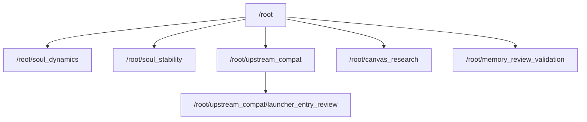

# 星杳 · 璇玑聊天档案

任务：检测 F 盘健康状态

本次快照时间：2026-09-18T05:39:01.389Z。共 7 个任务身份、12 个历史片段、4856 条可见消息与工具记录。

此档案应用户要求上传到公开仓库。保留用户与助理对话、子智能体之间的协作消息、工具调用及结果；密钥、访问令牌等凭据值已脱敏。系统和开发者指令、隐藏推理与内部运行上下文不在导出范围内。原始日志没有保存或已经截断的内容无法补回。

导出为时间点快照，之后的新消息不属于本次快照。主任务的历史片段全部保留；子智能体可能包含继承的对话上下文，未按相似文本删除。

| 历史片段 | 身份 | 对话/协作消息 | 工具调用/结果 | 文件 |
| --- | --- | ---: | ---: | --- |
| 1 | /root | 31 | 41/41 | [阅读](01-root.md) · [JSONL](01-root.jsonl) |
| 2 | /root | 1 | 0/0 | [阅读](02-root.md) · [JSONL](02-root.jsonl) |
| 3 | /root | 1 | 0/0 | [阅读](03-root.md) · [JSONL](03-root.jsonl) |
| 4 | /root | 2 | 1/1 | [阅读](04-root.md) · [JSONL](04-root.jsonl) |
| 5 | /root | 443 | 1010/1010 | [阅读](05-root.md) · [JSONL](05-root.jsonl) |
| 6 | /root/soul_dynamics | 59 | 134/134 | [阅读](06-root--soul_dynamics.md) · [JSONL](06-root--soul_dynamics.jsonl) |
| 7 | /root/soul_stability | 38 | 92/92 | [阅读](07-root--soul_stability.md) · [JSONL](07-root--soul_stability.jsonl) |
| 8 | /root/upstream_compat | 155 | 407/407 | [阅读](08-root--upstream_compat.md) · [JSONL](08-root--upstream_compat.jsonl) |
| 9 | /root/upstream_compat/launcher_entry_review | 7 | 12/12 | [阅读](09-root--upstream_compat--launcher_entry_review.md) · [JSONL](09-root--upstream_compat--launcher_entry_review.jsonl) |
| 10 | /root/canvas_research | 53 | 182/182 | [阅读](10-root--canvas_research.md) · [JSONL](10-root--canvas_research.jsonl) |
| 11 | /root/memory_review_validation | 8 | 53/53 | [阅读](11-root--memory_review_validation.md) · [JSONL](11-root--memory_review_validation.jsonl) |
| 12 | /root | 33 | 81/80 | [阅读](12-root.md) · [JSONL](12-root.jsonl) |

[导出清单与文件校验](manifest.json)记录来源、排除类别、脱敏计数和 SHA-256。JSONL 包含对应片段的完整可导出工具记录。

子智能体关系：

