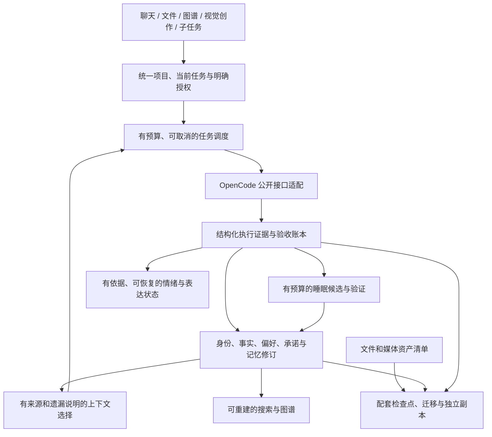

# 星杳 · 璇玑架构反省：长期正确性优先

审查日期：2026-09-17（Asia/Shanghai）。审查基线为已发布 `0.1.0-dev.4`、源码提交 `364beb5`。文件工作区前端和 `src/workspace-files.ts` 是工作树中的未发布草稿，单独注明，不把草稿当成已交付功能。

后续修复说明：本文保留 `.4` 历史结论和当时代码行号；`.5` 对证据、承诺、修订、时间及 schema 恢复边界的修复另见 [证据修复说明](evidence-fixes-2026-09-17.md)。没有修改修复前审计报告。长期质量、容量与资产迁移等未解决项仍适用。

本次回应的问题是：整个架构有什么问题、最不确定什么、连续使用三个月后可能怎样失效。结论依据源码审阅、隔离夹具和现有发行证据，不读取真实用户资料库或模型凭据，不对正式身份进行实验。

**判断：独立身份与领域库、公开执行适配层、来源修订、可恢复发行的方向值得保留；当前仍是受监督试用的工程原型，尚未证明可以承担长期主力助理。下一阶段应先修复事实与结果的判定链，再完成记忆质量、项目边界和恢复能力的闭环。**

## 1. 我需要纠正的设计与开发方法

1. 功能展开过快。文件、图谱、人格、睡眠、技能、便携恢复、画布和子智能体都有合理用途，但模块数量不能证明它们合作时有用。尚未完成真实中文任务的长期闭环评估，就扩展更多入口，是优先级错误。
2. 过早相信状态名称。设计明确要求真实执行证据，实际实现却把上游工具 `completed` 直接解释成成功。来源真实，不代表对来源的解释正确。这个错误会跨过多个模块传播。
3. 对“已实现”的描述需要更窄。现在的睡眠是确定性工具事件归档；学习是人工方法候选加工具结果计数；情绪只响应工具成功和失败。这些是基础构件，不能等同于理解主人、反思或持续成长。
4. 工程测试覆盖没有转化为效果证明。`.4` 的 211 项测试、类型检查、真实引擎和编译后浏览器验证有价值，但模型端使用确定性本地夹具，不证明真实模型的记忆归属、纠错、人格连续性或任务收益。
5. 发行流程已经暴露过检查顺序问题。此前 `.3` 安装后发现图布局重叠，再通过 `.4` 修正。已加入编译制品的浏览器门禁；以后核心语义与恢复验收也必须先于安装。

## 2. 已确认的问题与明确边界

P0 表示扩大真实使用和自动学习前必须解决；P1 表示进入长期主力使用前必须补齐；P2 表示后续改善。这里的优先级不代表已发生用户数据损失。

| 编号 | 优先级 | 事实与代码依据 | 用户后果 | 修正方向 |
| --- | --- | --- | --- | --- |
| A01 | P0 | `adapter.ts:265` 按工具生命周期 `completed` 归一化，丢弃 `state.metadata`；`server.ts:109` 映射为 `succeeded`。上游 shell 对非零退出仍可返回 completed，退出码在 metadata 中。 | 失败可以被记录成成功，进入正向情绪、睡眠情节和技能成功样本。整项任务仍需人工确认，不能把这个局部缺陷夸大为任务自动验收。 | 保留结构化执行证据；分开生命周期、操作结果、任务后置条件和主人验收。未知结果维持未知；不能用输出文本猜测成功。 |
| A02 | P1 | `store.ts:259` 的投影将固定记忆与普通记忆共用 6500 字符预算，超长条目直接跳过；`server.ts:215` 又将省略 pinned 的 commitment 显式传成 false，覆盖领域层默认固定规则。 | 即使“固定保留”，也可能没有进入本轮上下文；固定承诺过多时会静默遗漏。 | 修复 API 默认值，返回包含/省略原因；明确约束单独编译并检查预算，必要约束无法表示时明确失败或缩减其他上下文；操作授权必须由执行边界落实。 |
| A03 | P1 | `web/app.js:91` 新任务固定为 `global`；知识检索和图谱按指定范围加共享 global 工作。 | 多个项目的资料可能被用户误放入共享区；这属于默认上下文和交互问题，本次没有发现 SQL 范围过滤绕过。 | 稳定项目 ID 贯穿项目根、任务、资料、记忆和权限展示；共享需显式选择，不能把“没有选项目”自动当作“所有项目共享”。 |
| A04 | P1 | `checkpoint.ts:159` 复验每个历史代次，`:197` 创建时先扫描全部历史，再 `VACUUM INTO` 和全量复制；引擎库同样全量保存。没有容量配额与快照保留流程。 | 同步/启动等待随历史增长，F 盘容量被多份全量快照消耗。 | 先实测，再建立空间预检、保留政策、验证缓存与周期完整巡检。清理须保留父代/分叉证明和恢复底线，不可简单删旧目录。 |
| A05 | P1 | `main.ts:28` 活动库在宿主，便携检查点在 F 盘；备份不是所有原始文件、附件、依赖和凭据的完整迁移。文件编辑草稿也不在已发布检查点覆盖内。 | “已保存”可能被误解为“所有内容已经带走”。突拔后最新内容可能留在旧电脑；丢盘又离开旧电脑时缺少独立恢复源。 | 分开显示编辑草稿、原文件、宿主提交、便携检查点、独立备份。建立资产清单、缺失检测和新机恢复演练。 |
| A06 | P1 | `engine-backup.ts:94` 只恢复相同 engineVersion；`:145` 只认固定库名；适配器仅支持 legacy HTTP。领域检查点只接受当前 schema。 | 更新后旧备份或旧会话可能需要迁移；当前机制会拒绝不明确的恢复，这是保护，不是未来版本兼容已经完成。 | 产品、引擎哈希、适配器、数据 schema 和迁移能力组成发行单元。在复制分支上升级和续接会话，通过后切换；原数据和旧发行仍保留。 |
| A07 | P1 | `store.ts:277` 睡眠只将工具成功/失败经历复制为情节；`affect.ts:61` 情绪只评价这两类事件。`learning.ts:145` 按独立工具调用计算候选统计。 | 她可能记得大量命令输出，却不能自动理解主人改变的偏好；几条工具结果也不能证明某个方法使任务改善。 | 明确事件摘要、个人事实、偏好、承诺、方法经验的不同目标；加入归属、变化与冲突评估。方法评估绑定实际采用的方法版本和任务验收，数值不宣称为通用能力概率。 |
| A08 | P1 | `store.ts:184` 已有活动域的来源撤回和删除标记，但历史检查点、上游原生会话、原文件和 GitHub 聊天归档不在同一次删除中。 | 当前记忆页不再出现，不等于历史副本都被擦除。旧会话里的说法还可能影响回答。 | 定义每一份副本的保留和删除语义；旧版本恢复、会话续接、索引重建必须重新应用删除/纠正规则，并清楚报告覆盖范围。 |
| A09 | P2 | `knowledge-graph.ts:193` 文档先占节点额度，记忆随后加入；前端名称/类型筛选和邻居仅作用于已加载图。默认图不是全库查询。 | 文件多了以后，切到“记忆”可能空白，造成“忘了/没有关系”的错觉。 | 后端全库搜索、按节点取邻居、分页及类型配额；全局概览保持有限，具体查找必须能查到未加载节点。 |
| A10 | P1 | `adapter.ts:134` 取完整会话，`server.ts:132/142` 每轮前后都取历史；`store.ts:104` 全量反序列化记忆再过滤排序；`learning.ts:124` 全量读经历账本。工作台每 2.5 秒轮询任务数据。 | 长会话、长期经历和任务数增加后，反复传输和扫描变重。达到什么量级出现明显延迟尚未测量。 | 以测量驱动分页/增量对账、索引列和读取投影；给单次调用和后台任务设有界工作量，保持一个领域写入者。 |
| A11 | P1 | `store.ts:340` 的经历来源键包含动作 revision，睡眠以事件 ID 去重。一个 actionId 的三次结果修订产生三个事件。 | 同一次操作的结果变更会重复推动情绪、生成多份情节；并非又完成了三次工作。 | 区分根动作、结果修订和独立尝试，结果修订纠正既有经历；保留审计历史但只使用当前有效版本影响状态。学习统计已按 actionId 合并，不能把该缺陷扩大到所有计数路径。 |
| A12 | P2 | `store.ts:132` 记忆创建时间是整理时刻，`affect.ts:99` 据此计算年龄；新鲜度仅占查询评分的 10%。 | 很久以前的经历晚整理后会重获完整新鲜度。当前缺少自动压缩、归档和完整选择性遗忘，14 天半衰期不代表整条召回评分每 14 天减半。 | 分开事件时间、记录时间、最后验证时间和访问时间；整理不重置事实年龄。针对承诺、稳定事实、临时偏好和日志采用不同保留规则。 |

另一个升级相关的风险是情绪重建：`store.ts:249` 使用当前公式重放有效经历，`experience_policy` 仅记录开关，没有绑定当时的计算参数版本。未来更换公式后，一次纠正可能连带改变整段历史状态。应显式版本化参数，并将历史重算作为可比较的迁移；当前尚未进行跨公式版本复现。

补充的边界：`server.ts:63` 的检查点排除产品已知的前台作业，`main.ts:95` 的常规引擎备份并未停止引擎。没有复现跨库不一致，但不能据此证明未来引擎的后台写入均已停止。上游升级验收需要明确的静默屏障和联合恢复测试。

当前文件编辑草稿尚无完整保存/故障测试，存在发布期间并发写入、恢复路径验证和未保存编辑草稿持久化的待解决项。类型检查和浏览器构建通过不构成文件编辑器可交付证明；本次没有集成或安装它。

## 3. 最不确定的是什么

最大的未知是：**长期对话之后，系统能否提取属于主人的正确记忆，在合适的时候找到它，并在主人改变说法后及时停止使用旧结论。**

这不是选择哪个图数据库就能回答的问题。需要分别测试：

- 归属：主人说的、别人说的、引用文档说的、助手猜的，能否区分。
- 时效：去年有效的偏好、临时决定、已经完成的承诺，是否仍被当作当前约束。
- 冲突：新说法是纠正旧事实、改变偏好，还是仅在另一个项目适用。
- 召回：记住了但没取出来，与从未保存，是不同错误；中文近义表达尤其需要验证。
- 可信度：没有证据时是否明确“不知道”，而不是用连贯叙事补齐。
- 连续性：更换模型后，事实、承诺和边界仍稳定；表达风格的变化不能假装成有依据的人格成长。

次要但重要的未知是情绪机制是否改善相处体验。当前 5 分钟短时半衰期和 3 小时心境参数是工程起点；没有用户体验实验支持它们。应先让状态有真实触发、适度表达、可恢复，而不是增加维度或公式数量。真实存在持久化状态，不等于已经证明主观感受。

存储和性能也有不确定性，但更容易测量。实体换机、真实拔盘、空间不足和迁移尚未完整验证，不能用同一机器的临时目录测试替代。

## 4. 三个月后的故障预演

以下是有条件的情景推演，不是事故统计，也没有给未测量的概率。

| 时段/触发条件 | 可能先出现的症状 | 机制与提前观察 |
| --- | --- | --- |
| 第一周就运行失败命令 | 任务实际失败，情绪或经历却记成成功 | A01 无需等待数据增长就会触发；检查退出码、动作结果与学习来源是否一致。 |
| 2–4 周，项目增多、主人改变偏好 | 她记住旧习惯、混用另一个项目资料，需要反复纠正 | A03/A07；观察错归属、使用失效记忆、重复纠正和成功召回率。 |
| 1–2 个月，长期会话与工具日志增加 | 回答前等待变长，睡眠复制很多流水记录，保存变慢 | A04/A10；记录每轮历史字节数、记忆扫描量、检查点字节数/时长及维护积压。 |
| 资料达到图谱额度 | 搜索或类型切换看不到已有记忆，误以为丢失 | A09；核对全库计数和已加载计数，追踪后端截断原因。 |
| 期间首次上游升级 | 新引擎正常启动，但旧数据恢复或会话续接受阻 | A06；“能启动”和“能恢复旧身份继续工作”必须分别验收。 |
| 第一次仓促拔盘或换新电脑 | 最近内容留在旧电脑、媒体缺失、模型需要重新配置，或分叉要求处理 | A05；界面展示最后便携提交、缺失资产和宿主分支，不用含糊的一个“已保存”概括。 |
| 连续 90 天增加全量代次 | F 盘空间压力和同步延迟成为日常阻碍 | 容量约等于各代快照大小之和。假设平均每代 200 MB、每日 10 代、90 天约 180 GB，已超过约 114.59 GiB 的 F 盘容量；这是示例，不是实际增长预测。 |

最需要防止的整体结局是：界面越来越完整、记录越来越多，但主人越来越不相信她记住的事情和“已经完成”的报告。单纯多加模型、多加子智能体会增加这条错误链的放大机会。

## 5. 保留骨架，调整职责

继续保持 Bun 单进程服务和 SQLite 单写入者；当前没有证据支持为每个模块增加独立进程、Python 服务或图数据库。Cytoscape 保留为图谱视图，Infinite Canvas 保留为视觉创作入口，OpenCode 保留为执行引擎。

实施重点是明确以下职责：

- **证据和验收**：操作结束、命令结果、用户目标实现、主人确认是四个不同结论。保留退出码、取消/超时和可检查的成果；只有适用证据才能更新经验。
- **记忆和自我认识**：原始经历、当前认识、偏好、承诺、自我描述分开保存；自我描述从有效事件生成，不能反过来当作新事实或经历。
- **项目和授权**：项目 ID 控制上下文选择，执行权限控制实际操作；记忆 scope 不是操作系统沙盒。未来子智能体继承明确任务和资源范围，不能只继承一大段聊天。
- **调度和预算**：前台、睡眠、媒体生成、子任务共用任务归属、超时、取消、费用与并发预算；过期结果提交前复验来源修订。现在的作业 Map 和空闲轮询尚不是这个完整调度器。
- **可携带数据**：资产清单区分内置资产、外部引用、敏感配置和不可携带依赖；画布 IndexedDB 不能成为媒体唯一副本。原文件保存和系统检查点是不同提交。
- **可解释性**：每次回答能查询使用了哪些记忆和文档修订、哪些内容因范围/预算被排除、结果如何验收。记录必要诊断元数据，避免额外永久复制所有私密正文。

“灵魂”落实为这些状态随真实经历有连续、可解释的变化。温暖、有主见、稳定来自长期行为的一致性，包括坦诚承认未知和及时修正；不需要用更强烈的情绪或更多自述去填补事实链缺口。

## 6. 下一轮开发顺序与验收门槛

1. **修复结果语义，再扩大自动学习。** 覆盖非零退出、正常退出但后置条件不满足、超时、取消、权限拒绝、重复回传与缺少元数据。按工具契约判定：例如搜索的非零退出可能表示没有匹配，不能换成另一条全局粗略规则。历史可疑记录应从原始证据重核，无法核实的降为待核实，并让相关派生经验重新审阅；修复新数据的同时处理旧证据的影响。统一根事件去重，整理保持原事件年龄。
2. **完成项目上下文和必要约束。** 任务、资料、图谱与执行目录明确对应；默认不跨项目共享。用长承诺、多个固定规则、私密选择和 scope 变化验证上下文省略可见、必要约束不静默丢失。
3. **建立中文长期质量评估。** 首批 20–30 个任务同时有无记忆对照，包含同名人物、引用他人、否定、临时偏好、改口、跨项目及旧会话；通过用户纠正记录扩充。事实正确性、来源准确性和任务收益分别评分，不能只让另一个模型评价“像人”。
4. **建立容量和恢复闭环。** 压测模拟 90 天的数据规模；记录查询、检查点和恢复时间。先设计保留与父代规则，再实现可审阅清理；完成全新宿主、媒体缺失、满盘、故障中断、上游候选迁移和旧会话续接演练。
5. **再推进文件编辑、子智能体与视觉创作。** 文件编辑先完成并发冲突、可恢复草稿和中断保存；子任务先完成父任务/预算/权限/结果映射；Infinite Canvas 先完成资产、凭据和任务桥接，再做交互整合。

建议的硬性回归门槛是：不能把明确失败记成成功、不能静默混入不适用项目资料、不能把已纠正/删除内容通过派生索引重新激活、不能在恢复验证失败后声称数据已经带走。性能和记忆质量阈值需在实际工作负载上测量后确定，不凭空承诺数值。

## 7. 审查证据与本次交付边界

隔离复现脚本为 [audit-soul-2026-09-17.ts](../script/audit-soul-2026-09-17.ts)，运行 `bun run script/audit-soul-2026-09-17.ts`。机器可读结果保存在 `reports/architecture-audit-2026-09-17.json`。脚本使用真实产品 adapter/server/store 路径和合成 HTTP 上游消息；健康检查、会话创建由夹具提供，没有调用公网模型、启动真实失败命令或读取正式数据。根审查者已经独立重跑脚本并核对上游 shell/processor 源码。

| 复现输入 | 实际观测 |
| --- | --- |
| `completed + exit=1`、`completed + exit=null`（超时）、`completed + exit=2` | 三个动作均为 succeeded，三条 tool_success，睡眠新增三条 episode；技能经审计脚本显式启用后统计为三成功、零失败、0.8。0.8 是内部计数推导值，不是实测技能成功率。 |
| 7028 字符的固定 commitment | 投影没有该条记忆，最终只有 176 字符基础描述，没有溢出说明。 |
| 经 HTTP 创建 commitment，省略 pinned | 保存结果 pinned=false，未被无关查询中的固定约束路径选入。 |
| 同一调用连续三个成功结果修订 | 一个动作、三个事件、三条睡眠记忆；情绪正向维度依次为 0.175、0.30625、0.4046875。 |
| 第 0 天发生，第 90 天才归档 | 新鲜度为 1；按原事件年龄及现有 14 天参数计算应约为 0.011609。 |

技能夹具还说明一个边界：任意方法描述可以绑定所选工具结果，并被显式启用。后来另外十次失败调用没有改变这份候选的统计；这本身不能判为统计更新 bug，因为没有“这些调用采用了该技能”的归因记录。它证实实际使用与效果评估的闭环尚未建立。

现有测试遗漏的原因也已定位：`test/adapter.test.ts:77` 的失败案例采用 `state.status='error'`；`test/learning.test.ts:26` 根据子进程退出码直接生成正确动作状态，跳过了出错的 adapter → server 转换。需要补贯穿调用链的真实结果契约，不能只增加领域层成功/失败样例。

- 历史 `.4` 发行验证见 [verification-graph.md](verification-graph.md)：211 pass、0 fail、0 skip；它不包括本次新增审计案例，也不证明公网模型效果。
- 本轮已重跑隔离审计脚本和 `bun run typecheck`，执行成功；审计脚本记录了上述缺陷，执行成功不等于产品缺陷已修复。
- 本轮另外重跑 `bun test`：211 pass、0 fail、8230 个断言、23 个测试文件，62.24 秒；输出在 `reports/architecture-review-tests-2026-09-17.txt`。原测试套件仍全部通过，同时审计夹具仍能复现缺陷，进一步确认需要补齐结果语义的测试覆盖。本轮没有重新构建、做发行浏览器验收或安装制品。
- 已实现与未实现的范围见 [implementation-status.md](implementation-status.md)。
- 上游和便携兼容验证见 [opencode-patches.md](opencode-patches.md)。
- 本次发现的缺陷属于尚待修补的问题；没有因此改写真实身份、清理备份或安装下一版。
- GitHub 聊天归档属于一次单独发布的快照，不是可恢复的完整产品备份，也不是自动跟随本地删除的存储副本。

审查不是对所有风险穷尽的证明。最有价值的下一份证据应是：修复后的结果链回归、真实中文记忆纠错的对照结果，以及从独立副本在新宿主恢复同一身份完成任务。
