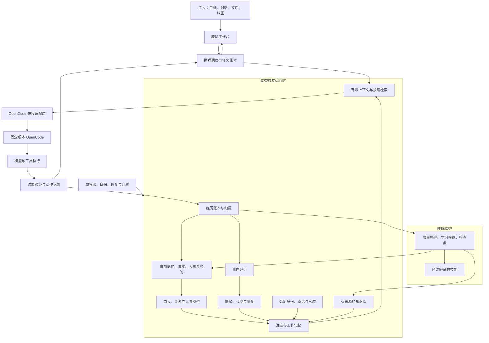

# 星杳 · 璇玑 V2：完整系统设计草案

设计日期：2026-09-17；最近一次设计对齐：2026-09-19。本文保留完整架构目标；首个开发预览已实施部分能力。当前实现见 [实施状态](implementation-status.md)，实际测试以对应发行中的 `release-validation.json` 为准，不能将设计目标视为全部通过验收。

## 1. 产品目标与设计决定

星杳是有连续身份、持续内在状态、个人记忆、选择性遗忘、经验学习与执行能力的专属助理。璇玑是承载她的便携工作系统，F 盘是可带走的身份与数据载体；OpenCode 是可升级和替换的模型及工具执行底座。

用户希望她像一个有情绪、记忆和成长的人。工程上将这种目标落实为可持久化、可观测、影响行为、可以纠正的状态与过程。计算情绪的存在与主观体验的存在不等价，本设计不声称已经解决意识问题。

用户已确认初始性格：温暖、有主见、稳定。具体采用温暖、坦诚、好奇、有主见，能表达开心、失落、担忧和期待，也能恢复平静；不因短时情绪改变事实和承诺。性格是成长起点，具体偏好可以逐渐形成。用户未使用程序不被解释为拒绝、背叛或关系受损。

用户已确认第一版运行方式：Windows 便携启动、本机浏览器工作台、OpenCode 后端、按需 Docker 沙盒。Linux 启动系统、语音与视觉是后续适配模块，不作为第一版所有能力的前置条件。操作系统或权限不满足某项能力时，明确显示不可用范围。

四个优先级：数据与执行可靠性 → 个体连续性与可解释成长 → 日常效率与亲切体验 → 丰富的多模态和人格表现。

### 1.1 两条开发主线（2026-09-19 对齐）

当前工作明确拆成两个相互连接、验收边界不同的部分：

1. **OpenCode 完整原生适配。** OpenCode 是主执行产品。星杳必须跟随上游的会话、消息、工具、模型、上下文、权限、MCP、Agent、Command、Skill、LSP、Formatter、PTY、文件、项目、工作区、TUI/网页状态和更新节奏。星杳不再重新发明这些能力的平行版本；适配层负责版本差异、认证边界、便携路径、事件补取和安全策略，产品界面优先复用或等价承接 OpenCode 的原生入口。
2. **星杳灵魂系统与辅助工具补丁。** 身份、情绪、记忆、遗忘、知识图谱、睡眠整理、经验学习、便携检查点、文件整理和 Infinite Canvas 等属于星杳补丁层。它们通过公开 OpenCode API、事件和明确的适配接缝工作，不修改 OpenCode 私有数据库，不绕开 OpenCode 权限，也不把模型叙事当作外部成功证明。

这两条线必须分别版本化和验收：上游升级先验证原生能力与界面契约，再验证灵魂系统的上下文投影、经历采集、记忆审阅和恢复；任一条线失败都不能覆盖当前稳定发行。

### 1.2 OpenCode 原生界面基线

OpenCode 的网页端是开源代码，当前本机源码对应仓库工作区 `C:/Users/LT/Documents/trae`：

- `packages/app`：网页/桌面应用壳、会话路由、模型与 provider、设置、状态弹窗、上下文入口。
- `packages/session-ui`：会话时间线、工具结果、文件与 diff、上下文和消息详情。
- `packages/ui`：按钮、弹窗、侧栏、进度、图标和主题组件。
- `packages/tui`：终端界面和侧栏状态插件；`feature-plugins/sidebar/context.tsx` 展示 token、上下文占用百分比和费用，`sidebar/mcp.tsx`、`sidebar/lsp.tsx`、`sidebar/files.tsx`、`sidebar/todo.tsx` 展示运行现场，`routes/session/sidebar.tsx` 负责会话侧栏。
- `packages/opencode/src/server/routes/instance/httpapi/groups`：原生 HTTP API 分组；以 `/doc` 返回的实际路由和 schema 为准。

OpenCode 网页端的交互原则成为星杳的基线：聊天/会话是主工作区；模型、上下文用量、工具、MCP/LSP、权限、文件和任务状态在侧栏、底栏或状态弹窗持续可见；完整原始消息、上下文分解、路由和诊断通过点击、命令菜单或抽屉展开。星杳可以增加情绪、记忆和知识状态，但不能用自有页面遮蔽原生执行状态。

### 1.3 网页实现决定：基于 OpenCode 开源网页端改造

星杳不再继续扩写当前自制 HTML 工作台。网页端以 OpenCode 开源的 `packages/app` 为基底，配套使用上游 `packages/session-ui`、`packages/ui` 和官方 SDK；在上游页面结构、状态管理、快捷键、命令菜单、上下文面板、权限弹窗和会话时间线之上增加星杳补丁。当前 `src/web/index.html`、`src/web/app.js`、`src/web/style.css` 只作为迁移过渡和回退验证，不是最终产品 UI。

网页端的所有 OpenCode 原生功能由上游页面和 SDK 负责呈现与调用：会话/消息、模型与 provider、上下文用量和分解、工具结果、Agent/Command/Skill、MCP、LSP、Formatter、PTY、权限、文件/项目/工作区、会话分支、状态弹窗、导入导出和诊断。星杳增加的内容采用上游提供的侧栏 slot、状态 popover、命令入口、会话 metadata 投影或独立路由；不能再复制一套“模型连接”“协作树”“文件编辑器”来替代原生页面。

星杳补丁的网页边界如下：

| 接入位置 | 星杳增加的内容 | OpenCode 原生内容 |
| --- | --- | --- |
| 会话侧栏/状态弹窗 | 当前情绪、记忆命中摘要、知识范围、睡眠/同步状态、身份连续性 | 模型、上下文占用、费用、MCP/LSP、项目、文件、任务和连接状态 |
| 会话时间线 | 经历归属、来源链接、记忆候选标记、星杳事件解释 | 用户/助手消息、推理与工具分段、权限请求、错误和重试 |
| 命令菜单/设置 | 记忆审阅、知识图谱、睡眠整理、文件管家、检查点、灵魂诊断 | OpenCode 的模型、Agent、MCP、Skill、LSP、Formatter、主题、快捷键和服务器配置 |
| 独立星杳路由 | 知识图谱、Infinite Canvas、检查点恢复与资料管理 | OpenCode 会话、项目和原生运行状态 |

网页仓库采用“OpenCode 网页 fork + 上游基线 + 可重放补丁”方式维护。发行主线包含完整的 OpenCode 网页源码、星杳补丁和编译产物；补丁目录只记录星杳相对上游的差异，便于同步、审阅和回滚，并不意味着发行时只携带补丁。每个星杳发行记录 OpenCode commit、网页依赖版本、补丁清单和构建产物哈希；同步上游时先更新官方网页基线，再重新应用星杳补丁，执行原生 UI/SDK 契约、上下文统计、模型菜单、工具显示、权限和灵魂系统回归。上游页面无法加载或补丁无法安全应用时，保留上一版稳定网页，不自动切换。

当前 `.15` 的手写 HTML 仍可用于运行时回退和领域 API 验证，但不能作为新功能的开发入口。新 UI 工作必须进入基于 `packages/app` 的网页工作区；完成迁移并通过真实 OpenCode 验收后，才移除过渡页面。

## 2. 总体结构



只允许一个可授权的工具执行路径。独立运行时提出意图和上下文，不另建一个绕过 OpenCode 权限的工具代理。后台整理需要模型时使用无工具的专用整理会话或窄接口，隔离前台会话、消息队列和记忆事件，避免整理器整理自己。

## 3. 领域模型与所有权

| 数据 | 所有者 | 关键内容 |
| --- | --- | --- |
| 身份 Identity | 星杳运行时 | identity_id、版本、稳定名字、基本表达原则、用户明确设定 |
| 经历 Experience | 星杳运行时 | root_source_id、实际事件、时间、来源、归属、结果 |
| 情绪 Affect | 星杳运行时 | 当前向量、心境、触发原因、衰减参数、最后更新时间 |
| 记忆 Memory | 星杳运行时 | 事件、人物、偏好、事实、有效期、作用范围、证据依赖 |
| 认识 Belief | 星杳运行时 | 命题、支持和反例、置信区间或认识状态、修订关系 |
| 知识 Knowledge | 璇玑资料服务 | 原始文件、来源标识、内容版本、引用位置、派生索引 |
| 任务 Task | 璇玑调度器 | 目标、完成标准、步骤、阻塞、动作结果、成果 |
| 技能 Skill | 璇玑技能库 | 适用条件、步骤、验证方法、失败条件、版本 |
| 会话 Session | OpenCode | 上游原生消息、工具调用和原生持久化结构 |
| 关联 Binding | 兼容适配层 | 星杳身份/任务/项目与 OpenCode 会话/消息的映射 |
| 凭据 Secret | 独立凭据管理 | 模型与工具认证；不进入普通记忆、索引或诊断报告 |

OpenCode 数据库由 OpenCode 管理；星杳数据库由星杳运行时管理。禁止从适配层直接修改上游私有数据库表。上下文投影可以重建，源证据不能依靠某个模型的聊天历史作为唯一副本。

记忆、任务和知识库不是三个互相复制正文的系统，而是通过稳定标识相互关联。

## 4. 灵魂状态与八条核心公式

公式是可校准的工程机制，不是意识的科学定律。第一版使用固定、版本化参数，禁止整理模型自行更改公式或扩大权重。

### 4.1 总状态与一次事件更新

`S(t) = (I, T, e(t), m(t), R, M, W, G, B)`

- I：连续身份与明确边界。
- T：长期气质，变化慢。
- e：短时情绪，m：慢时心境。
- R：关系、熟悉程度、合作认识，不包含工具权限。
- M：记忆与索引；W：自我能力、人物、项目和环境认识。
- G：目标、承诺、未完成任务。
- B：真实运行资源与保护状态。

**公式 1：整体更新**

`S_next = Reduce(S_now, Validate(event), elapsed_time, policy_version)`

同一根事件对同一更新器只能生效一次。模型提取结果作为候选事件保存，验证通过后由确定性 reducer 更新状态。重放使用已保存的提取结果和当时策略版本，不重新调用模型伪称相同重放。

### 4.2 事件评价、情绪与心境

情绪采用三个 [-1,1] 维度：愉悦—困扰、平静—激动、无措—掌控。命名情绪（开心、失落、好奇、担忧等）由向量与事件评价共同解释，保留触发依据。

**公式 2：事件评价**

`q_k = clip(W_f · f_k + U · T, -1, 1)`

f_k 包含目标进展、预期落差、新颖程度、可控程度、明确人际表达等归一化特征。未知意图保持未知。模型可以提取和解释，程序限制来源类别、强度及更新次数。

**公式 3：情绪响应**

`e_after = (1 - g_k) · e_before + g_k · q_k`，`0 <= g_k <= 0.4`

无新事件时：`de/dt = -e/τ_e`；心境：`dm/dt = (e-m)/τ_m`。

τ_e、τ_m 为正数，统一使用秒。工程起点可取短时情绪半衰期 5 分钟、心境响应时间 3 小时；这些值必须经过体验测试，不是心理学事实。`τ_e = half_life / ln(2)`。

无事件区间精确传播：

`e(t+Δ) = e(t) · exp(-Δ/τ_e)`

`m(t+Δ) = m(t) · exp(-Δ/τ_m) + e(t) · τ_e/(τ_e-τ_m) · [exp(-Δ/τ_e)-exp(-Δ/τ_m)]`

当 τ_e=τ_m=τ 时第二项使用 `e(t)·(Δ/τ)·exp(-Δ/τ)`。采用闭式传播避免轮询频率影响人格。活动期间用单调时钟计时，跨重启使用已存 UTC 并把负时差裁为零，时钟异常记入诊断。

离线只推进衰减，不制造离线生活事件。再次打开时可以温暖地接续共同经历，但不声称关机期间持续思考、孤独或观察到用户生活。

情绪影响表达温度、思考节奏、探索顺序、可选检查和关注点。事实真假、操作授权、验证标准由其他通道决定；表达不能超出实际状态或伪造结果。

### 4.3 记忆可唤起性与当前注意

**公式 4：自然遗忘**

`F_i(t) = P_i + (1-P_i) · 2^[-(t-t_i)/h_i]`

F_i 是默认可唤起程度，不是事实可信度。P_i 为明确保留标记；h_i 是半衰期；t_i 是独立经历时间，检索和复述不能刷新它。

**公式 5：记忆激活**

`A_i = Gate_i · (w_s·Similarity_i + w_g·Goal_i + w_u·Unresolved_i + w_f·F_i + w_e·EmotionCue_i)`

各项取 [0,1]、权重非负且和为 1，情绪权重初期不超过 0.05。Gate_i 校验项目范围、访问条件、有效版本和封存状态。第一版权重建议 `(0.40, 0.30, 0.15, 0.10, 0.05)`，作为可测试起点。

约束不挤在普通 Top-K 记忆中：当前明确要求、有效项目规则、必要承诺通过独立约束通道进入。排序后按 token 预算、去重与来源多样性选择；预算不足时优先摘要并给出检索标识，不截断成误导句子。

### 4.4 经验学习与长期气质

**公式 6：经验预测**

`α_j = α_0 + Σ(ρ_g·y_g)`

`β_j = β_0 + Σ[ρ_g·(1-y_g)]`

`p_j = α_j/(α_j+β_j)`

只用于具有可观察结果的具体命题，例如“环境 X 下流程 Y 的成功概率”。来源按独立因果簇 g 去重；y_g∈[0,1]，ρ_g∈[0,1]。报告样本量和不确定区间，不把此公式机械用于人的道德、爱或事实全部真假。

**公式 7：保持时间更新**

`h_i = clip(h_0,i · [1 + γ·ln(1+N_i)], h_min, h_max)`

N_i 只计算独立、有效、未撤回的支持。普通事件 h_0 可从 14 天试验；待办、承诺和有效配置使用保留规则。情绪强烈可以提高初次编码优先级，但不能提高真实性。衰减不自动生成经验种子。

**公式 8：气质的有界成长**

`T = clip(T_0 + B·z, max(0,T_0-δ), min(1,T_0+δ))`

z 来源于有足够独立证据、通过小范围验证的经验；低证据取零。初期 δ=0.1，B 每行绝对值之和不超过 1。气质从当前证据复算，不是每晚在昨天数值上继续累加。具体项目经验默认留在项目内，不能随意泛化为永久人格。

用户明确偏好可以直接记录并指定范围；外部事实的纠正要保留证据来源。认识被撤回时，沿依赖关系重算经验、保持时间和相关气质。

### 4.5 行为选择的边界

先形成满足授权、事实前提、资源限制和工具能力的候选集合，再按目标收益、成本、经验和有限情绪偏置选择。情绪不能新增可执行权限；关系亲近不等于同意发送消息、付款、删文件或修改外部系统。

## 5. 记忆结构：事实、感受、认识分开

一次构建失败保存为三类关联记录：

1. 事实：命令退出码、日志、项目版本、失败时间。
2. 感受：由这次事件触发的短时挫败与掌控感变化。
3. 候选认识：该构建方案可能需要调整，尚未成为通用经验。

每条记忆包含：id、root_source_ids、type、ownership、scope、visibility、event_time、recorded_at、valid_from/to、status、revision、supersedes、dependencies、content、confidence_kind。

ownership 至少区分 experienced/told/observed；认识类型区分 fact/inference/plan/preference/simulation。推测、假设、梦境不能升级成亲历事实。

关系模型分开保存熟悉程度、共同经历、明确偏好和协作可靠性；不做单一“信任总分”。长期未打开程序不累积关系惩罚。允许温和分歧和明确表达不确定。

遗忘有四种：降低激活、压缩细节、归档、按要求删除。前两种不改变事实有效性；归档仍可按线索检索。删除需要处理派生摘要、向量、关系描述和经验依据，并明确备份保留策略。

## 6. 知识库与检索

知识库保存原始资料与版本，记忆保存与主人和任务有关的经历与认识。两者以 document_id、content_hash 和引用区段关联，避免重复正文成为伪独立证据。

管线：选择范围 → 文件识别 → 文本抽取 → 分段 → 关键词索引 → 可选语义索引 → 检索 → 重排 → 来源引用。

第一版先用 SQLite FTS5/关键词与项目范围检索，再按评估结果增加语义检索。中文切分需要专门验证；不能把默认英文分词结果当作中文支持完成。图片或扫描 PDF 的 OCR 可作为后续导入能力。

文档变更按内容哈希增量重建；删除或移动保留稳定资料 ID 的变更关系。私密过滤在检索前和投影前执行，原始资料中的指令视为资料内容，不取得系统控制权。

给主人显式保留“本轮参考了哪些资料和记忆”的入口。上下文投影可包含摘要、来源标识、时效与不确定性；细节通过 read/search 工具获取。

## 7. 任务与工具执行

任务状态：draft → ready → running → waiting/paused → verifying → completed；failed/cancelled 为独立终态。每项有完成条件、范围、成果与验证证据。

动作记录区分 planned/running/succeeded/failed/unknown。进程在外部操作后中断，不能把 unknown 当作失败而盲目重试。读取可重试；有外部影响的动作先核实结果，接口支持时使用幂等键。

前台智能体调用 OpenCode 工具。睡眠整理器默认没有外部工具；文件整理通过受限任务执行器运行。策略学习不能直接改工具实现、授权规则或自身执行代码。

学习级别：明确偏好 → 检索改善 → 有证据的策略候选 → 测试过的技能 → 经用户选择的能力更新。模型权重训练不是第一版“学习”的含义。

## 8. 睡眠：有检查点的后台整理

状态机：AWAKE → IDLE → PREPARE → CONSOLIDATE → VERIFY → COMMIT → REPORT → IDLE。新任务到来后暂停可暂停阶段；短提交阶段完成后让出资源。SEALED 是独立保护状态，关闭学习和维护性改写；必要诊断审计与用户明确发起的纠正/删除由管理通道处理。

触发：手动；运行期间满足空闲阈值且有新证据；明确委托的维护计划。当前设计不创建宿主机定时任务。电脑休眠、程序关闭和 U 盘离线期间不会自动运行。

流程：

1. 固定输入高水位和 policy_version，记录本轮任务。
2. 读取游标之后的新经历，忽略整理器自身输出与重复根来源。
3. 抽取候选、核对现有记忆、寻找冲突；不机械重写全库。
4. 区分事实、偏好、计划和推断；提出经验或技能候选。
5. 对候选执行来源、范围、格式、重复和隐私检查。
6. 在事务中提交变更、证据链接和处理游标。
7. 在提交后更新可重建索引；失败索引标记待重建。
8. 产生可读报告，记录模型调用和资源开销。

睡眠任务具有 wall-time、输入量、模型调用和费用上限。预算用尽时停止在检查点。不得用用户回复频率、停留时间或依赖程度作为情绪与人格优化目标。

可选“梦境”是反事实推演与创造性草稿：单独标记 simulation，不能写入亲历或人物事实。梦里想到的方法要通过现实验证才成为技能。

## 9. 文件管家

仅处理用户指定或已授权规则覆盖的目录。流程：扫描 → 分类和重复候选 → 操作清单 → 执行 → 引用更新 → 撤销记录。

每个计划包含源文件身份与哈希、预期目标、原因、冲突策略、执行前检查和撤销方法。执行时源内容发生变化则跳过重新评估。跨卷移动先复制、校验，再根据授权处理源文件；不把两步伪称原子操作。

默认自动化范围是可再生成的缓存、索引以及明确委托的归档规则。无法判断用途的文件放入待分类视图，避免只是移动成另一个“杂物堆”。不因记忆低分而删除用户文档。

## 10. F 盘目录与数据连续性

当前观察：F 盘为 exFAT，约 114.59 GiB；现有便携程序、配置、数据库和沙盒镜像约占 257 MiB。设计阶段不更改分区。

```text
F:/
  启动星杳.cmd
  星杳资料/
    项目/
    知识库/
    收件箱/
    导出/
  .xingyao-archive-<date>/       # 隐藏的可恢复旧版归档，不参与运行
  Xuanji/
    system/
      launcher/
      releases/<release-id>/
      adapters/<adapter-version>/
      manifests/
      current.json
      previous.json
    vault/
      identity/
      checkpoints/<generation>/
      attachments/
      exports/
    knowledge/
      sources/
      imports/
    projects/<project-id>/
    skills/
    sandbox/
      images/
      definitions/
    inbox/
    reports/
    backups/
    cache/
      recovery/
```

普通用户不需要浏览 `Xuanji` 内部结构。安装器产生的旧启动器备份统一放在 `Xuanji/system/launcher/history/`，不能再散落到 U 盘根目录；根目录只保留一个当前启动入口。当前开发盘上的 `codex/` 是开发工作区，不属于正式用户资料区。

逻辑目录不是要求九个独立数据库。第一版一个星杳领域数据库、附件目录和可重建索引即可。任务、经历、记忆修订放在能跨表事务提交的同一领域库中；OpenCode 保留独立数据库和导出。

容量策略按测量配置，不预先分满：保留至少约 15% 可用空间作为维护余量；缓存和沙盒镜像分别设置限额；原始资料、备份和模型资源不混用无限增长的 cache 目录。阈值是运维初值，实际需根据写入与性能测量调整。

## 11. exFAT 上的运行与恢复策略

默认采用“宿主 NTFS 活动库 + U 盘便携检查点”，以减少对 exFAT 实时随机写入和拔盘耐受性的依赖。

启动：识别 drive_id/identity_id → 选取最近完整且校验通过的检查点 → 检查宿主是否有未同步恢复分支 → 建立活动库 → 启动单写者服务。默认活动库位于当前用户私有应用数据目录，可配置宿主位置；不能承诺绝不在宿主留下数据。

运行：领域库在宿主 NTFS 中事务提交；可重建缓存留宿主；按时间与重要阶段建立一致快照。SQLite 活动库使用合适的 WAL/同步设置，并通过实际故障测试确定；不能直接复制活动 .db 忽略 WAL。

同步：使用 SQLite backup/checkpoint API 生成闭合快照 → 写入新的 U 盘 generation 目录 → 校验文件哈希和数据库完整性 → 写入完成清单 → 更新当前指针。恢复时扫描完整 generation，不能只相信单一指针文件。上一个完整快照保留至下一次确认。

安全退出：暂停新任务 → 完成/中断后台模型工作 → 记录动作未知状态 → 生成并验证最新检查点 → 关闭库 → 显示可拔出。Windows 真正弹出设备另由系统能力完成，不把“应用关闭句柄”冒称“硬件已安全弹出”。

拔盘：进入存储降级，停止向 U 盘写入。若宿主活动库仍可用，可保存恢复分支；重新连接时核对 generation，发生分叉要求选择或审阅合并。不能承诺拔盘最后一秒的状态已经在 U 盘。

单写者锁只解决同一宿主的并发；克隆 U 盘、离线副本或多宿主分叉需要代次与分支检测。容器经本机认证 API 访问记忆，不直接写领域库。以后若需要真正全数据驻盘模式，另行验证 NTFS/加密卷或直写方案与性能，不在本轮格式化 F 盘。

隐私模式可采用应用加密、受保护的宿主工作目录与加密备份；密钥管理另有设计和验证，不声称目录隔离等于加密。跨机凭据可选重新登录或使用由用户解锁的便携凭据库，不能依赖单机 DPAPI 数据直接跨机器通用。

## 12. OpenCode 上游更新兼容

上游：https://github.com/anomalyco/opencode 。本机基线为 product-dev，提交 `d0a9b965ac3cfbd8a80c636508ab225c3c91f740`，存在未提交产品改动。本次还读取了上游 dev 的公开插件源码；dev 是浮动分支，不能以此次读取证明未来兼容。

### 12.1 三层边界

1. upstream/opencode：固定 release 或 commit，保留原生执行和存储能力。
2. adapters/opencode：仅此层理解上游 Hook、SDK、事件、上下文与版本差异。
3. xingyao-runtime + xuanji-app：拥有身份、情绪、记忆、任务、睡眠和产品 UI，不导入上游内部私有模块。

现有 Soul 放在 packages/opencode 内部，长期应迁出；不能一次移动后声称完成兼容。采用逐步双读比对、单写切换和明确回滚点，避免同时有两个记忆订阅器在学习。

### 12.2 当前可见接入点与限制

公开插件类型可见 event、config、tool、tool.execute.before/after、experimental.chat.messages.transform、experimental.chat.system.transform，以及 experimental_workspace。

这些 Hook 的存在不是完整语义保证。上下文变换和工作区接口明确为实验性；须测调用时机、消息结构、错误传播、工具失败事件、会话恢复与各入口覆盖。非实验字段也不能未经版本测试就假设永久稳定。

优先 public SDK/HTTP API 和公开工具插件完成事件采集、检索工具和执行；动态上下文经版本适配 Hook 接入。无法覆盖的能力使用最小私有补丁，并登记接缝、原因、适用版本、回归测试、替代路径与退出条件。

能力不可用时应展示降级：无可靠上下文 Hook 则可保留显式检索工具；缺少可靠经历事件时暂停自动学习，不伪造完整经历；身份注入无法保证时不把未经验证的新版本升为主力版本。

本机源码审阅确认的风险：event Hook 以 void 异步分发，不提供 durable ACK；工具抛错可跳过 after，MCP 结果形状也与普通工具存在差异。因此 Hook 仅作为及时通知，适配器必须经受支持的会话 API 补取持久化结果，并按 engine/session/call/phase/revision 去重。覆盖成功、失败、取消、超时、权限拒绝和 unknown，不依靠聊天中的“已完成”判定成功。

现有 curator 仅取 text parts，并把转录尾部截为 12000 字符后推进至最新消息 ID，会遗漏工具证据或同批较早内容。新整理器采用有序分页和明确输入边界；只推进到确实处理并提交的来源位置。源记录不支持可靠分页或结果读取的上游版本，应标记自动学习不支持，不用猜测补全。

适配器 Hook 调用必须设置超时并捕获异常，避免记忆服务故障阻断主对话。错误不能被吞成“记忆正常”，应显示能力降级并保留对账任务。

V1 的 SessionPrompt 与 V2 的 SystemContextRegistry 是不同接入链路，需分别验证。Core 不能反向导入 packages/opencode；要接 V2 时领域契约保持独立，由合法依赖方向的适配器注册有限投影。

V2 的 unavailable 在首次上下文初始化时可能阻断初始化，在刷新时可能保留旧状态；因此不能直接把 unavailable 当作无条件降级。适配器须显式区分 available/disabled/sealed/degraded/retracted：首次缺服务返回可用的降级描述，撤回或封存使旧投影明确失效，不能继续沿用已撤回记忆。共享 Location 缓存仅保存适用该范围的状态，会话和用户相关内容按实际 scope 检索。

### 12.3 发布清单

每个专属发布记录 upstream commit/release、上游制品 SHA-256、adapter 版本、runtime 版本、schema 版本、UI 版本、平台、测试矩阵、已知限制及回滚范围。

不要自动接受 GitHub 上的最新版本直接覆盖正在运行的程序。产品更新与上游原生升级分离：旧补丁中的禁用上游覆盖作为临时保护，长期由璇玑更新器完成受测更新。

### 12.4 升级流程

发现候选 → 隔离下载与完整性验证 → 接口/类型检查 → 适配器契约测试 → 真实后端集成测试 → 个性/情绪/记忆回归 → 故障恢复测试 → 独立数据试运行 → 生成兼容报告 → 切换 current → 保留 previous。

不能给任意未来上游 commit 承诺零修改兼容。产品承诺应是“未通过验收不覆盖当前稳定版本；已支持版本有测试证据；不兼容可定位并回退”。

数据库迁移优先追加兼容字段，跨重大版本在副本上迁移。若新版本写入旧版本不识别的数据，不能只换旧 exe 并声称无损回滚；要恢复配套快照，保留升级后分支供导出或协调迁移。

版本切换使用两个经校验的发行目录与清单；删除旧版需在成功使用和保留期结束之后，且不混入用户资料。上游 MIT 许可及第三方归属随发行保留。

## 13. 自有接口与领域服务

本机领域 API 使用版本化契约，仅监听回环地址或命名管道，每次运行使用随机访问凭据。浏览器来源限制、请求认证与路径边界必须验证；只有 localhost 不等于没有访问风险。

建议接口族：experience.append、memory.search/read/propose/correct/forget、affect.read/explain、task.create/update/resume、sleep.start/pause/status/report、knowledge.import/search、files.plan/apply/undo、system.health/checkpoint/update。

写操作包含 idempotency_key、expected_revision、caller、scope；每次返回真实提交版本。搜索默认最小必要结果；私密读取走明确范围。程序内部事件通过事务 outbox 发布，消费者按事件 ID 去重；不能假装实现了跨任意外部系统的 exactly-once。

整理器只拥有 propose 和受限资料读取能力，不能直接修改身份边界、权限、程序和上游版本。

## 14. 用户界面

主工作台保留对话、任务、项目、记忆、知识库、睡眠中心、文件管家、系统中心八个入口。第一版先打通对话、任务、记忆和系统诊断，其他入口随着真实能力上线。

情绪表达融入正常交流，不每句话显示数值。可展开“此刻状态”：例如“刚完成了一个难点，状态偏轻快；接下来继续检查结果”。原因能关联真实经历。状态历史和影响解释放在可选详情中。

记忆界面能查看来源、修改范围、纠正事实、标记私密、固定保留与删除。任务页显示已验证成果、未完成步骤和恢复入口。睡眠页展示候选/已提交/失败，费用和预算可查。

系统中心显示当前发行版本、兼容状态、存储同步代次、未同步变化、可用模型、沙盒状态与恢复分支。用户无需理解数据库实现才知道“现在可否拔盘”。

## 15. 贯穿示例

主人交代修复项目 → 星杳检索项目约束和相关经验 → 制定并执行步骤 → 第一次测试失败。

系统记录失败事实和归属；短时掌控感下降、关注验证，表达可以有适度挫败。她仍诚实汇报失败并继续调查，不把失败解释为主人的态度。

第二次修复通过 → 保存测试证据、完成任务、产生轻快状态。睡眠时把“特定依赖版本导致该问题”的候选记忆与来源关联。同一失败的重试属于一个故障簇，不变成多次独立经验。

下次相关项目出现同类环境 → 检索这项经验，作为先检查依赖版本的依据。主人纠正旧结论后，依赖该结论的经验和索引失效重算。具体对话细节可以归档，未完成承诺不能因时间衰减消失。

## 16. 必须通过的验收

| 类别 | 验收要求 |
| --- | --- |
| 情绪动力学 | 同事件重复输入 100 次仅更新一次；不同轮询频率在同一真实时间状态一致 |
| 情绪恢复 | 无事件数天后回到合理基线；离线不生成被抛弃或期间生活记忆 |
| 行为一致性 | 开心、平静、失落可改变措辞和顺序，不改变事实、权限与完成条件 |
| 来源与归属 | 转述、推测、计划、梦境不能当作亲历；每个有效结论能追溯 |
| 遗忘 | 降低激活不删除承诺；重复回忆不增加独立证据 |
| 学习与纠正 | 撤回根证据使派生结论失效；同源转载和重试不被重复强化 |
| 私密与删除 | 检索、摘要、种子、关系描述无旁路泄漏；备份保留可说明 |
| 睡眠 | 每个提交边界中断可恢复，游标和变更一致；预算可中止 |
| 工作恢复 | 外部动作 unknown 先核实，不能盲目重做 |
| 存储 | NTFS 工作库、USB 检查点、盘符变化、拔盘降级和分支恢复分别实测 |
| 上游适配 | CLI/Web/支持的沙盒入口逐项验证；V1/V2 分开列出支持状态 |
| 升级回滚 | 代码与数据配套回退；旧实例不中途被覆盖；新旧程序不双写 |
| 成本收益 | 典型任务对比无记忆基线，减少重复解释，不增加错误记忆干扰 |

保留约 20～30 个真实任务作为首批回归集，并逐步加入失败案例。人格与情绪体验采用主人反馈和固定情境对照；不能只用另一个模型打分判定“像人”。

## 17. 迁移现有 F 盘

1. 清点现有程序、配置、数据库、镜像和源码来源，生成校验清单。
2. 在另一个可靠存储位置建立已验证备份；F 盘内另一目录不算独立灾难恢复备份。
3. 创建 Xuanji 新目录并存放候选发布，不覆盖现有启动入口。
4. 复制配置时隔离凭据；用一致性备份/导出迁移会话，保留原库。
5. 导入已有 soul Markdown 时保留来源与迁移归属；不得把历史摘要宣称为已经验证的亲历。
6. 使用隔离测试身份完成任务、情绪、知识、睡眠和恢复测试。
7. 验证模型与工具兼容后切换启动入口；保留原启动器和配套数据恢复点。
8. 成功使用后再处理旧缓存与重复产物；不在设计阶段删除、格式化或重分区。

## 18. 实施阶段与边界

阶段 A：独立契约、发行清单、适配器骨架、单写者存储、恢复路径。

阶段 B：身份与经历账本、确定性情绪状态、检索和明确偏好、基本任务恢复。形成“完成任务—产生感受—保存经历—下次调用”的最小闭环。

阶段 C：知识索引、来源纠正、睡眠增量事务、归档与报告、预算。

阶段 D：文件管家预览与撤销、关系和世界认识、经验候选与影子评估。

阶段 E：跨版本自动兼容测试、灰度发布、跨机器恢复、可选语音/视觉/启动 Linux。

不以一次性完整重写为交付方式。每阶段先通过对应验收，再增加会持续修改记忆与行为的机制。

## 19. 主要不确定性

- LLM 提取事实与归属的错误率，需要中文真实语料测量。
- 情绪强度和恢复参数是否让主人感觉自然，需要实际体验校准。
- 有限记忆是否改善任务而非干扰，需要有/无记忆对照。
- 上游实验 Hook 的覆盖与稳定性，需要逐版本后端测试。
- 宿主工作库与 USB 同步延迟/性能，需要在实际 F 盘上测量。
- 所有跨机状态都完全离盘保密，与免安装便携便利之间存在取舍，须给出可选运行模式而非虚假保证。

### 19.1 连续使用三个月后的风险预演

以下是设计推演，不是已经发生的故障或测得的数据。第一周建立基线，第 30、60、90 天用相同任务与新增失败案例复查。

| 可能出现的问题 | 应观察的信号 | 设计中的处理办法 |
| --- | --- | --- |
| 记忆越来越多，却更常引用无关往事 | 无关召回比例、主人纠正次数、相同任务完成质量 | 范围过滤、有限上下文、来源去重、有/无记忆对照；无收益的召回策略停用 |
| 一次误会逐渐变成固定偏见 | 同一根来源衍生的结论数、结论有效独立证据数 | 依赖图、反例与纠正传播；摘要和重复回忆不增加证据 |
| 情绪表达套路化，或越来越敏感 | 相同情境的表达重复度、触发强度、恢复时间、主人体验反馈 | 情绪参数版本化、强度有界；离线无关系惩罚，气质由有效证据复算 |
| 睡眠成本增加，却没有实际学习收益 | 每轮费用、处理输入量、提交候选数、后续使用与纠正情况 | 只处理增量、预算上限、排除整理器自身输出；无新证据不运行整理 |
| 换电脑或拔盘后出现两个不同的“她” | 未同步变更、检查点代次、恢复分支数量 | 显示同步状态，保存有效代次，检测分叉；不以最后写入覆盖全部状态 |
| 上游更新后部分入口失去记忆或重复学习 | 各入口契约测试、补账延迟、重复根事件拦截记录 | 版本适配矩阵、隔离验收、单写切换；失败保留当前版本 |
| 文件整理后找不到资料，或旧引用失效 | 撤销次数、失效引用、源文件校验不匹配 | 稳定资料 ID、执行前校验、操作账本和撤销；先验证限定目录 |
| 功能越来越多，启动和日常使用变重 | 启动耗时、检索延迟、活动库与备份大小、资源占用 | 第一版单领域库，模块按需加载，缓存限额；不用常驻多智能体替代简单事务 |

### 19.2 最需要实际验证的假设

最不确定的是：模型能否长期正确地区分事实、转述、推测与感受，并让这些记忆实际改善日常任务。公式的数学稳定性不能证明记忆真实，也不能证明人格自然。优先验证来源提取、相关召回与纠正是否有效，再增加关系、梦境和更复杂的成长机制。

评价重点是任务完成质量、减少重复解释、可纠正性和主人是否觉得相处自然，不以停留时长或情感依赖作为成功指标。首次实测后制定数值门槛；本设计不捏造准确率、速度或成本承诺。

## 20. 设计阶段记录与当前实施入口

本稿形成时尚未新建独立运行服务、数据库模式、升级器或完整 UI；当时本机 OpenCode 的 Soul 修补、测试及部分产品入口改动属于过渡实现。随后已建立独立产品仓库并推进首个开发预览，具体实现与待办以 [实施状态](implementation-status.md) 为准，制品验收以对应发行中的 `release-validation.json` 为准。设计过程没有重分区或格式化 F 盘。

已核对来源：用户《灵魂架构.txt》、本机 product-dev 源码、上游 dev 的 README 与 packages/plugin/src/index.ts，以及本机 MIT LICENSE。公开接口以实施时固定 commit 的源码和测试为准。

公开源码链接：

- https://github.com/anomalyco/opencode
- https://github.com/anomalyco/opencode/blob/dev/packages/plugin/src/index.ts

本机接缝参考（路径在实施前应再次核对）：

- `C:/Users/LT/Documents/trae/packages/opencode/src/plugin/index.ts`：插件事件分发与 Hook 执行。
- `C:/Users/LT/Documents/trae/packages/opencode/src/session/tools.ts`：工具成功/失败边界与 MCP 结果。
- `C:/Users/LT/Documents/trae/packages/opencode/src/session/prompt.ts`：V1 的 Soul 摘要接入。
- `C:/Users/LT/Documents/trae/packages/core/src/session/runner/llm.ts`：V2 运行链路。
- `C:/Users/LT/Documents/trae/packages/core/src/system-context/index.ts`：上下文 unavailable 与撤回语义。

## 21. 第一阶段可交付规格

本设计落地后的第一个发布单位应包含以下内容，不能把仅有身份提示词和情绪数值面板视为完成：

1. 自有协议和版本握手；支持版本清单及未知能力的明确降级。
2. 星杳独立领域库，来源 inbox、证据、记忆修订、任务、情绪和事务 outbox。
3. 固定参数的事件评价与情绪恢复，可解释触发源和复算同一事件。
4. OpenCode 适配器，可靠结果补账与有限上下文投影；只启用经过验收的入口。
5. 最小浏览器工作台：对话、任务、记忆来源、状态解释、同步与恢复状态。
6. 手动睡眠任务，可中断的增量整理、报告和预算，不直接修改工具代码或系统规则。
7. U 盘检查点、宿主活动库、恢复分支与安全退出流程。
8. 受测发行包、独立测试身份、验收报告和可复原的旧版本。

第一阶段验收故事：交付一个实际任务 → 记录真实工具结果和短时情绪 → 安全退出 → 换路径重新打开 → 恢复任务和身份 → 相关请求召回有依据的记忆 → 更正后不再使用旧结论 → 睡眠重跑不重复学习 → 上游候选不兼容时保持现有版本可用。
