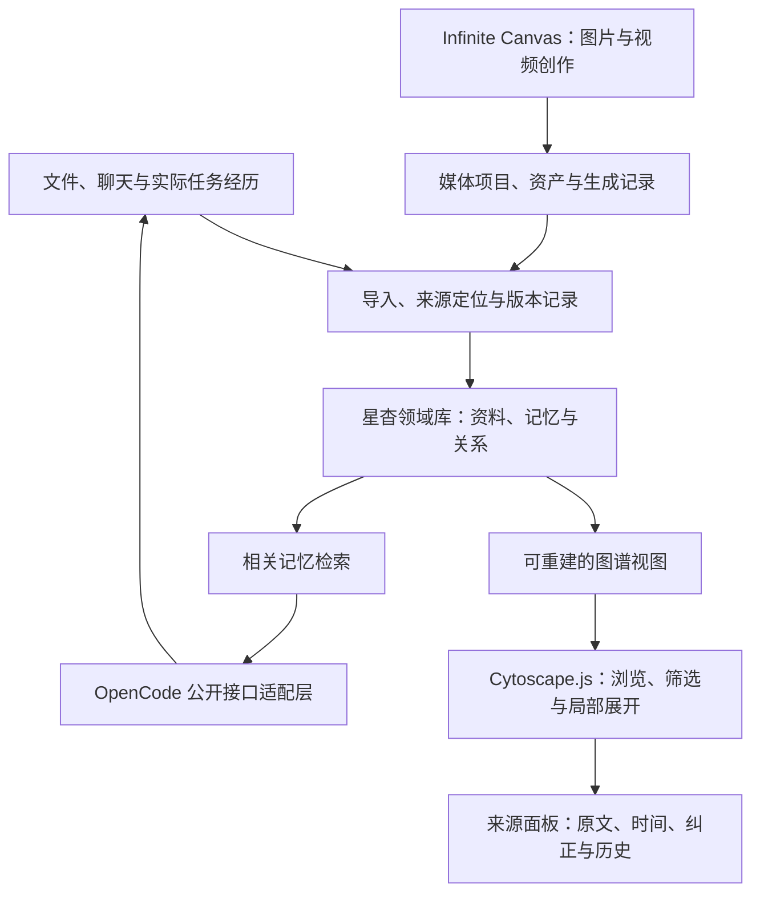

# 工作台模块与开源选型

记录日期：2026-09-17。以用户最新明确用途为准：`basketikun/infinite-canvas` 用于图片、视频等视觉创作；文件、知识与记忆使用独立知识图谱。两者在同一个星杳工作台提供入口。

## 工作台分工

| 入口 | 用途 | 数据与行为 |
| --- | --- | --- |
| 文件侧栏 | 文件树、搜索、打开文件 | 显示用户选择的项目目录；中间打开正文，右侧显示来源和反向链接 |
| 知识图谱 | 文件、记忆、经历及其关系 | 全局概览与当前节点的局部图；边区分明确链接、引用来源、经审阅的关系和待验证推断 |
| 视觉创作 | 图片、视频、提示词、视觉方案编排 | 集成 Infinite Canvas；媒体资产和项目文件需要随便携检查点保存 |
| 子智能体 | 分工、状态、成果、协作记录 | 归属到同一任务账本与权限体系；点击子任务可查看消息和证据 |
| 睡眠整理 | 候选记忆、冲突、归档与学习 | 结构化提取后审阅；未审阅的推断不能作为确定事实 |

视觉创作中的人工连线表示创作编排，不能直接升级成知识或记忆事实。图谱上的边必须说明产生方式；点开能查看原文、时间、修订和来源。

## 推荐：Cytoscape.js 作为图谱界面

[cytoscape/cytoscape.js](https://github.com/cytoscape/cytoscape.js) 是 MIT 许可的 JavaScript 图分析与可视化库，可用于浏览器与无界面计算。当前正式版本 [v3.34.3](https://github.com/cytoscape/cytoscape.js/releases/tag/v3.34.3) 发布于 2026-09-07，包清单没有运行时 dependencies。它不要求把现有原生 HTML/JS 工作台整体迁移到 React。

选择理由：原生节点/边模型、样式与选择器、交互事件、布局、遍历和 JSON 数据接口，适合实现“选中文件 → 展开相邻资料 → 筛选关系 → 查看证据”的工作流。MIT 许可也适合本产品的独立改装与分发，随发行保留许可。

这是图谱显示和交互层，记忆的来源、时效、纠正和删除仍由星杳数据库负责。不会用图上节点的位置或大小代替事实置信度。性能需使用我们的真实资料量测量，尚无本产品的吞吐或最大节点数承诺。

## 数据结构与界面安排

文件树保留目录位置；图谱提供按关系查找的入口，两者选择同一资料时联动。中间可切换正文、图谱和视觉创作，右侧提供选中资料或关系的来源。全局图用于概览，默认工作视图从当前问题或当前节点展开 1–2 层，支持按项目、类型和时间筛选。

目标关系模型覆盖“文件引用文件、记忆来自经历、人物参与项目、偏好在某段时间有效、观点被新证据纠正”。当前开发代码只实现文件显式链接和记忆来源投影；人物、语义关系和时间筛选仍是后续设计。人工确认、原文显式陈述、模型推断分别标记，不因模型重复生成而提升为已确认事实。

未来记忆关系记录至少包含稳定 ID、作用域、来源版本、有效时间、记录时间、证据、状态及修订号。原文说法有变化时，保留新旧关系和取代关系；遗忘先区分降低检索优先级、归档、明确删除。明确删除要另外覆盖索引、派生摘要和备份保留策略，不能用“从图上隐藏”代替删除完成。

图谱是领域数据的可重建视图。若后续引入 Graphiti 或文档抽取服务，由适配器提交带证据的候选，沿用领域库的确认和纠正规则；避免两套系统同时维护互相矛盾的长期记忆。OpenCode 升级只影响执行适配层，文件和记忆格式独立迁移。

资料：[官方文档](https://js.cytoscape.org/) · [固定版本包清单](https://github.com/cytoscape/cytoscape.js/blob/v3.34.3/package.json) · [许可证](https://github.com/cytoscape/cytoscape.js/blob/v3.34.3/LICENSE)

## 对比候选

| 项目 | 适合的职责 | 当前判断 |
| --- | --- | --- |
| [Cytoscape.js](https://github.com/cytoscape/cytoscape.js) · MIT | 图谱交互、关系探索、布局与分析 | 第一版首选，容易接入现有网页与 SQLite 数据投影 |
| [Sigma.js](https://github.com/jacomyal/sigma.js) · MIT | 基于 WebGL 的大型节点网络浏览，配合 Graphology | 保留作大图渲染候选；稳定核心包当前为 3.0.3，最新发布为 4.0 beta，正式接入需固定经过测试的版本 |
| [force-graph](https://github.com/vasturiano/force-graph) · MIT | 原生 JavaScript 的 Canvas 力导向图 | 很适合 Obsidian 式点线浏览，不依赖 React；偏重图形交互，关系管理与来源审阅仍需自己实现 |
| [react-force-graph](https://github.com/vasturiano/react-force-graph) · MIT | React 下的 2D/3D 力导向图 | 可做探索效果，现有工作台不需要为了 3D 表现引入 React；关系审阅与正文编辑仍需自建 |
| [思源 SiYuan](https://github.com/siyuan-note/siyuan) · AGPL-3.0 | 完整知识管理应用、块引用、双向链接、Markdown 编辑 | 适合参考知识工作流，或以后作为外部资料源；直接整体整合会多一套内核、数据格式和许可义务 |
| [Logseq](https://github.com/logseq/logseq) · AGPL-3.0 | 完整笔记应用、块级组织、引用、知识管理 | 可参考双向链接与大纲交互；当前 DB 版仍标 beta 并提醒备份，不能直接替换已验证的便携数据层 |
| [Graphiti](https://github.com/getzep/graphiti) · Apache-2.0 | AI 时序知识图谱、实体/关系提取、来源与历史检索 | 最接近长期记忆目标，但它是后端框架；依赖 Python 和图数据库，需额外维护。先评估提取质量与收益，再决定是否增加独立服务 |
| [LightRAG](https://github.com/HKUDS/LightRAG) · MIT | 文档实体/关系抽取、图与向量联合检索 | 后续资料检索增强候选；Python 3.10+，抽取效果和运行成本需评估，不能直接承担全部个人记忆生命周期 |

Graphiti 官方当前要求 Python 3.10+，支持 Neo4j/FalkorDB 等后端，嵌入式 FalkorDB Lite 要求 Python 3.12+；Kuzu 支持已被标为 deprecated。其模型推理和嵌入需要配置服务，自动抽取的正确性仍要用中文任务评估。不能把框架的存在等同于星杳已经实现可靠长期记忆。

LightRAG 官方说明默认 JSON/NetworkX/NanoVectorDB 等存储会全量加载到内存，适合小规模测试，生产环境推荐 PostgreSQL。若试点，先使用隔离的小型资料集，评估中文引用准确率、增量更新、内存和重建成本，不把默认本地存储当作已验证的大库方案。参见 [官方 README](https://github.com/HKUDS/LightRAG/blob/main/README.md) 与 [离线部署说明](https://github.com/HKUDS/LightRAG/blob/main/docs/OfflineDeployment.md)。

[Obsidian JSON Canvas](https://github.com/obsidianmd/jsoncanvas) 是 MIT 的 `.canvas` 开放格式规范；它不是 Obsidian 的知识图谱 UI 源码，也不代表拥有其整套笔记界面。若后续做交换导出，可单独支持该格式。

## 三个月后的重点问题与验证

| 可能问题 | 设计与验证方向 |
| --- | --- |
| 图谱变成难以阅读的大网 | 默认局部展开、类型与时间筛选；用真实资料比较加载、布局和选择延迟，再决定是否换 Sigma.js |
| 同名人物合并错误、模型编造关系 | 保留来源与候选状态；建立中文别名、同名、否定、转述和偏好变化的评估集，记录误合并与误确认 |
| 改名、移动或重导入留下重复节点 | 使用稳定资料 ID 与修订号；以搬移、覆盖、删除后重新导入验证增量更新 |
| 文档抽取成本与等待时间增长 | 内容哈希去重、仅处理变更、任务预算与可恢复队列；记录每次抽取的时间和用量 |
| 已纠正或删除的记忆从缓存、备份恢复 | 沿来源撤回派生关系；逐项验证索引重建、检查点恢复与删除保留策略，公开尚未覆盖的存储位置 |
| 拔盘换电脑后媒体或数据库不全 | 文件资产清单、配套检查点与版本固定；在独立宿主验证恢复，浏览器存储不能作为唯一副本 |

最大的未确定项是中文真实使用中的自动抽取质量与实体合并准确率；框架提供这些能力不代表它在本产品中的效果已经合格。先用 20–30 个实际任务和对应修正记录评估，再扩大自动处理范围。

## Infinite Canvas 的视觉创作接入

明确对象：[basketikun/infinite-canvas](https://github.com/basketikun/infinite-canvas)，本机只读检视的固定提交为 `e856c878e0a34651bb828e28f0af20d71016a7d4`，目录 `F:/codex/vendor/infinite-canvas`。

- MIT 许可允许修改和分发；保留版权、许可证与上游来源标识。
- React 19 + Vite 7，可构建成静态资产由本机 Bun 服务提供。Docker 不是运行基础画布的必需条件。
- 图片、视频、提示词与编排适合其现有产品方向；基础编辑可在本地运行，AI 生成仍需模型服务。
- 默认项目与媒体保存在浏览器 IndexedDB，必须适配到本机资产与检查点，才能换电脑携带。仅嵌入页面不能算完成便携集成。
- 原生导出 ZIP 包含 `projects.json` 与媒体，格式是 `app: infinite-canvas, version: 3`；不与知识图谱数据混用。
- 原版浏览器保存 API Key 并直连模型；原版 Canvas Agent 会启另一套 Agent 链路。产品接入需统一凭据、生成任务与结果记录。
- 路由、插件路径、默认远程提示词来源和更新行为需做明确适配，基础工作台不依赖首次访问外部 CDN。
- 上游 README 明示不保证历史数据兼容。固定版本、保留原始导出并测迁移后再升级。

依据：[README](https://github.com/basketikun/infinite-canvas/blob/e856c878e0a34651bb828e28f0af20d71016a7d4/README.md) · [LICENSE](https://github.com/basketikun/infinite-canvas/blob/e856c878e0a34651bb828e28f0af20d71016a7d4/LICENSE) · [持久化入口](https://github.com/basketikun/infinite-canvas/blob/e856c878e0a34651bb828e28f0af20d71016a7d4/web/src/lib/localforage-storage.ts) · [导出格式](https://github.com/basketikun/infinite-canvas/blob/e856c878e0a34651bb828e28f0af20d71016a7d4/web/src/types/canvas-export.ts)

## 当前落实状态

第一阶段后端投影在 2026-09-17 通过完整 `bun test`：199 项通过、0 失败、8097 个断言、22 个文件，62.54 秒。该结果只对应当时后端开发阶段。

`0.1.0-dev.3` 已接入 `/api/graph` 和 `/api/graph/source`，新增本地打包的 Cytoscape.js 图谱入口、已导入资料目录树、搜索/类型/私密/范围筛选、已加载邻居、来源面板和正文分页。文档来源使用导入缓存；若版本已不同于图节点，界面要求刷新。记忆纠正或删除后的旧节点不再提供来源正文。新增数据以文本显示，模型或文件中的 HTML 不作为页面执行。

图谱目录树仍仅表示本次加载的已导入资料，局部邻居仍受本次图谱数量限制。真正的项目文件浏览编辑、子智能体面板、视觉创作、自动语义关系与时序实体仍待推进。新版本的浏览器与发行验收结果记录在对应报告中，不沿用上一阶段的测试计数。

`0.1.0-dev.4` 包含上述功能与布局修正。已有安装只能激活更高版本；同版本的不同构建不会覆盖已安装制品。
